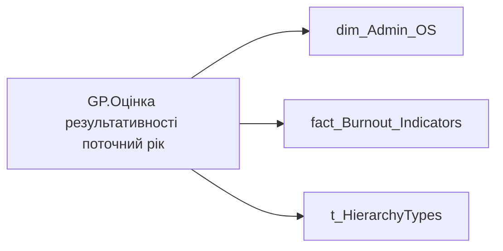

# GP.Оцінка результативності поточний рік

| Властивість | Значення |
|---|---|
| Тип | міра |
| Home table | _Measures |
| displayFolder | `Group_Profile\_Main\SVG` |
| formatString | `0` |
| dataType | — |
| Прихована | ні |

## DAX

```dax
//************* ROLE FILTERS **************
VAR _roleIndex = SELECTEDVALUE ( 't_HierarchyTypes'[Index], 1 )   -- 0 = LT, 1 = Admin
VAR _filter_lt = TREATAS ( VALUES ( 'dim_Admin_LT_OS'[USER_ACCESS_ID] ),'dim_Admin_OS'[USER_ACCESS_ID] )

/* *********** ADMIN *********** */
VAR _admin = 
	CALCULATE(
		AVERAGEX(
			VALUES('dim_Admin_OS'[USER_ACCESS_ID]),
			CALCULATE(
				SUM('fact_Burnout_Indicators'[LAST_YEAR_PERFORMANCE_DESC_RATE])
			)
		)
	)

/* *********** LT *********** */
VAR _admin_lt =
	CALCULATE(
		AVERAGEX(
			VALUES('dim_Admin_OS'[USER_ACCESS_ID]),
			CALCULATE(
				SUM('fact_Burnout_Indicators'[LAST_YEAR_PERFORMANCE_DESC_RATE])
			)
		),
		_filter_lt
	)

VAR _res =
	SWITCH (
		_roleIndex,
		0, _admin_lt,    -- LT
		1, _admin,       -- Admin
		_admin
	)
RETURN _res
```

## Джерела

Вихідні таблиці: `DM.vw_R27_dim_Employee_Access_List`

Колонки: `Index`, `LAST_YEAR_PERFORMANCE_DESC_RATE`, `USER_ACCESS_ID`

Power Query: `dim_Admin_OS`

## Бізнес-суть

LAST_YEAR_PERFORMANCE_DESC_RATE → Оцінка результативності за останній рік в цифровому форматі; LAST_YEAR_PERFORMANCE_DESC_RATE → Оцінка результативності (ОР) за останній рік; LAST_YEAR_PERFORMANCE_DESC_RATE → Загальна оцінка співробітника за останній період (рік); LAST_YEAR_PERFORMANCE_DESC_RATE → Середня оцінка результативності команди за останній рік в цифровому форматі

Для розрахунку метрики "Тренд оцінки рез-ті" Ці дані виводяться в деталізацію по тренду оцінки результативності Потрібно вирахувати середнє значення по команді = сума значень всіх оцінок членів команди станом на поточний момент поділити на кіл-сть таких членів команди (кількість записів). Тобто, якщо в складі команди є працівники, які не оцінювалися, вони участі в розрахунку не приймають.  <br>В розрахунок беремо оцінку всіх працівників, які станом на поточний момент є членами команди. На те, що вони могли працювати та оцінюватися на інших підприємствах/підрозділах не заважати.

**Вимоги:** `Індивідуальний-профіль-працівника/Паспортна-частина-індивідуального-профілю-співробітника/Сторінка-Картка-(паспорт)-працівника/Додати-інформацію-про-оцінку-результативності-працівника-в-Картку-працівника`, `Кейс-Втрати-Продуктивності-Працівників/Деталізація-метрик-в-кейсі-Продуктивність`, `Кейс-Утримання-працівників/Опис-джерел-для-сторінки-%22Кейс-звільнення-(вигорання)%22`, `Командний-профіль/Паспортна-частина-групового-профілю/Додати-інформацію-про-ОКР-команди-та-середню-оцінку-результативності-по-команді`

## Залежності

Таблиці: `dim_Admin_OS`, `fact_Burnout_Indicators`, `t_HierarchyTypes`

Колонки: `dim_Admin_LT_OS[USER_ACCESS_ID]`, `dim_Admin_OS[USER_ACCESS_ID]`, `fact_Burnout_Indicators[LAST_YEAR_PERFORMANCE_DESC_RATE]`, `t_HierarchyTypes[Index]`

## Схема



## Нотатки

_порожньо_
