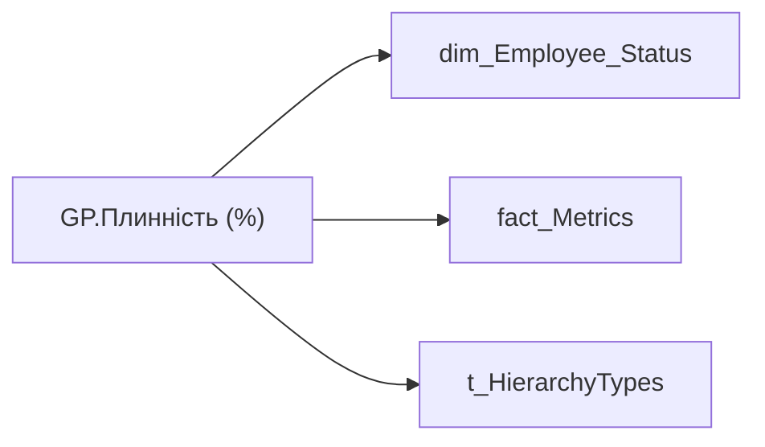

# GP.Плинність (%)

*тека `Group_Profile\_Main\Дані про команду`*

## Бізнес-суть

EMPLOYEE_UNIT_AVERAGE → Середньооблікова чисельність кадрового підрозділу за ост. 12 міс.; FIRED_UNIT_CNT → Кількість звільнених; FIRED_UNIT_CNT → Загальна плинність; FIRED_UNIT_CNT → Прогноз плинності; FIRED_UNIT_CNT → Керівник з високою плинністю

Для розрахунку метрики "Плинність % по вертикалі" Кількість звільнених (поле Fired_Unit_Cnt)  <br>/ Середньооблікову чисельність (поле Employee_Unit_Average) за останні 12 місяців або скільки існує підрозділ Прогноз плинності = Плинність з початку року/кількість повних місяців з початку року*12.  <br>- Плинність з початку року = це значення плинності за період з 1 січня поточного року до останнього повністю завершеного місяця.  <br>- Кількість повних місяців з початку року - кількість завершених календарних місяців у поточному році, починаючи з січня до останнього повного місяця. Наприклад, у 

**Вимоги:** `Кейс-Втрати-Продуктивності-Працівників/Деталізація-метрик-в-кейсі-Продуктивність`, `Кейс-Утримання-працівників/Деталізація-метрик-в-кейсі-Утримання-співробітника`, `Командний-профіль/Сторінка-Моя-команда/ТЗ.-Деталізація-метрик-групового-профілю-звіту`, `Командний-профіль/Сторінка-Плинність-та-Exits`

## На сторінках звіту

[Group Profile](../report/group-profile.md)

## Пов'язані міри

_Прямих зв'язків з іншими мірами немає._

---

## Технічний опис

| Властивість | Значення |
|---|---|
| Тип | міра |
| Home table | _Measures |
| displayFolder | `Group_Profile\_Main\Дані про команду` |
| formatString | — |
| dataType | — |
| Прихована | ні |

### DAX

```dax
"В розробці"
// //************* ROLE FILTERS **************
// VAR _roleIndex = SELECTEDVALUE ( 't_HierarchyTypes'[Index], 1 )   -- 0 = LT, 1 = Admin
// VAR _filter_lt = TREATAS ( VALUES ( 'dim_Admin_LT_OS'[USER_ACCESS_ID] ), 'fact_metrics'[USER_ACCESS_ID] )

// /* *********** ADMIN *********** */
// VAR _admin = 
// CALCULATE(
//     DIVIDE(
//         SUM(fact_Metrics[FIRED_UNIT_CNT]),
//         SUMX(
//             VALUES(fact_Metrics[DIVISION_PERSON_ID]),
//             CALCULATE(AVERAGE(fact_Metrics[EMPLOYEE_UNIT_AVERAGE]))
//         )
//     ),
//     'dim_Employee_Status'[STATUS_KEY] IN {"1", "4"}
// )
// VAR _admin_lt = 
//     CALCULATE(
//         DIVIDE(
//             SUM(fact_Metrics[FIRED_UNIT_CNT]),
//             SUMX(
//                 VALUES(fact_Metrics[DIVISION_PERSON_ID]),
//                 CALCULATE(AVERAGE(fact_Metrics[EMPLOYEE_UNIT_AVERAGE]))
//             )
//         ),
//         'dim_Employee_Status'[STATUS_KEY] IN {"1", "4"},
//         _filter_lt
//     )
// VAR _res = 
//     SWITCH(
//         SELECTEDVALUE('t_HierarchyTypes'[Index]),
//         0, _admin_lt,
//         1, _admin
//     )
// RETURN 
// 	TRIM(
// 		FORMAT(
// 			COALESCE(_res, "-"),
// 			"0.00%"
// 		) 
// 	)
```

### Джерела даних

Вихідні таблиці: `DM.vw_R27_dim_Employee_Status`

Колонки: `DIVISION_PERSON_ID`, `EMPLOYEE_UNIT_AVERAGE`, `FIRED_UNIT_CNT`, `Index`, `STATUS_KEY`, `USER_ACCESS_ID`

Power Query: `dim_Employee_Status`

### Залежності (таблиці й колонки)

Таблиці: `dim_Employee_Status`, `fact_Metrics`, `t_HierarchyTypes`

Колонки: `dim_Admin_LT_OS[USER_ACCESS_ID]`, `dim_Employee_Status[STATUS_KEY]`, `fact_Metrics[DIVISION_PERSON_ID]`, `fact_Metrics[EMPLOYEE_UNIT_AVERAGE]`, `fact_Metrics[FIRED_UNIT_CNT]`, `fact_metrics[USER_ACCESS_ID]`, `t_HierarchyTypes[Index]`

### Схема



## Нотатки

_порожньо_
