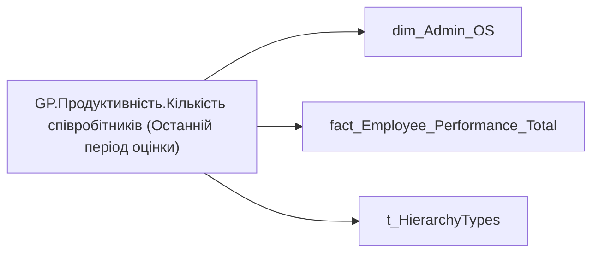

# GP.Продуктивність.Кількість співробітників (Останній період оцінки)

*тека `Group_Profile\_Main\Продуктивність` · формат `0`*

## Бізнес-суть

!!! note "Бізнес-визначення відсутнє"
    Поля міри не зіставлено з wiki «Таблицями джерел даних». Можна заповнити вручну в `manualNotes`.

## На сторінках звіту

_Не використовується на основних сторінках звіту._

## Пов'язані міри

**Використовує:** [GP.Продуктивність.Останній період оцінки](../measures/gp-produktyvnist-ostannii-period-otsinky.md)

**Використовується в:** [GP.Продуктивність.SVG.Bar chart](../measures/gp-produktyvnist-svg-bar-chart.md), [GP.Продуктивність.К-ть співробітників, що оцінюються.Текстове поле](../measures/gp-produktyvnist-k-t-spivrobitnykiv-shcho-otsiniuiutsia-tekstove-pole.md)

---

## Технічний опис

| Властивість | Значення |
|---|---|
| Тип | міра |
| Home table | _Measures |
| displayFolder | `Group_Profile\_Main\Продуктивність` |
| formatString | `0` |
| dataType | — |
| Прихована | ні |

### DAX

```dax
//************* ROLE FILTERS **************
VAR _filter_lt = TREATAS(VALUES(dim_Admin_LT_OS[USER_ACCESS_ID]), 'dim_Admin_OS'[USER_ACCESS_ID])

VAR LastPeriod = [GP.Продуктивність.Останній період оцінки]

/* *********** ADMIN *********** */
VAR _admin =
CALCULATE(
        DISTINCTCOUNT('fact_Employee_Performance_Total'[USER_ACCESS_ID]),
        'fact_Employee_Performance_Total'[performence_period] = LastPeriod)
        // FILTER(
        //     'fact_Employee_Performance_Total',
        //     'fact_Employee_Performance_Total'[order] = 1))

/* *********** ADMIN LT *********** */
VAR _admin_lt =
CALCULATE(
        DISTINCTCOUNT('fact_Employee_Performance_Total'[USER_ACCESS_ID]),
        'fact_Employee_Performance_Total'[performence_period] = LastPeriod,
        // FILTER(
        //     'fact_Employee_Performance_Total',
        //     'fact_Employee_Performance_Total'[order] = 1),
        _filter_lt)

VAR _res = 
	SWITCH(
		SELECTEDVALUE( t_HierarchyTypes[Index] ),
		0, _admin_lt,
		1, _admin
	)

/* *********** RESULT *********** */
RETURN COALESCE(_res, 0)
```

### Джерела даних

Вихідні таблиці: `DM.vw_R27_dim_Employee_Access_List`, `DM.vw_R27_fact_Employee_Performance_General_PBI`

Колонки: `Index`, `USER_ACCESS_ID`, `order`, `performence_period`

Power Query: `dim_Admin_OS`

### Залежності (таблиці й колонки)

Таблиці: `dim_Admin_OS`, `fact_Employee_Performance_Total`, `t_HierarchyTypes`

Колонки: `dim_Admin_OS[USER_ACCESS_ID]`, `fact_Employee_Performance_Total[USER_ACCESS_ID]`, `fact_Employee_Performance_Total[order]`, `fact_Employee_Performance_Total[performence_period]`, `t_HierarchyTypes[Index]`

### Схема



## Нотатки

_порожньо_
