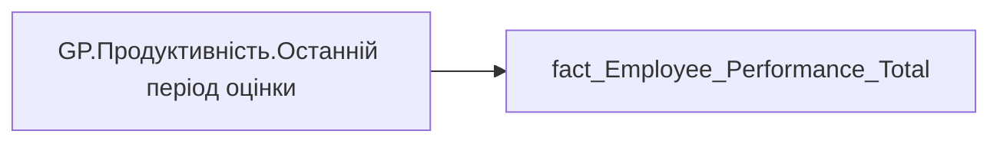

# GP.Продуктивність.Останній період оцінки

*тека `Group_Profile\_Main\Продуктивність`*

## Технічний опис

| Властивість | Значення |
|---|---|
| Тип | міра |
| Home table | _Measures |
| displayFolder | `Group_Profile\_Main\Продуктивність` |
| formatString | — |
| dataType | — |
| Прихована | ні |

### DAX

```dax
 
//_last_period = CALCULATE(MAX('fact_Employee_Performance_Total'[performance_PBI_order]), ALL('dim_Performance_Evalution'))

-- логіка визначення періоду для виводу 
-- наприклад: 01.11.2025-31.03.2026 - Півріччя 2025 | 01.04.2026-31.10.2026 - Річна 2025
VAR _date  = TODAY()
VAR _year  = YEAR ( _date )
VAR _month = MONTH ( _date )

VAR _baseYear =
    SWITCH (
        TRUE(),
        _month >= 11, _year,        -- листопад–грудень → поточний рік
        _month <= 3,  _year - 1,    -- січень–березень → попередній рік
        _month >= 4 && _month <= 10, _year - 1  -- квітень–жовтень → попередній рік
    )

VAR _periodIndex =
    IF ( _month >= 11 || _month <= 3, 1, 2 )

VAR _last_period = 
_baseYear * 10 + _periodIndex

VAR _res =
CALCULATE(
    SELECTEDVALUE('fact_Employee_Performance_Total'[performence_period]), 
    'fact_Employee_Performance_Total'[performance_PBI_order] = _last_period)

RETURN _res
```

### Джерела даних

Вихідні таблиці: `DM.vw_R27_fact_Employee_Performance_General_PBI`

Колонки: `performance_PBI_order`, `performence_period`

Power Query: `fact_Employee_Performance_Total`

### Залежності (таблиці й колонки)

Таблиці: `fact_Employee_Performance_Total`

Колонки: `fact_Employee_Performance_Total[performance_PBI_order]`, `fact_Employee_Performance_Total[performence_period]`

### Схема



---

## Бізнес-суть

performance_PBI_order → Сортування (для виведення 4-х останніх періодів)

**Вимоги:** `Індивідуальний-профіль-працівника/Паспортна-частина-індивідуального-профілю-співробітника/Зміна-джерела-даних-для-павутинки-Оцінка-результативності`, `Індивідуальний-профіль-працівника/Паспортна-частина-індивідуального-профілю-співробітника/Сторінка-Картка-(паспорт)-працівника/ТЗ-на-побудову-візуала-Павутинка-по-оцінці-результативності-працівника`, `Індивідуальний-профіль-працівника/Сторінка-Результативність-та-оцінка`, `Командний-профіль/Паспортна-частина-групового-профілю/Редизайн-паспортної-частини-групового-профілю`, `Командний-профіль/Сторінка-Результативність-та-оцінка-команди`

## На сторінках звіту

_Не використовується на основних сторінках звіту._

## Пов'язані міри

**Використовується в:** [GP.Продуктивність.Кількість співробітників (Останній період оцінки)](../measures/gp-produktyvnist-kilkist-spivrobitnykiv-ostannii-period-otsinky.md), [GP.Продуктивність.Оцінка керівника.Значення](../measures/gp-produktyvnist-otsinka-kerivnyka-znachennia.md), [GP.Продуктивність.Середня оцінка команди.Значення](../measures/gp-produktyvnist-serednia-otsinka-komandy-znachennia.md), [GP.Результативність.Назва графіка](../measures/gp-rezultatyvnist-nazva-hrafika.md)

## Нотатки

_порожньо_
