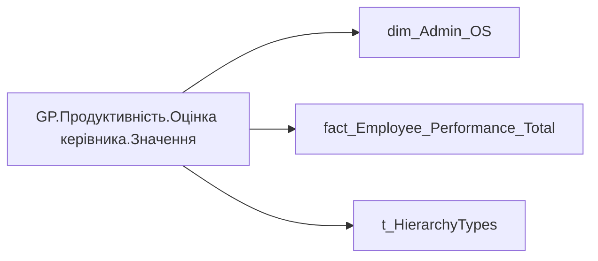

# GP.Продуктивність.Оцінка керівника.Значення

*тека `Group_Profile\_Main\Продуктивність`*

## Технічний опис

| Властивість | Значення |
|---|---|
| Тип | міра |
| Home table | _Measures |
| displayFolder | `Group_Profile\_Main\Продуктивність` |
| formatString | — |
| dataType | — |
| Прихована | ні |

### DAX

```dax
//************* ROLE FILTERS **************
VAR _filter_lt = TREATAS(VALUES(dim_Admin_LT_OS[USER_ACCESS_ID]), 'dim_Admin_OS'[USER_ACCESS_ID])
VAR _LastPeriod = [GP.Продуктивність.Останній період оцінки]

--1. Якщо у вибірку для HR BP потрапляють керівники рівня N-1, то конкатинацію робити лише по категоріях посади Старший менеджмент А, Старший менеджмент А+ і Топ-менеджмент

VAR _sample_of_users = 
    CALCULATETABLE(
        VALUES('dim_Admin_OS'[USER_ACCESS_ID]),
        OR(
            'dim_Admin_OS'[POSITION_CATEGORY_DETAIL] IN {"Старший менеджмент А", "Старший менеджмент А+", "Топ-менеджмент"} && 'dim_Admin_OS'[path_length] = 2,
            dim_Admin_OS[path_length] > 2
        )
    )
VAR _sample_of_users_lt = 
    CALCULATETABLE(
        VALUES('dim_Admin_OS'[USER_ACCESS_ID]),
        OR(
            'dim_Admin_OS'[POSITION_CATEGORY_DETAIL] IN {"Старший менеджмент А", "Старший менеджмент А+", "Топ-менеджмент"} && 'dim_Admin_OS'[path_length] = 2,
            dim_Admin_OS[path_length] > 2
        ),
        _filter_lt
    )

--2. Визначення найвищого рівня ієрархії, за яким конкатенується атрибут

VAR _highest_ADMIN_hierarchy_level = CALCULATE(MINX('dim_Admin_OS', 'dim_Admin_OS'[path_length]))
VAR _highest_ADMIN_hierarchy_level_lt = CALCULATE(MINX('dim_Admin_OS', 'dim_Admin_OS'[path_length]))
VAR _highest_HRBP_hierarchy_level = CALCULATE(MINX('dim_Admin_OS', 'dim_Admin_OS'[path_length]),_sample_of_users)
VAR _highest_HRBP_hierarchy_level_lt = CALCULATE(MINX('dim_Admin_OS', 'dim_Admin_OS'[path_length]),_sample_of_users_lt)

--3. * *********** ADMIN *********** */

VAR _admin =
    CALCULATE(
        AVERAGE('fact_Employee_Performance_Total'[General_Performance_Desc_Rate]),
        'fact_Employee_Performance_Total'[performence_period] = _LastPeriod,
        'dim_Admin_OS'[path_length] = _highest_ADMIN_hierarchy_level
    )
VAR _admin_lt = 
    CALCULATE(
        AVERAGE('fact_Employee_Performance_Total'[General_Performance_Desc_Rate]),
        'fact_Employee_Performance_Total'[performence_period] = _LastPeriod,
        'dim_Admin_OS'[path_length] = _highest_ADMIN_hierarchy_level_lt,
        _filter_lt
    )

--4. /* *********** HRBP *********** */

VAR _HRBP =
    CALCULATE(
        AVERAGE('fact_Employee_Performance_Total'[General_Performance_Desc_Rate]),
        'fact_Employee_Performance_Total'[performence_period] = _LastPeriod,
        'dim_Admin_OS'[path_length] = _highest_HRBP_hierarchy_level,
        _sample_of_users
    )
VAR _HRBP_lt = 
    CALCULATE(
        AVERAGE('fact_Employee_Performance_Total'[General_Performance_Desc_Rate]),
        'fact_Employee_Performance_Total'[performence_period] = _LastPeriod,
        'dim_Admin_OS'[path_length] = _highest_HRBP_hierarchy_level_lt,
        _sample_of_users_lt
    )

--5. Визначення результату
VAR _res = 
    SWITCH(
        SELECTEDVALUE('t_HierarchyTypes'[Index]),
        0, 
        SWITCH(
            SELECTEDVALUE('dim_Admin_OS'[USER_ROLE]),
            "Адміністративний керівник", _admin_lt,
            "HRBP", _HRBP_lt
        ),
        1,
        SWITCH(
            SELECTEDVALUE('dim_Admin_OS'[USER_ROLE]),
            "Адміністративний керівник", _admin,
            "HRBP", _HRBP
        )
    )
RETURN ROUND(_res,2)
```

### Джерела даних

Вихідні таблиці: `DM.vw_R27_dim_Employee_Access_List`, `DM.vw_R27_fact_Employee_Performance_General_PBI`

Колонки: `General_Performance_Desc_Rate`, `Index`, `POSITION_CATEGORY_DETAIL`, `USER_ACCESS_ID`, `USER_ROLE`, `path_length`, `performence_period`

Power Query: `dim_Admin_OS`

### Залежності (таблиці й колонки)

Таблиці: `dim_Admin_OS`, `fact_Employee_Performance_Total`, `t_HierarchyTypes`

Колонки: `dim_Admin_OS[POSITION_CATEGORY_DETAIL]`, `dim_Admin_OS[USER_ACCESS_ID]`, `dim_Admin_OS[USER_ROLE]`, `dim_Admin_OS[path_length]`, `fact_Employee_Performance_Total[General_Performance_Desc_Rate]`, `fact_Employee_Performance_Total[performence_period]`, `t_HierarchyTypes[Index]`

### Схема



---

## Бізнес-суть

!!! note "Бізнес-визначення відсутнє"
    Поля міри не зіставлено з wiki «Таблицями джерел даних». Можна заповнити вручну в `manualNotes`.

## На сторінках звіту

_Не використовується на основних сторінках звіту._

## Пов'язані міри

**Використовує:** [GP.Продуктивність.Останній період оцінки](../measures/gp-produktyvnist-ostannii-period-otsinky.md)

**Використовується в:** [GP.Продуктивність.Оцінка керівника.Категорія](../measures/gp-produktyvnist-otsinka-kerivnyka-katehoriia.md), [GP.Продуктивність.Оцінка керівника.Текстове поле](../measures/gp-produktyvnist-otsinka-kerivnyka-tekstove-pole.md)

## Нотатки

_порожньо_
