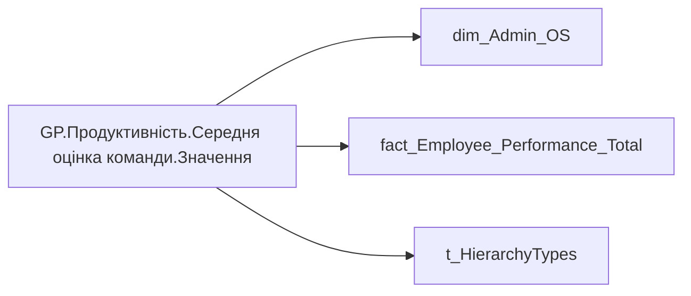

# GP.Продуктивність.Середня оцінка команди.Значення

*тека `Group_Profile\_Main\Продуктивність`*

## Технічний опис

| Властивість | Значення |
|---|---|
| Тип | міра |
| Home table | _Measures |
| displayFolder | `Group_Profile\_Main\Продуктивність` |
| formatString | — |
| dataType | — |
| Прихована | ні |

### DAX

```dax
//************* ROLE FILTERS **************
VAR _filter_lt = TREATAS(VALUES(dim_Admin_LT_OS[USER_ACCESS_ID]), 'dim_Admin_OS'[USER_ACCESS_ID])

VAR LastPeriod = [GP.Продуктивність.Останній період оцінки]
    // SUMMARIZE(
    //     'fact_Employee_Performance_Total', 
    //     'fact_Employee_Performance_Total'[USER_ACCESS_ID], 
    //     "MaxYear", MAX('fact_Employee_Performance_Total'[performance_PBI_order])
    // )
/* *********** ADMIN *********** */
VAR _admin = 
    CALCULATE(
            AVERAGE('fact_Employee_Performance_Total'[General_Performance_Desc_Rate]),
            'fact_Employee_Performance_Total'[performence_period] = LastPeriod
            // TREATAS(LastYearsPerPerson, 'fact_Employee_Performance_Total'[USER_ACCESS_ID], 'fact_Employee_Performance_Total'[performance_PBI_order])
        )

/* *********** ADMIN LT *********** */
VAR _admin_lt = 
    CALCULATE(
            AVERAGE('fact_Employee_Performance_Total'[General_Performance_Desc_Rate]),
            'fact_Employee_Performance_Total'[performence_period] = LastPeriod,
            // TREATAS(LastYearsPerPerson, 'fact_Employee_Performance_Total'[USER_ACCESS_ID], 'fact_Employee_Performance_Total'[performance_PBI_order]),
            _filter_lt
        )

/* *********** RESULT *********** */
VAR _res = 
	SWITCH(
		SELECTEDVALUE( t_HierarchyTypes[Index] ),
		0, _admin_lt,
		1, _admin
	)

RETURN ROUND(_res, 2)
```

### Джерела даних

Вихідні таблиці: `DM.vw_R27_dim_Employee_Access_List`, `DM.vw_R27_fact_Employee_Performance_General_PBI`

Колонки: `General_Performance_Desc_Rate`, `Index`, `USER_ACCESS_ID`, `performance_PBI_order`, `performence_period`

Power Query: `dim_Admin_OS`

### Залежності (таблиці й колонки)

Таблиці: `dim_Admin_OS`, `fact_Employee_Performance_Total`, `t_HierarchyTypes`

Колонки: `dim_Admin_OS[USER_ACCESS_ID]`, `fact_Employee_Performance_Total[General_Performance_Desc_Rate]`, `fact_Employee_Performance_Total[USER_ACCESS_ID]`, `fact_Employee_Performance_Total[performance_PBI_order]`, `fact_Employee_Performance_Total[performence_period]`, `t_HierarchyTypes[Index]`

### Схема



---

## Бізнес-суть

!!! note "Бізнес-визначення відсутнє"
    Поля міри не зіставлено з wiki «Таблицями джерел даних». Можна заповнити вручну в `manualNotes`.

## На сторінках звіту

- [Group Profile](../report/group-profile.md) — Версія 2 › Індикатори здоров'я команди

## Пов'язані міри

**Використовує:** [GP.Продуктивність.Останній період оцінки](../measures/gp-produktyvnist-ostannii-period-otsinky.md)

**Використовується в:** [GP.Продуктивність.Середня Оцінка.Formeted](../measures/gp-produktyvnist-serednia-otsinka-formeted.md), [GP.Продуктивність.Середня оцінка команди.Категорія](../measures/gp-produktyvnist-serednia-otsinka-komandy-katehoriia.md), [GP.Продуктивність.Середня оцінка команди.Текстове поле](../measures/gp-produktyvnist-serednia-otsinka-komandy-tekstove-pole.md)

## Нотатки

_порожньо_
