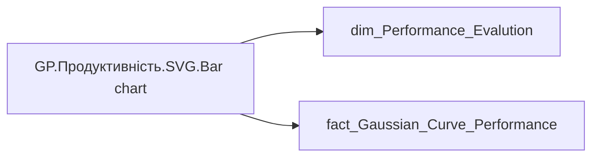

# GP.Продуктивність.SVG.Bar chart

*тека `Group_Profile\_Main\Продуктивність\SVG`*

## Технічний опис

| Властивість | Значення |
|---|---|
| Тип | міра |
| Home table | _Measures |
| displayFolder | `Group_Profile\_Main\Продуктивність\SVG` |
| formatString | — |
| dataType | — |
| Прихована | ні |

### DAX

```dax
-- === НАЛАШТУВАННЯ РОЗМІРІВ ===
VAR CanvasWidth = 348
VAR CanvasHeight = 170
VAR HalfBar = 19
VAR TopMargin = 15
VAR BottomMargin = 20
VAR ChartTop = TopMargin + 15 + HalfBar
VAR ChartBottom = CanvasHeight - BottomMargin
VAR MaxBarHeight = ChartBottom - ChartTop
VAR ZeroLineY = ChartBottom - HalfBar

-- === ОБЧИСЛЕННЯ (ФАКТ - БАРИ) ===
VAR TotalEmployees = CALCULATE([GP.Продуктивність.Кількість співробітників (Останній період оцінки)], ALL('dim_Performance_Evalution'))

-- === ОБЧИСЛЕННЯ (ГАУС - КРИВА) ===
VAR TotalGaussian = CALCULATE(SUM('fact_Gaussian_Curve_Performance'[EMPLOYEE_COUNT]), ALL('fact_Gaussian_Curve_Performance'))

VAR Data = 
    ADDCOLUMNS(
        SUMMARIZE('dim_Performance_Evalution', 'dim_Performance_Evalution'[General_Performance_Str_Rate]), 
        
        "EmpCount", [GP.Продуктивність.Кількість співробітників (Останній період оцінки)],
        "ValuePct", DIVIDE([GP.Продуктивність.Кількість співробітників (Останній період оцінки)], TotalEmployees, 0),
        
        "CurvePct", 
            VAR GaussCategory = SWITCH(
                'dim_Performance_Evalution'[General_Performance_Str_Rate],
                "Категорія ТОР А", "Категорія TOP A",
                "Категорія А", "Категорія A",
                "Категорія B", "Категорія B",
                "Категорія C", "Категорія C",
                "Категорія D", "Категорія D",
                'dim_Performance_Evalution'[General_Performance_Str_Rate]
            )
            RETURN DIVIDE(
                CALCULATE(
                    SUM('fact_Gaussian_Curve_Performance'[EMPLOYEE_COUNT]),
                    'fact_Gaussian_Curve_Performance'[General_Performance_Str_Rate] = GaussCategory,
                    ALL('fact_Gaussian_Curve_Performance')
                ),
                TotalGaussian, 
                0
            ),
        
        "SortOrder", SWITCH('dim_Performance_Evalution'[General_Performance_Str_Rate],
            "Категорія ТОР А", 1, "Категорія А", 2, "Категорія B", 3, "Категорія C", 4, "Категорія D", 5, 6)
    )

VAR MaxPctInGroup = 1 
VAR CountItems = COUNTROWS(Data)
VAR BarWidth = HalfBar * 2
VAR Gap = ROUND((CanvasWidth - BarWidth * CountItems) / (CountItems + 1), 0)

-- === СТИЛІ ===
VAR ColorText = "#1F4E79"
VAR ColorLine = "#94C0FF"

-- === ПІДГОТОВКА ТОЧОК ===
VAR Points = 
    ADDCOLUMNS(
        Data,
        "X", Gap + ([SortOrder] - 1) * (BarWidth + Gap) + (BarWidth / 2),
        "Y_Bar", ZeroLineY - (MaxBarHeight * DIVIDE([ValuePct], MaxPctInGroup, 0)),
        "Y_Curve", ZeroLineY - (MaxBarHeight * DIVIDE([CurvePct], MaxPctInGroup, 0))
    )

-- === ГЕНЕРАЦІЯ ШЛЯХУ КРИВОЇ ===
VAR PathDefinition = 
    CONCATENATEX(
        Points,
        VAR Idx = [SortOrder]
        VAR X0 = [X]
        VAR Y0 = [Y_Curve]
        VAR X1 = MAXX(FILTER(Points, [SortOrder] = Idx + 1), [X])
        VAR Y1 = MAXX(FILTER(Points, [SortOrder] = Idx + 1), [Y_Curve])
        VAR X_1 = MAXX(FILTER(Points, [SortOrder] = Idx - 1), [X])
        VAR Y_1 = MAXX(FILTER(Points, [SortOrder] = Idx - 1), [Y_Curve])
        VAR X2 = MAXX(FILTER(Points, [SortOrder] = Idx + 2), [X])
        VAR Y2 = MAXX(FILTER(Points, [SortOrder] = Idx + 2), [Y_Curve])
        VAR P_1_X = IF(ISBLANK(X_1), X0, X_1)
        VAR P_1_Y = IF(ISBLANK(Y_1), Y0, Y_1)
        VAR P2_X = IF(ISBLANK(X2), X1, X2)
        VAR P2_Y = IF(ISBLANK(Y2), Y1, Y2)
        VAR CP1_X = X0 + (X1 - P_1_X) / 6
        VAR CP1_Y = Y0 + (Y1 - P_1_Y) / 6
        VAR CP2_X = X1 - (P2_X - X0) / 6
        VAR CP2_Y = Y1 - (P2_Y - Y0) / 6
        RETURN 
            IF(Idx = 1, "M " & X0 & " " & Y0 & " ", "") & 
            IF(Idx < CountItems, 
                "C " & CP1_X & " " & CP1_Y & ", " & CP2_X & " " & CP2_Y & ", " & X1 & " " & Y1 & " ", 
                ""
            ),
        "", [SortOrder], ASC
    )

VAR FirstX = MAXX(FILTER(Points, [SortOrder] = 1), [X])
VAR LastX  = MAXX(FILTER(Points, [SortOrder] = CountItems), [X])

-- === ГЕНЕРАЦІЯ БАРІВ З TOOLTIP ===
VAR BarsSVG = 
    CONCATENATEX(
        Points,
        VAR CurrentPct = [ValuePct]
        VAR CurrentCount = [EmpCount]
        VAR CurrentCurve = [CurvePct]
        VAR CatName = 'dim_Performance_Evalution'[General_Performance_Str_Rate]

        VAR LabelCategory = SWITCH(CatName,
            "Категорія ТОР А", "TOP A", "Категорія А", "A", "Категорія B", "B", "Категорія C", "C", "Категорія D", "D", CatName)

        VAR ColorFill = SWITCH(LabelCategory,
            "TOP A", "#8bd6ea",
            "A", "#5a974d",
            "B", "#e9c246",
            "C", "#9e241e",
            "D", "#a5a4a6",
            "#a5a4a6"
        )

        VAR XPos = [X]
        VAR Y_Top_Fill = [Y_Bar]
        
        VAR LabelValue = FORMAT(CurrentPct, "0.0%") 
        VAR LabelY = Y_Top_Fill - HalfBar - 3
        
        VAR TooltipText = 
            CatName & UNICHAR(10) & 
            "К-ть працівників: " & FORMAT(CurrentCount, "#,0") & UNICHAR(10) & 
            "Факт: " & FORMAT(CurrentPct, "0.0%") & UNICHAR(10) & 
            "Крива (Гаус): " & FORMAT(CurrentCurve, "0.0%")

        RETURN 
        "<g>" &
            "<title>" & TooltipText & "</title>" &
            "<rect x='" & (XPos - BarWidth/2) & "' y='0' width='" & BarWidth & "' height='" & CanvasHeight & "' fill='transparent' />" &
            IF(CurrentPct > 0, 
                "<line x1='" & XPos & "' y1='" & ZeroLineY & "' x2='" & XPos & "' y2='" & Y_Top_Fill & "' 
                       stroke='" & ColorFill & "' stroke-width='" & BarWidth & "' stroke-linecap='round' />",
                "") &
            "<text x='" & XPos & "' y='" & LabelY & "' text-anchor='middle' font-family='Segoe UI' font-weight='bold' font-size='11' fill='" & ColorText & "'>" & LabelValue & "</text>" &
            "<text x='" & XPos & "' y='" & (ZeroLineY + HalfBar + 13) & "' text-anchor='middle' font-family='Segoe UI' font-size='10' fill='" & ColorText & "'>" & LabelCategory & "</text>" &
        "</g>",
        "", [SortOrder], ASC
    )

RETURN
"<svg xmlns='http://www.w3.org/2000/svg' viewBox='0 0 " & CanvasWidth & " " & CanvasHeight & "' overflow='hidden'>" &
    "<path d='" & PathDefinition & " L " & LastX & " " & ZeroLineY & " L " & FirstX & " " & ZeroLineY & " Z' 
           fill='" & ColorLine & "' fill-opacity='0.2' stroke='none' />" &
    BarsSVG &
    "<path d='" & PathDefinition & "' 
           fill='none' stroke='" & ColorLine & "' stroke-width='3' stroke-linecap='round' />" &
"</svg>"
```

### Джерела даних

Вихідні таблиці: `DM.R27_fact_Employee_Performance`

Колонки: `EMPLOYEE_COUNT`, `General_Performance_Str_Rate`

Power Query: `dim_Performance_Evalution`

### Залежності (таблиці й колонки)

Таблиці: `dim_Performance_Evalution`, `fact_Gaussian_Curve_Performance`

Колонки: `dim_Performance_Evalution[General_Performance_Str_Rate]`, `fact_Gaussian_Curve_Performance[EMPLOYEE_COUNT]`, `fact_Gaussian_Curve_Performance[General_Performance_Str_Rate]`

### Схема



---

## Бізнес-суть

General_Performance_Str_Rate → Категорія оцінки результативнсті; General_Performance_Str_Rate → #71711; General_Performance_Str_Rate → Категорія оцінки співробітника; General_Performance_Str_Rate → Категорія оцінки співробітника за останній період (рік); General_Performance_Str_Rate → Категорія оцінки співробітника за передостанній період (рік); General_Performance_Str_Rate → Керівник з високими/низькими оцінками результативності підлеглих; General_Performance_Str_Rate → Остання доступна оцінка керівника, Категорія

Останнє НЕ пусте актуальне значення на дату (date) поточного запису Останнє НЕ пусте актуальне значення на дату (date) поточного запису. Відбираємо один будь-який рядок по даті запуску форми оцінювання. Для розрахунку потрібні лише річні форми оцінки:  <br>1. Оцінка результативності: Річна, Form_Template_ID = '06c35fbd-1ff3-f1b8-37a3-45b9cd528696'  <br>2. Оцінка результативності: Річна функціональним керівником, Form_Template_ID ='ef3fbd7d-0099-e129-2027-f75748fed9bd'<br>3. Оцінка результативності річна 2023 Form_Template_ID ='8d88b5e2-da71-d373-1ccd-72a1eb2d045d' <br>4. Оцінка результативност

**Вимоги:** `Індивідуальний-профіль-працівника/Історія-по-посадам`, `Індивідуальний-профіль-працівника/Історія-по-посадам/Реліз-1.-Історія-по-посадам`, `Індивідуальний-профіль-працівника/Паспортна-частина-індивідуального-профілю-співробітника/Сторінка-Картка-(паспорт)-працівника/ТЗ-на-побудову-візуала-Павутинка-по-оцінці-результативності-працівника`, `Індивідуальний-профіль-працівника/Сторінка-Результативність-та-оцінка`, `Допоміжні-вітрини-для-звіту/Таблиця-для-розрахунку-агрегованих-метрик-по-звіту`, `Командний-профіль/Паспортна-частина-групового-профілю/Редизайн-паспортної-частини-групового-профілю`, `Командний-профіль/Сторінка-Моя-команда/ТЗ.-Деталізація-метрик-групового-профілю-звіту`, `Командний-профіль/Сторінка-Результативність-та-оцінка-команди`

## На сторінках звіту

[Group Profile](../report/group-profile.md)

## Пов'язані міри

**Використовує:** [GP.Продуктивність.Кількість співробітників (Останній період оцінки)](../measures/gp-produktyvnist-kilkist-spivrobitnykiv-ostannii-period-otsinky.md)

## Нотатки

_порожньо_
