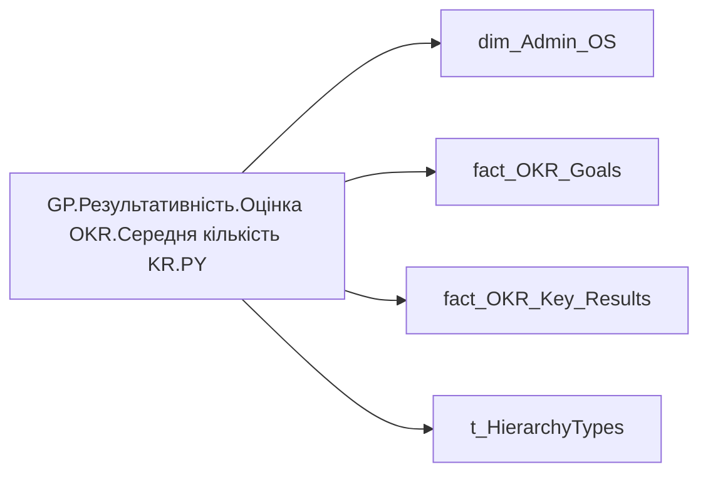

# GP.Результативність.Оцінка OKR.Середня кількість KR.PY

| Властивість | Значення |
|---|---|
| Тип | міра |
| Home table | _Measures |
| displayFolder | `Group_Profile\Результативність та оцінка\Оцінка OKR` |
| formatString | — |
| dataType | — |
| Прихована | ні |

## DAX

```dax
VAR _roleIndex = SELECTEDVALUE ( 't_HierarchyTypes'[Index], 1 )   -- 0 = LT, 1 = Admin

// VAR _filter_admin = VALUES('dim_Admin_OS'[EMPLOYEE_ID])
// VAR _filter_lt= VALUES('dim_Admin_LT_OS'[EMPLOYEE_ID])

// VAR _admin_emp_count = 
// CALCULATE(
//     DISTINCTCOUNT('fact_OKR_Key_Results'[EMPLOYEE_ID]),
//     TREATAS(_filter_admin, 'fact_OKR_Key_Results'[EMPLOYEE_ID]),
//     YEAR(TODAY()) - 1 = 'fact_OKR_Goals'[PLAN_YEAR])

// VAR _admin_lt_emp_count = 
// CALCULATE(
//     DISTINCTCOUNT('fact_OKR_Goals'[EMPLOYEE_ID]),
//     TREATAS(_filter_lt, 'fact_OKR_Key_Results'[EMPLOYEE_ID]),
//     YEAR(TODAY()) - 1 = 'fact_OKR_Goals'[PLAN_YEAR])

// VAR _admin = 
// DIVIDE(
//     [GP.Результативність.Оцінка OKR.Загальна кількість KR.PY], 
//     [GP.Результативність.Оцінка OKR.Кількість співробітників з OKR.PY], BLANK())

// VAR _admin_lt = 
// DIVIDE(
//     [GP.Результативність.Оцінка OKR.Загальна кількість KR.PY],
//     [GP.Результативність.Оцінка OKR.Кількість співробітників з OKR.PY], BLANK())

VAR _res =
DIVIDE(
    [GP.Результативність.Оцінка OKR.Загальна кількість KR.PY], 
    [GP.Результативність.Оцінка OKR.Загальна кількість OKR.PY], BLANK())

RETURN _res
```

## Джерела

Вихідні таблиці: `DM.R27_fact_OKR_Goals`, `DM.R27_fact_OKR_Key_Results`, `DM.vw_R27_dim_Employee_Access_List`

Колонки: `EMPLOYEE_ID`, `Index`, `PLAN_YEAR`

Power Query: `dim_Admin_OS`

## Бізнес-суть

PLAN_YEAR → Рік ОКР; PLAN_YEAR → Значення останнього року оцінки ОКР; PLAN_YEAR → Значення передостаннього  року оцінки ОКР

Останнє доступне значення станом на дату поточного запису, релевантне відповідній оцінці результативності. Значення останнього року оцінки ОКР визначати в залежності від того, які дані доступні на поточний момент. Наприклад, протягом 2025 року в оцінку брати коефіцієнт індивідуального бонусу працівника за 2023-2024 роки, бо за 2025 рік оцінки ще немає. Тому останній рік буде 2024. На початку 2026 року, коли з'являться результати оцінки ОКР за 2025 рік, потрібно буде змістити період і брати 2025 рік.  <br>  <br>Для того, що визначити період (рік), за який виставлено індивідуальний бонус, потріб

**Вимоги:** `Індивідуальний-профіль-працівника/Історія-по-посадам`, `Індивідуальний-профіль-працівника/Історія-по-посадам/Реліз-1.-Історія-по-посадам`, `Індивідуальний-профіль-працівника/Паспортна-частина-індивідуального-профілю-співробітника`, `Індивідуальний-профіль-працівника/Паспортна-частина-індивідуального-профілю-співробітника/Сторінка-Картка-(паспорт)-працівника/Редизайн-паспортної-частини`, `Індивідуальний-профіль-працівника/Сторінка-Результативність-та-оцінка`, `Допоміжні-вітрини-для-звіту/Таблиця-для-розрахунку-агрегованих-метрик-по-звіту`, `Командний-профіль/Паспортна-частина-групового-профілю/Редизайн-паспортної-частини-групового-профілю`, `Командний-профіль/Сторінка-Результативність-та-оцінка-команди/Створити-блок-Виконання-OKR`

## Залежності

Міри: [GP.Результативність.Оцінка OKR.Загальна кількість KR.PY](../measures/gp-rezultatyvnist-otsinka-okr-zahalna-kilkist-kr-py.md), [GP.Результативність.Оцінка OKR.Загальна кількість OKR.PY](../measures/gp-rezultatyvnist-otsinka-okr-zahalna-kilkist-okr-py.md), [GP.Результативність.Оцінка OKR.Кількість співробітників з OKR.PY](../measures/gp-rezultatyvnist-otsinka-okr-kilkist-spivrobitnykiv-z-okr-py.md)

Таблиці: `dim_Admin_OS`, `fact_OKR_Goals`, `fact_OKR_Key_Results`, `t_HierarchyTypes`

Колонки: `dim_Admin_LT_OS[EMPLOYEE_ID]`, `dim_Admin_OS[EMPLOYEE_ID]`, `fact_OKR_Goals[EMPLOYEE_ID]`, `fact_OKR_Goals[PLAN_YEAR]`, `fact_OKR_Key_Results[EMPLOYEE_ID]`, `t_HierarchyTypes[Index]`

## Схема



## Нотатки

_порожньо_
