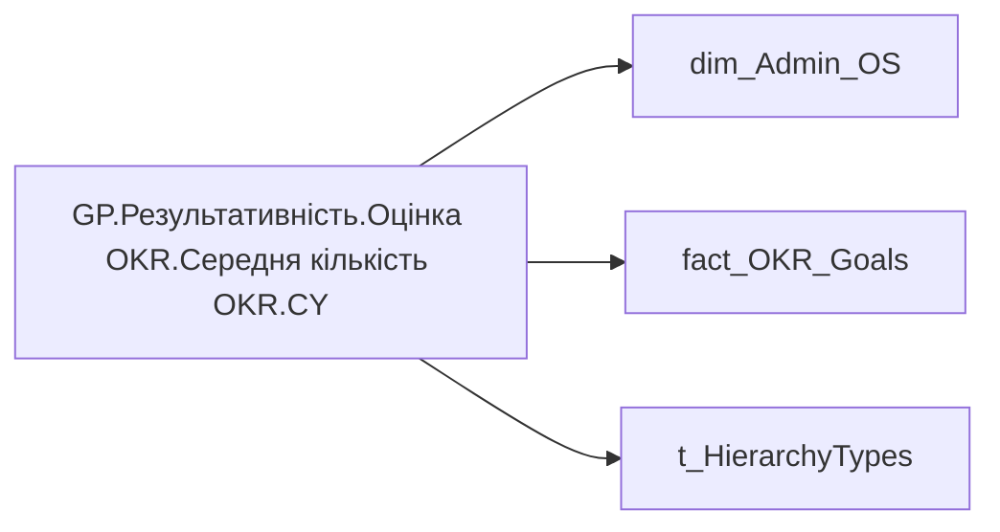

# GP.Результативність.Оцінка OKR.Середня кількість OKR.CY

*тека `Group_Profile\Результативність та оцінка\Оцінка OKR`*

## Технічний опис

| Властивість | Значення |
|---|---|
| Тип | міра |
| Home table | _Measures |
| displayFolder | `Group_Profile\Результативність та оцінка\Оцінка OKR` |
| formatString | — |
| dataType | — |
| Прихована | ні |

### DAX

```dax
// VAR _roleIndex = SELECTEDVALUE ( 't_HierarchyTypes'[Index], 1 )   -- 0 = LT, 1 = Admin

// VAR _filter_admin = VALUES('dim_Admin_OS'[EMPLOYEE_ID])
// VAR _filter_lt= VALUES('dim_Admin_LT_OS'[EMPLOYEE_ID])

// VAR _admin_emp_count = 
// CALCULATE(
//     DISTINCTCOUNT('fact_OKR_Goals'[EMPLOYEE_ID]),
//     TREATAS(_filter_admin, 'fact_OKR_Goals'[EMPLOYEE_ID]),
//     YEAR(TODAY()) = 'fact_OKR_Goals'[PLAN_YEAR])

// VAR _admin_lt_emp_count = 
// CALCULATE(
//     DISTINCTCOUNT('fact_OKR_Goals'[EMPLOYEE_ID]),
//     TREATAS(_filter_lt, 'fact_OKR_Goals'[EMPLOYEE_ID]),
//     YEAR(TODAY()) = 'fact_OKR_Goals'[PLAN_YEAR])

// VAR _admin = 
// DIVIDE(
//     [GP.Результативність.Оцінка OKR.Загальна кількість OKR.CY],
//     [GP.Результативність.Оцінка OKR.Кількість співробітників з OKR.CY], BLANK())

// VAR _admin_lt = 
// DIVIDE(
//     [GP.Результативність.Оцінка OKR.Загальна кількість OKR.CY],
//     [GP.Результативність.Оцінка OKR.Кількість співробітників з OKR.CY], BLANK())

VAR _res =
	DIVIDE(
    [GP.Результативність.Оцінка OKR.Загальна кількість OKR.CY],
    [GP.Результативність.Оцінка OKR.Кількість співробітників з OKR.CY], BLANK())

RETURN _res
```

### Джерела даних

Вихідні таблиці: `DM.R27_fact_OKR_Goals`, `DM.vw_R27_dim_Employee_Access_List`

Колонки: `EMPLOYEE_ID`, `Index`, `PLAN_YEAR`

Power Query: `dim_Admin_OS`

### Залежності (таблиці й колонки)

Таблиці: `dim_Admin_OS`, `fact_OKR_Goals`, `t_HierarchyTypes`

Колонки: `dim_Admin_LT_OS[EMPLOYEE_ID]`, `dim_Admin_OS[EMPLOYEE_ID]`, `fact_OKR_Goals[EMPLOYEE_ID]`, `fact_OKR_Goals[PLAN_YEAR]`, `t_HierarchyTypes[Index]`

### Схема



---

## Бізнес-суть

!!! note "Бізнес-визначення відсутнє"
    Поля міри не зіставлено з wiki «Таблицями джерел даних». Можна заповнити вручну в `manualNotes`.

## На сторінках звіту

- [Group Profile](../report/group-profile.md) — Результативність та оцінка › Оцінка ОКР

## Пов'язані міри

**Використовує:** [GP.Результативність.Оцінка OKR.Загальна кількість OKR.CY](../measures/gp-rezultatyvnist-otsinka-okr-zahalna-kilkist-okr-cy.md), [GP.Результативність.Оцінка OKR.Кількість співробітників з OKR.CY](../measures/gp-rezultatyvnist-otsinka-okr-kilkist-spivrobitnykiv-z-okr-cy.md)

## Нотатки

_порожньо_
