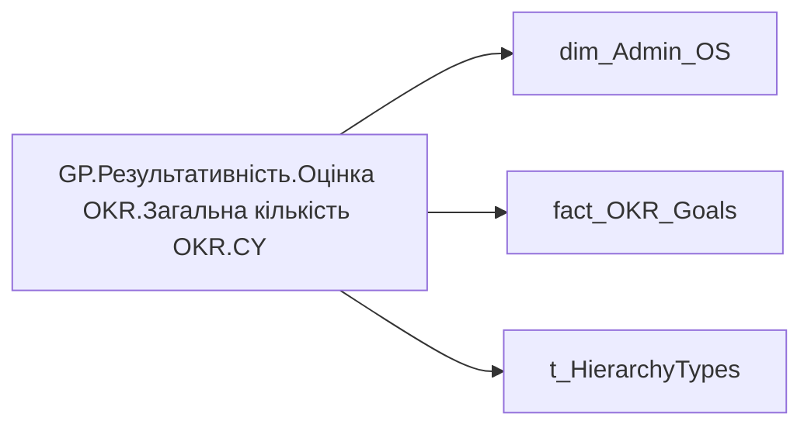

# GP.Результативність.Оцінка OKR.Загальна кількість OKR.CY

*тека `Group_Profile\Результативність та оцінка\Оцінка OKR`*

!!! abstract "Джерела даних"
    `DM.R27_fact_OKR_Goals`, `DM.vw_R27_dim_Employee_Access_List`

## Бізнес-суть

!!! note "Бізнес-визначення відсутнє"
    Поля міри не зіставлено з wiki «Таблицями джерел даних». Можна заповнити вручну в `manualNotes`.

## На сторінках звіту

[Group Profile](../report/group-profile.md)

## Пов'язані міри

**Використовується в:** [GP.Результативність.Оцінка OKR.Середня кількість KR на OKR.CY](../measures/gp-rezultatyvnist-otsinka-okr-serednia-kilkist-kr-na-okr-cy.md), [GP.Результативність.Оцінка OKR.Середня кількість OKR.CY](../measures/gp-rezultatyvnist-otsinka-okr-serednia-kilkist-okr-cy.md)

---

## Технічний опис

| Властивість | Значення |
|---|---|
| Тип | міра |
| Home table | _Measures |
| displayFolder | `Group_Profile\Результативність та оцінка\Оцінка OKR` |
| formatString | — |
| dataType | — |
| Прихована | ні |

### DAX

```dax
VAR _roleIndex = SELECTEDVALUE ( 't_HierarchyTypes'[Index], 1 )   -- 0 = LT, 1 = Admin

VAR _filter_admin = VALUES('dim_Admin_OS'[EMPLOYEE_ID])
VAR _filter_lt = 
CALCULATETABLE(
    VALUES('dim_Admin_OS'[EMPLOYEE_ID]), 
    TREATAS(VALUES( dim_Admin_LT_OS[USER_ACCESS_ID] ), 'dim_Admin_OS'[USER_ACCESS_ID]))

VAR _admin = 
CALCULATE(
    COUNTA('fact_OKR_Goals'[OKR_OBJECTIVE_ID]),
    TREATAS(_filter_admin, 'fact_OKR_Goals'[EMPLOYEE_ID]))

VAR _admin_lt = 
CALCULATE(
    COUNTA('fact_OKR_Goals'[OKR_OBJECTIVE_ID]),
    TREATAS(_filter_lt, 'fact_OKR_Goals'[EMPLOYEE_ID]))

VAR _res =
	SWITCH (
		_roleIndex,
		0, _admin_lt,    -- LT
		1, _admin,       -- Admin
		_admin
	)

RETURN _res
```

### Джерела даних

Вихідні таблиці: `DM.R27_fact_OKR_Goals`, `DM.vw_R27_dim_Employee_Access_List`

Колонки: `EMPLOYEE_ID`, `Index`, `OKR_OBJECTIVE_ID`, `USER_ACCESS_ID`

Power Query: `dim_Admin_OS`

### Залежності (таблиці й колонки)

Таблиці: `dim_Admin_OS`, `fact_OKR_Goals`, `t_HierarchyTypes`

Колонки: `dim_Admin_OS[EMPLOYEE_ID]`, `dim_Admin_OS[USER_ACCESS_ID]`, `fact_OKR_Goals[EMPLOYEE_ID]`, `fact_OKR_Goals[OKR_OBJECTIVE_ID]`, `t_HierarchyTypes[Index]`

### Схема



## Нотатки

_порожньо_
