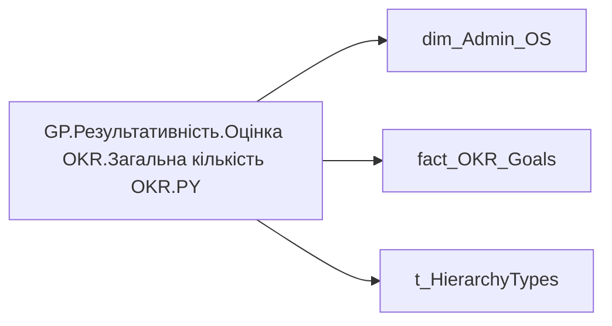

# GP.Результативність.Оцінка OKR.Загальна кількість OKR.PY

| Властивість | Значення |
|---|---|
| Тип | міра |
| Home table | _Measures |
| displayFolder | `Group_Profile\Результативність та оцінка\Оцінка OKR` |
| formatString | `0` |
| dataType | — |
| Прихована | ні |

## DAX

```dax
VAR _roleIndex = SELECTEDVALUE ( 't_HierarchyTypes'[Index], 1 )   -- 0 = LT, 1 = Admin

VAR _filter_admin = VALUES('dim_Admin_OS'[EMPLOYEE_ID])
VAR _filter_lt = 
CALCULATETABLE(
    VALUES('dim_Admin_OS'[EMPLOYEE_ID]), 
    TREATAS(VALUES( dim_Admin_LT_OS[USER_ACCESS_ID] ), 'dim_Admin_OS'[USER_ACCESS_ID]))

VAR _admin = 
CALCULATE(
    COUNTA('fact_OKR_Goals'[OKR_OBJECTIVE_ID]),
    TREATAS(_filter_admin, 'fact_OKR_Goals'[EMPLOYEE_ID]),
    SELECTEDVALUE('fact_OKR_Goals'[PLAN_YEAR]) - 1 = 'fact_OKR_Goals'[PLAN_YEAR])

VAR _admin_lt = 
CALCULATE(
    COUNTA('fact_OKR_Goals'[OKR_OBJECTIVE_ID]),
    TREATAS(_filter_lt, 'fact_OKR_Goals'[EMPLOYEE_ID]),
    SELECTEDVALUE('fact_OKR_Goals'[PLAN_YEAR]) - 1 = 'fact_OKR_Goals'[PLAN_YEAR])

VAR _res =
	SWITCH (
		_roleIndex,
		0, _admin_lt,    -- LT
		1, _admin,       -- Admin
		_admin
	)

RETURN _res
```

## Джерела

Вихідні таблиці: `DM.R27_fact_OKR_Goals`, `DM.vw_R27_dim_Employee_Access_List`

Колонки: `EMPLOYEE_ID`, `Index`, `OKR_OBJECTIVE_ID`, `PLAN_YEAR`, `USER_ACCESS_ID`

Power Query: `dim_Admin_OS`

## Бізнес-суть

PLAN_YEAR → Рік ОКР; PLAN_YEAR → Значення останнього року оцінки ОКР; PLAN_YEAR → Значення передостаннього  року оцінки ОКР

Останнє доступне значення станом на дату поточного запису, релевантне відповідній оцінці результативності. Значення останнього року оцінки ОКР визначати в залежності від того, які дані доступні на поточний момент. Наприклад, протягом 2025 року в оцінку брати коефіцієнт індивідуального бонусу працівника за 2023-2024 роки, бо за 2025 рік оцінки ще немає. Тому останній рік буде 2024. На початку 2026 року, коли з'являться результати оцінки ОКР за 2025 рік, потрібно буде змістити період і брати 2025 рік.  <br>  <br>Для того, що визначити період (рік), за який виставлено індивідуальний бонус, потріб

**Вимоги:** `Індивідуальний-профіль-працівника/Історія-по-посадам`, `Індивідуальний-профіль-працівника/Історія-по-посадам/Реліз-1.-Історія-по-посадам`, `Індивідуальний-профіль-працівника/Паспортна-частина-індивідуального-профілю-співробітника`, `Індивідуальний-профіль-працівника/Паспортна-частина-індивідуального-профілю-співробітника/Сторінка-Картка-(паспорт)-працівника/Редизайн-паспортної-частини`, `Індивідуальний-профіль-працівника/Сторінка-Результативність-та-оцінка`, `Допоміжні-вітрини-для-звіту/Таблиця-для-розрахунку-агрегованих-метрик-по-звіту`, `Командний-профіль/Паспортна-частина-групового-профілю/Редизайн-паспортної-частини-групового-профілю`, `Командний-профіль/Сторінка-Результативність-та-оцінка-команди/Створити-блок-Виконання-OKR`

## Залежності

Таблиці: `dim_Admin_OS`, `fact_OKR_Goals`, `t_HierarchyTypes`

Колонки: `dim_Admin_OS[EMPLOYEE_ID]`, `dim_Admin_OS[USER_ACCESS_ID]`, `fact_OKR_Goals[EMPLOYEE_ID]`, `fact_OKR_Goals[OKR_OBJECTIVE_ID]`, `fact_OKR_Goals[PLAN_YEAR]`, `t_HierarchyTypes[Index]`

## Схема



## Нотатки

_порожньо_
