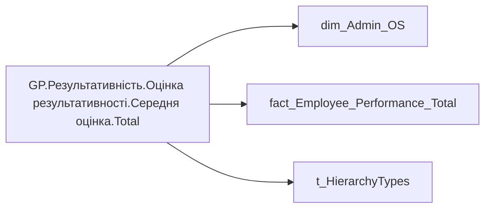

# GP.Результативність.Оцінка результативності.Середня оцінка.Total

*тека `Group_Profile\Результативність та оцінка\Оцінка результативності` · формат `0.00`*

## Технічний опис

| Властивість | Значення |
|---|---|
| Тип | міра |
| Home table | _Measures |
| displayFolder | `Group_Profile\Результативність та оцінка\Оцінка результативності` |
| formatString | `0.00` |
| dataType | — |
| Прихована | ні |

### DAX

```dax
VAR _roleIndex = SELECTEDVALUE ( 't_HierarchyTypes'[Index], 1 )   -- 0 = LT, 1 = Admin
VAR _filter_lt= TREATAS(VALUES( dim_Admin_LT_OS[USER_ACCESS_ID] ), 'dim_Admin_OS'[USER_ACCESS_ID])

VAR _admin = 
CALCULATE(
    AVERAGEA('fact_Employee_Performance_Total'[General_Performance_Desc_Rate]))

VAR _admin_lt = 
CALCULATE(
    AVERAGEA('fact_Employee_Performance_Total'[General_Performance_Desc_Rate]),
    _filter_lt)

VAR _res =
	SWITCH (
		_roleIndex,
		0, _admin_lt,    -- LT
		1, _admin,       -- Admin
		_admin
	)

RETURN _res
```

### Джерела даних

Вихідні таблиці: `DM.vw_R27_dim_Employee_Access_List`, `DM.vw_R27_fact_Employee_Performance_General_PBI`

Колонки: `General_Performance_Desc_Rate`, `Index`, `USER_ACCESS_ID`

Power Query: `dim_Admin_OS`

### Залежності (таблиці й колонки)

Таблиці: `dim_Admin_OS`, `fact_Employee_Performance_Total`, `t_HierarchyTypes`

Колонки: `dim_Admin_OS[USER_ACCESS_ID]`, `fact_Employee_Performance_Total[General_Performance_Desc_Rate]`, `t_HierarchyTypes[Index]`

### Схема



---

## Бізнес-суть

General_Performance_Desc_Rate → Бал оцінки результативності; General_Performance_Desc_Rate → Загальна оцінка; General_Performance_Desc_Rate → Загальна оцінка співробітника за останній період (рік); General_Performance_Desc_Rate → Загальна оцінка співробітника за передостанній період (рік); General_Performance_Desc_Rate → Остання доступна оцінка керівника,  бал

Останнє НЕ пусте актуальне значення на дату (date) поточного запису Останнє НЕ пусте актуальне значення на дату (date) поточного запису. Відбираємо один будь-який рядок по даті запуску форми оцінювання. Якщо у працівника є дві оцінки (форми) за один період, від адміністративного та функціонального керівника, то потрібно вивести середньоарифметичне значення

**Вимоги:** `Індивідуальний-профіль-працівника/Історія-по-посадам`, `Індивідуальний-профіль-працівника/Історія-по-посадам/Реліз-1.-Історія-по-посадам`, `Індивідуальний-профіль-працівника/Паспортна-частина-індивідуального-профілю-співробітника/Сторінка-Картка-(паспорт)-працівника/ТЗ-на-побудову-візуала-Павутинка-по-оцінці-результативності-працівника`, `Індивідуальний-профіль-працівника/Сторінка-Результативність-та-оцінка`, `Допоміжні-вітрини-для-звіту/Таблиця-для-розрахунку-агрегованих-метрик-по-звіту`, `Командний-профіль/Паспортна-частина-групового-профілю/Редизайн-паспортної-частини-групового-профілю`, `Командний-профіль/Сторінка-Моя-команда/ТЗ.-Деталізація-метрик-групового-профілю-звіту`, `Командний-профіль/Сторінка-Результативність-та-оцінка-команди`

## На сторінках звіту

[Group Profile](../report/group-profile.md)

## Пов'язані міри

_Прямих зв'язків з іншими мірами немає._

## Нотатки

_порожньо_
