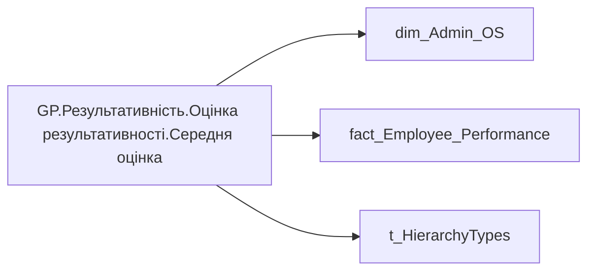

# GP.Результативність.Оцінка результативності.Середня оцінка

| Властивість | Значення |
|---|---|
| Тип | міра |
| Home table | _Measures |
| displayFolder | `Group_Profile\Результативність та оцінка\Оцінка результативності` |
| formatString | — |
| dataType | — |
| Прихована | ні |

## DAX

```dax
VAR _roleIndex = SELECTEDVALUE ( 't_HierarchyTypes'[Index], 1 )   -- 0 = LT, 1 = Admin
VAR _filter_lt= TREATAS(VALUES( dim_Admin_LT_OS[USER_ACCESS_ID] ), 'dim_Admin_OS'[USER_ACCESS_ID])

VAR _admin = 
CALCULATE(
    AVERAGEA('fact_Employee_Performance'[OFFICIAL_RATE]))

VAR _admin_lt = 
CALCULATE(
    AVERAGEA('fact_Employee_Performance'[OFFICIAL_RATE]),
    _filter_lt)

VAR _res =
	SWITCH (
		_roleIndex,
		0, _admin_lt,    -- LT
		1, _admin,       -- Admin
		_admin
	)

RETURN _res
```

## Джерела

Вихідні таблиці: `DM.vw_R27_dim_Employee_Access_List`, `DM.vw_R27_fact_Employee_Performance_PBI`

Колонки: `Index`, `OFFICIAL_RATE`, `USER_ACCESS_ID`

Power Query: `dim_Admin_OS`

## Бізнес-суть

OFFICIAL_RATE → Оцінка керівника (Офіційна оцінка компетенції); OFFICIAL_RATE → Оцінка кожного індикатора керівником

**Вимоги:** `Індивідуальний-профіль-працівника/Паспортна-частина-індивідуального-профілю-співробітника/Зміна-джерела-даних-для-павутинки-Оцінка-результативності`, `Індивідуальний-профіль-працівника/Паспортна-частина-індивідуального-профілю-співробітника/Сторінка-Картка-(паспорт)-працівника/ТЗ-на-побудову-візуала-Павутинка-по-оцінці-результативності-працівника`, `Індивідуальний-профіль-працівника/Сторінка-Результативність-та-оцінка`, `Командний-профіль/Паспортна-частина-групового-профілю/Редизайн-паспортної-частини-групового-профілю`, `Командний-профіль/Сторінка-Моя-команда/ТЗ.-Деталізація-метрик-групового-профілю-звіту`, `Командний-профіль/Сторінка-Результативність-та-оцінка-команди`

## Залежності

Таблиці: `dim_Admin_OS`, `fact_Employee_Performance`, `t_HierarchyTypes`

Колонки: `dim_Admin_OS[USER_ACCESS_ID]`, `fact_Employee_Performance[OFFICIAL_RATE]`, `t_HierarchyTypes[Index]`

## Схема



## Нотатки

_порожньо_
