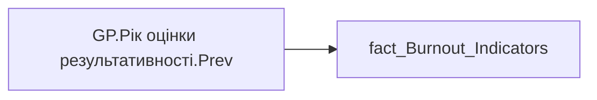

# GP.Рік оцінки результативності.Prev

| Властивість | Значення |
|---|---|
| Тип | міра |
| Home table | _Measures |
| displayFolder | `Group_Profile\_Main\SVG` |
| formatString | — |
| dataType | — |
| Прихована | ні |

## DAX

```dax
"Оцінка результативності " &
AVERAGE('fact_Burnout_Indicators'[PREV_YEAR_PERFORMANCE])
```

## Джерела


Колонки: `PREV_YEAR_PERFORMANCE`

Power Query: `fact_Burnout_Indicators`

## Бізнес-суть

PREV_YEAR_PERFORMANCE → Значення передостаннього  року оцінки результативності; PREV_YEAR_PERFORMANCE → Значення передостанній  року оцінки результативності

Ці дані виводяться в деталізацію по тренду оцінки результативності

**Вимоги:** `Індивідуальний-профіль-працівника/Паспортна-частина-індивідуального-профілю-співробітника/Сторінка-Картка-(паспорт)-працівника/Додати-інформацію-про-оцінку-результативності-працівника-в-Картку-працівника`, `Кейс-Утримання-працівників/Опис-джерел-для-сторінки-%22Кейс-звільнення-(вигорання)%22`, `Командний-профіль/Паспортна-частина-групового-профілю/Додати-інформацію-про-ОКР-команди-та-середню-оцінку-результативності-по-команді`

## Залежності

Таблиці: `fact_Burnout_Indicators`

Колонки: `fact_Burnout_Indicators[PREV_YEAR_PERFORMANCE]`

## Схема



## Нотатки

_порожньо_
