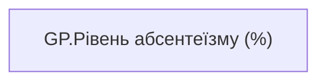

# GP.Рівень абсентеїзму (%)

*тека `Group_Profile\_Main\Ризики та фокуси уваги`*

## Бізнес-суть

Рівень абсентеїзму (%)

Розрахункове поле.  <br>Коефіцієнт абсентизму розраховується по команді за попередні 12 місяців, НЕ включаючи поточний місяць. Розрахунок треба проводити за кожен період, так як FTE_employee може змінюватися.  <br>АБСЕНТЕЇЗМ= (Кількість днів на лікарняному, крім днів на лікарняному по вагітності та пологам) по кожному працівнику та періоду/(відпрацьовані робочі дні у місяці*FTE_employee + дні на лік-му (без днів на лікарняному по вагітності та пологам) по кожному працівнику та періоду, де Кількість днів на лікарняному крім днів на лікарняному по вагітності та пологам = Sick_Leave_Day_Without_P

**Вимоги:** `Командний-профіль/Паспортна-частина-групового-профілю/Редизайн-паспортної-частини-групового-профілю`

## На сторінках звіту

[Group Profile](../report/group-profile.md)

## Пов'язані міри

**Використовує:** [5AC.Коефіцієнт абсентеїзму](../measures/5ac-koefitsiient-absenteizmu.md)

---

## Технічний опис

| Властивість | Значення |
|---|---|
| Тип | міра |
| Home table | _Measures |
| displayFolder | `Group_Profile\_Main\Ризики та фокуси уваги` |
| formatString | — |
| dataType | — |
| Прихована | ні |

### DAX

```dax
TRIM(
	FORMAT(
		COALESCE([5AC.Коефіцієнт абсентеїзму], 0),
		"0.00%"
	) 
)
```

### Джерела даних

—

### Залежності (таблиці й колонки)

—

### Схема



## Нотатки

_порожньо_
