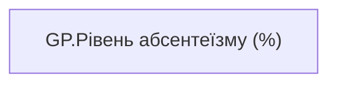

# GP.Рівень абсентеїзму (%)

*тека `Group_Profile\_Main\Ризики та фокуси уваги`*

## Технічний опис

| Властивість | Значення |
|---|---|
| Тип | міра |
| Home table | _Measures |
| displayFolder | `Group_Profile\_Main\Ризики та фокуси уваги` |
| formatString | — |
| dataType | — |
| Прихована | ні |

### DAX

```dax
TRIM(
	FORMAT(
		COALESCE([5AC.Коефіцієнт абсентеїзму], 0),
		"0.00%"
	) 
)
```

### Джерела даних

—

### Залежності (таблиці й колонки)

—

### Схема



---

## Бізнес-суть

**Бізнес-назва:** Рівень абсентеїзму (%)

### Опис із ТЗ

Розрахункове поле.   Коефіцієнт абсентизму розраховується по команді за попередні 12 місяців, НЕ включаючи поточний місяць. Розрахунок треба проводити за кожен період, так як `FTE_employee` може змінюватися.   АБСЕНТЕЇЗМ= (Кількість днів на лікарняному, крім днів на лікарняному по вагітності та пологам) по кожному працівнику та періоду/(відпрацьовані робочі дні у місяці*`FTE_employee` + дні на лік-му (без днів на лікарняному по вагітності та пологам) по кожному працівнику та періоду, де Кількість днів на лікарняному крім днів на лікарняному по вагітності та пологам = Sick_Leave_Day_Without_PregnancyВідпрацьовані робочих днів у місяці = `FTE_weighted_work_day_for_absenteeism`

**Вимоги (ТЗ):**

- [Командний профіль › Паспортна частина групового профілю › Редизайн паспортної частини групового профілю](https://dev.azure.com/MHPITDepProjects/People%20Digital%20Profile%20%28PDP%29/_wiki/wikis/PDP.wiki?pagePath=/%D0%A4%D1%83%D0%BD%D0%BA%D1%86%D1%96%D0%BE%D0%BD%D0%B0%D0%BB%D1%8C%D0%BD%D1%96%20%D0%B2%D0%B8%D0%BC%D0%BE%D0%B3%D0%B8/%D0%92%D0%B8%D0%BC%D0%BE%D0%B3%D0%B8%20%D0%B4%D0%BE%20%D0%B7%D0%B2%D1%96%D1%82%D1%83%20People%20Digital%20Profile/%D0%9A%D0%BE%D0%BC%D0%B0%D0%BD%D0%B4%D0%BD%D0%B8%D0%B9%20%D0%BF%D1%80%D0%BE%D1%84%D1%96%D0%BB%D1%8C/%D0%9F%D0%B0%D1%81%D0%BF%D0%BE%D1%80%D1%82%D0%BD%D0%B0%20%D1%87%D0%B0%D1%81%D1%82%D0%B8%D0%BD%D0%B0%20%D0%B3%D1%80%D1%83%D0%BF%D0%BE%D0%B2%D0%BE%D0%B3%D0%BE%20%D0%BF%D1%80%D0%BE%D1%84%D1%96%D0%BB%D1%8E/%D0%A0%D0%B5%D0%B4%D0%B8%D0%B7%D0%B0%D0%B9%D0%BD%20%D0%BF%D0%B0%D1%81%D0%BF%D0%BE%D1%80%D1%82%D0%BD%D0%BE%D1%97%20%D1%87%D0%B0%D1%81%D1%82%D0%B8%D0%BD%D0%B8%20%D0%B3%D1%80%D1%83%D0%BF%D0%BE%D0%B2%D0%BE%D0%B3%D0%BE%20%D0%BF%D1%80%D0%BE%D1%84%D1%96%D0%BB%D1%8E)

## На сторінках звіту

- [Group Profile](../report/group-profile.md) — Версія 1, Версія 2 › Ризики та фокуси уваги

## Пов'язані міри

**Використовує:** [5AC.Коефіцієнт абсентеїзму](../measures/5ac-koefitsiient-absenteizmu.md)

## Нотатки

_порожньо_
