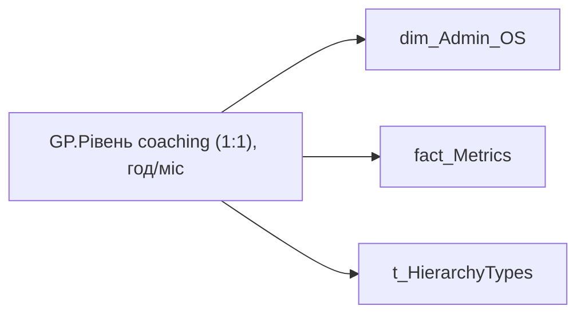

# GP.Рівень coaching (1:1), год/міс

*тека `Group_Profile\_Main\Ризики та фокуси уваги`*

## Технічний опис

| Властивість | Значення |
|---|---|
| Тип | міра |
| Home table | _Measures |
| displayFolder | `Group_Profile\_Main\Ризики та фокуси уваги` |
| formatString | — |
| dataType | — |
| Прихована | ні |

### DAX

```dax
//************* ROLE FILTERS **************
VAR _filter_lt = TREATAS(VALUES(dim_Admin_LT_OS[USER_ACCESS_ID]), 'dim_Admin_OS'[USER_ACCESS_ID])

/* *********** ADMIN *********** */
VAR _admin =
CALCULATE(
	DIVIDE(
		SUM('fact_Metrics'[MEETING_WITH_MANAGER_ONE_TO_ONE_HOUR]),
		COUNT('fact_Metrics'[MEETING_WITH_MANAGER_ONE_TO_ONE_HOUR]), "-"),
	FILTER('fact_Metrics', 'fact_Metrics'[IS_MAIN_POSITION] = TRUE()))

/* *********** ADMIN LT *********** */
VAR _admin_lt =
CALCULATE(
	DIVIDE(
		SUM('fact_Metrics'[MEETING_WITH_MANAGER_ONE_TO_ONE_HOUR]),
		COUNT('fact_Metrics'[MEETING_WITH_MANAGER_ONE_TO_ONE_HOUR]), "-"),
	FILTER('fact_Metrics', 'fact_Metrics'[IS_MAIN_POSITION] = TRUE()),
	_filter_lt)

VAR _res = 
	SWITCH(
		SELECTEDVALUE( t_HierarchyTypes[Index] ),
		0, DIVIDE(_admin_lt, 3, BLANK()),
		1, DIVIDE(_admin, 3, BLANK())
	)

/* *********** RESULT *********** */
RETURN 
TRIM(
    COALESCE(ROUND(_res, 2), 0))
```

### Джерела даних

Вихідні таблиці: `DM.vw_R27_dim_Employee_Access_List`

Колонки: `IS_MAIN_POSITION`, `Index`, `MEETING_WITH_MANAGER_ONE_TO_ONE_HOUR`, `USER_ACCESS_ID`

Power Query: `dim_Admin_OS`

### Залежності (таблиці й колонки)

Таблиці: `dim_Admin_OS`, `fact_Metrics`, `t_HierarchyTypes`

Колонки: `dim_Admin_OS[USER_ACCESS_ID]`, `fact_Metrics[IS_MAIN_POSITION]`, `fact_Metrics[MEETING_WITH_MANAGER_ONE_TO_ONE_HOUR]`, `t_HierarchyTypes[Index]`

### Схема



---

## Бізнес-суть

**Бізнес-назва:** Рівень coaching (1:1), год/міс

### Опис із ТЗ

Розраховується як відношення суми `MEETING_WITH_MANAGER_ONE_TO_ONE_HOUR` по всім членам команди за попередній місяць до загальної кількості команди

**Вимоги (ТЗ):**

- [Командний профіль › Паспортна частина групового профілю › Редизайн паспортної частини групового профілю](https://dev.azure.com/MHPITDepProjects/People%20Digital%20Profile%20%28PDP%29/_wiki/wikis/PDP.wiki?pagePath=/%D0%A4%D1%83%D0%BD%D0%BA%D1%86%D1%96%D0%BE%D0%BD%D0%B0%D0%BB%D1%8C%D0%BD%D1%96%20%D0%B2%D0%B8%D0%BC%D0%BE%D0%B3%D0%B8/%D0%92%D0%B8%D0%BC%D0%BE%D0%B3%D0%B8%20%D0%B4%D0%BE%20%D0%B7%D0%B2%D1%96%D1%82%D1%83%20People%20Digital%20Profile/%D0%9A%D0%BE%D0%BC%D0%B0%D0%BD%D0%B4%D0%BD%D0%B8%D0%B9%20%D0%BF%D1%80%D0%BE%D1%84%D1%96%D0%BB%D1%8C/%D0%9F%D0%B0%D1%81%D0%BF%D0%BE%D1%80%D1%82%D0%BD%D0%B0%20%D1%87%D0%B0%D1%81%D1%82%D0%B8%D0%BD%D0%B0%20%D0%B3%D1%80%D1%83%D0%BF%D0%BE%D0%B2%D0%BE%D0%B3%D0%BE%20%D0%BF%D1%80%D0%BE%D1%84%D1%96%D0%BB%D1%8E/%D0%A0%D0%B5%D0%B4%D0%B8%D0%B7%D0%B0%D0%B9%D0%BD%20%D0%BF%D0%B0%D1%81%D0%BF%D0%BE%D1%80%D1%82%D0%BD%D0%BE%D1%97%20%D1%87%D0%B0%D1%81%D1%82%D0%B8%D0%BD%D0%B8%20%D0%B3%D1%80%D1%83%D0%BF%D0%BE%D0%B2%D0%BE%D0%B3%D0%BE%20%D0%BF%D1%80%D0%BE%D1%84%D1%96%D0%BB%D1%8E)

## На сторінках звіту

- [Group Profile](../report/group-profile.md) — Версія 2 › Ризики та фокуси уваги

## Пов'язані міри

_Прямих зв'язків з іншими мірами немає._

## Нотатки

_порожньо_
