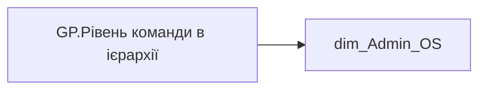

# GP.Рівень команди в ієрархії

*тека `Group_Profile\Загальна інформація`*

## Бізнес-суть

EMP_HIERARCHY_LEVEL → Рівень в ієрархії

Якщо значення в полі відсутнє, то потрібно визначити проблему та виправити

**Вимоги:** `Індивідуальний-профіль-працівника/Сторінка-Індивідуальний-профіль-працівника`

## На сторінках звіту

[Group Profile](../report/group-profile.md)

## Пов'язані міри

_Прямих зв'язків з іншими мірами немає._

---

## Технічний опис

| Властивість | Значення |
|---|---|
| Тип | міра |
| Home table | _Measures |
| displayFolder | `Group_Profile\Загальна інформація` |
| formatString | — |
| dataType | — |
| Прихована | ні |

### DAX

```dax
FIRSTNONBLANKVALUE(
	'dim_Admin_OS'[ORDER_NUM_2],
	MIN('dim_Admin_OS'[EMP_HIERARCHY_LEVEL])
)
```

### Джерела даних

Вихідні таблиці: `DM.vw_R27_dim_Employee_Access_List`

Колонки: `EMP_HIERARCHY_LEVEL`, `ORDER_NUM_2`

Power Query: `dim_Admin_OS`

### Залежності (таблиці й колонки)

Таблиці: `dim_Admin_OS`

Колонки: `dim_Admin_OS[EMP_HIERARCHY_LEVEL]`, `dim_Admin_OS[ORDER_NUM_2]`

### Схема



## Нотатки

_порожньо_
