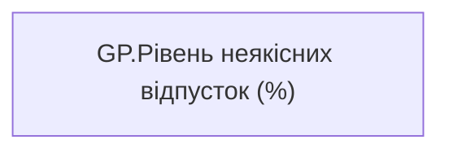

# GP.Рівень неякісних відпусток (%)

*тека `Group_Profile\_Main\Ризики та фокуси уваги`*

## Бізнес-суть

Рівень неякісних відпусток (%)

Це метрика, обернена до Доля співробітників з наявними відпустками понад 10 днів. Тобто 100% - показник Доля співробітників з наявними відпустками понад 10 днів.

**Вимоги:** `Командний-профіль/Паспортна-частина-групового-профілю/Редизайн-паспортної-частини-групового-профілю`

## На сторінках звіту

[Group Profile](../report/group-profile.md)

## Пов'язані міри

**Використовує:** [AC.Доля співробітників з відпустками понад 10 днів](../measures/ac-dolia-spivrobitnykiv-z-vidpustkamy-ponad-10-dniv.md)

---

## Технічний опис

| Властивість | Значення |
|---|---|
| Тип | міра |
| Home table | _Measures |
| displayFolder | `Group_Profile\_Main\Ризики та фокуси уваги` |
| formatString | — |
| dataType | — |
| Прихована | ні |

### DAX

```dax
VAR _res = 1 - [AC.Доля співробітників з відпустками понад 10 днів]

RETURN 
TRIM(COALESCE(FORMAT(_res, "##%"), 0))
```

### Джерела даних

—

### Залежності (таблиці й колонки)

—

### Схема



## Нотатки

_порожньо_
