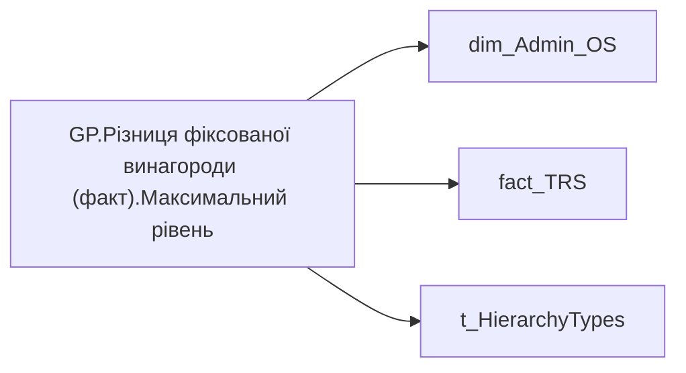

# GP.Різниця фіксованої винагороди (факт).Максимальний рівень

| Властивість | Значення |
|---|---|
| Тип | міра |
| Home table | _Measures |
| displayFolder | `Group_Profile\TRS` |
| formatString | `#,0` |
| dataType | — |
| Прихована | ні |

## DAX

```dax
//************* ROLE FILTERS **************
VAR _roleIndex = SELECTEDVALUE ( 't_HierarchyTypes'[Index], 1 )   -- 0 = LT, 1 = Admin
VAR _filter_lt = TREATAS ( VALUES ( 'dim_Admin_LT_OS'[USER_ACCESS_ID] ),dim_Admin_OS[USER_ACCESS_ID] )

/* *********** ADMIN *********** */
VAR _admin =
    VAR _Employees = VALUES('dim_Admin_OS'[USER_ACCESS_ID])
        VAR _table0 = 
            ADDCOLUMNS(
                _Employees,
                "@Indicator",
                CALCULATE(
                    SUM('fact_TRS'[PAYMENTS_FACT_UAH]),
                    'fact_TRS'[TRS_CATEGORY] = "Фіксована винагорода",
                    'fact_TRS'[is_payments_plan] = 1,
                    'fact_TRS'[PERIOD] = EOMONTH(TODAY(), -2) + 1,
                    'dim_Admin_OS'[IS_MANAGER] = FALSE())
            )
        VAR _ShareOfSomeIndicator = 
            MAXX(
                FILTER(
                    _table0, 
                    NOT ISBLANK([@Indicator]) && [@Indicator] > 0
                ), [@Indicator]
            )

        RETURN _ShareOfSomeIndicator

/* *********** ADMIN LT *********** */
VAR _admin_lt =
    VAR _Employees =VALUES('dim_Admin_OS'[USER_ACCESS_ID])
        VAR _table0 = 
            CALCULATETABLE(
                ADDCOLUMNS(
                    _Employees,
                    "@Indicator",
                    CALCULATE(
                        SUM('fact_TRS'[PAYMENTS_FACT_UAH]),
                        'fact_TRS'[TRS_CATEGORY] = "Фіксована винагорода",
                        'fact_TRS'[is_payments_plan] = 1,
                        'fact_TRS'[PERIOD] = EOMONTH(TODAY(), -2) + 1,
                        'dim_Admin_OS'[IS_MANAGER] = FALSE())),
                _filter_lt
            )
        VAR _ShareOfSomeIndicator = 
            MAXX(
                FILTER(
                    _table0, 
                    NOT ISBLANK([@Indicator]) && [@Indicator] > 0
                ), [@Indicator]
            )

        RETURN _ShareOfSomeIndicator
    
VAR _res = 
	SWITCH(
		_roleIndex,
		0, _admin_lt,
		1, _admin
	)
RETURN _res
```

## Джерела

Вихідні таблиці: `DM.vw_R27_dim_Employee_Access_List`, `DM.vw_R27_fact_TRS_PDP`

Колонки: `IS_MANAGER`, `Index`, `PAYMENTS_FACT_UAH`, `PERIOD`, `TRS_CATEGORY`, `USER_ACCESS_ID`, `is_payments_plan`

Power Query: `dim_Admin_OS`

## Бізнес-суть

IS_MANAGER → Кількість керівників; IS_MANAGER → Керівник; IS_MANAGER → Доля керівників серед всіх співробітників (%); IS_MANAGER → Керівник - ПІБ керівника команди; PAYMENTS_FACT_UAH → Зірка МХП; PAYMENTS_FACT_UAH → Наставництво (ост. 12 міс); PAYMENTS_FACT_UAH → Доплати за суміщення; PAYMENTS_FACT_UAH → Щомісячні премії; PAYMENTS_FACT_UAH → Квартальні премії; PAYMENTS_FACT_UAH → Річні бонуси; PAYMENTS_FACT_UAH → Інші доплати; PAYMENTS_FACT_UAH → Премія МХП Зірки; PAYMENTS_FACT_UAH → Проектний бонус за стратегічні ІТ проєкти; PAYMENTS_FACT_UAH → Інвестиційний проєктний бонус; PAYMENTS_FACT_UAH → Премія за збереження та розширення земельного банку; PAYMENTS_FACT_UAH → Разова премія за програмою визнання; PAYMENTS_FACT_UAH → Премія за внутрішнє тренерство; PAYMENTS_FACT_UAH → Доплата за наставництво; PAYMENTS_FACT_UAH → Премія за програмою «Приведи друга»; PAYMENTS_FACT_UAH → Премія за Банк ідей; PAYMENTS_FACT_UAH → Соціальна підтримка; PAYMENTS_FACT_UAH → Внутрішнє тренерство; PAYMENTS_FACT_UAH → Наставництво; PAYMENTS_FACT_UAH → Програма визнання; PAYMENTS_FACT_UAH → Сума нарахування; PAYMENTS_FACT_UAH → Місячний дохід з річним бонусом; PAYMENTS_FACT_UAH → Місячний дохід без річного бонусу; PAYMENTS_FACT_UAH → Доля команди із премією МХП Зірки, %; PAYMENTS_FACT_UAH → Доля команди із проектним бонусом за стратегічні ІТ проєкти, %; PAYMENTS_FACT_UAH → Доля команди із інвестиційним проєктним бонусом, %; PAYMENTS_FACT_UAH → Доля команди із премією за збереження та розширення земельного банку, %; PAYMENTS_FACT_UAH → Середній розмір премії МХП Зірки; PAYMENTS_FACT_UAH → Середній розмір проектного бонус за стратегічні ІТ проєкти; PAYMENTS_FACT_UAH → Середній розмір інвестиційного проєктного бонусу; PAYMENTS_FACT_UAH → Середній розмір премії за збереження та розширення земельного банку; PAYMENTS_FACT_UAH → Доля команди із разовою премією за програмою визнання, %; PAYMENTS_FACT_UAH → Доля команди із премією за внутрішнє тренерство, %; PAYMENTS_FACT_UAH → Доля команди із доплатою за наставництво, %; PAYMENTS_FACT_UAH → Доля команди із премією за програмою «Приведи друга», %; PAYMENTS_FACT_UAH → Доля команди із премією за Банк ідей, %; PAYMENTS_FACT_UAH → Середній розмір разової премії за програмою визнання; PAYMENTS_FACT_UAH → Середній розмір премії за внутрішнє тренерство; PAYMENTS_FACT_UAH → Середній розмір доплати за наставництво; PAYMENTS_FACT_UAH → Середній розмір премії за програмою «Приведи друга»; PAYMENTS_FACT_UAH → Середній розмір премії за Банк ідей; PAYMENTS_FACT_UAH → Доля команди з соціальними виплатами, %; PAYMENTS_FACT_UAH → Середній розмір соціальної підтримки; PAYMENTS_FACT_UAH → Середня заробітна плата; PAYMENTS_FACT_UAH → Діапазон фіксованої винагороди (факт); PAYMENTS_FACT_UAH → Доля команди з премією за місяць, % факт; PAYMENTS_FACT_UAH → Середній розмір премії за місяць факт; PAYMENTS_FACT_UAH → Доля команди з доплатою за шкідливі умови праці, % факт; PAYMENTS_FACT_UAH → Середній розмір доплати за шкідливі умови праці; PAYMENTS_FACT_UAH → Доля команди з доплатою за роз’їзний характер роботи, % факт; PAYMENTS_FACT_UAH → Середній розмір доплати за роз’їзний характер роботи факт; PAYMENTS_FACT_UAH → Доля команди із щомісячними преміями; PAYMENTS_FACT_UAH → Середній розмір щомісячних премій; PAYMENTS_FACT_UAH → Доля команди із квартальними преміями; PAYMENTS_FACT_UAH → Середній розмір квартальних премій; PAYMENTS_FACT_UAH → Доля команди із річними бонусами; PAYMENTS_FACT_UAH → Середній розмір річних бонусів; PAYMENTS_FACT_UAH → Доля команди із доплатами за суміщення; PAYMENTS_FACT_UAH → Середній розмір доплат за суміщення; PAYMENTS_FACT_UAH → Соціальні виплати; PERIOD → Дата нарахування премії Зірка МХП; PERIOD → Дата; PERIOD → Період нарахування; PERIOD → Період

Відібрати із переліку усіх членів команди тих, у кого поле is_manager = 1 Якщо lead team - то ПІБ керівника цієї команди (поточного користувача).  <br>Якщо структурна одиниця- ПІБ керівника визначати по кадровому підрозділу цієї одиниці.  <br>Потрібно відібрати в кадровому підрозділі запис в якому is_manager =true та вивести ПІБ.  <br>Якщо для кадрового підрозділу відсутній такий запис, то вивести "Дані відсутні"  <br>Це поле має бути доступне у візуалізаціях, побудованих на основі фактової таблиці [dm.vw_R27_fact_Employee_List]. Керівником вважається той працівник, який має підлеглих. Потрібн

**Вимоги:** `Індивідуальний-профіль-працівника/Історія-по-посадам`, `Індивідуальний-профіль-працівника/Історія-по-посадам/Реліз-1.-Історія-по-посадам`, `Індивідуальний-профіль-працівника/Паспортна-частина-індивідуального-профілю-співробітника`, `Індивідуальний-профіль-працівника/Паспортна-частина-індивідуального-профілю-співробітника/Бейджики-під-фото-працівника`, `Індивідуальний-профіль-працівника/Паспортна-частина-індивідуального-профілю-співробітника/Сторінка-Картка-(паспорт)-працівника/Редизайн-паспортної-частини`, `Індивідуальний-профіль-працівника/Сторінка-Взаємодія-Viva-та-залученість-працівника`, `Індивідуальний-профіль-працівника/Сторінка-Винагорода-працівника`, `Індивідуальний-профіль-працівника/Сторінка-Винагорода-працівника/Деталізація-на-сторінці-Винагорода`, `Індивідуальний-профіль-працівника/Сторінка-Винагорода-працівника/Доопрацювання-сторінки-ТРС`, `Допоміжні-вітрини-для-звіту/Таблиця-(вью)-для-розрахунку-метрики-Укомплектованість-штату`, `Допоміжні-вітрини-для-звіту/Таблиця-періодична-(попередні-12-міс)-для-розрахунку-метрики-Середній-дохід`, `Командний-профіль/Паспортна-частина-групового-профілю/Редизайн-паспортної-частини-групового-профілю`, `Командний-профіль/Паспортна-частина-групового-профілю/Сторінка-Картка-команди`, `Командний-профіль/Сторінка-TRS-команди`, `Командний-профіль/Сторінка-TRS-команди/Доопрацювання-сторінки-TRS`, `Командний-профіль/Сторінка-TRS-команди/Сторінка-Винагорода-групового-профілю#вимоги-до-звіту`, `Командний-профіль/Сторінка-Ефективність`, `Командний-профіль/Сторінка-Загальна-інформація-про-команду`, `Командний-профіль/Сторінка-Моя-команда/ТЗ.-Деталізація-метрик-групового-профілю-звіту`

## Залежності

Таблиці: `dim_Admin_OS`, `fact_TRS`, `t_HierarchyTypes`

Колонки: `dim_Admin_LT_OS[USER_ACCESS_ID]`, `dim_Admin_OS[IS_MANAGER]`, `dim_Admin_OS[USER_ACCESS_ID]`, `fact_TRS[PAYMENTS_FACT_UAH]`, `fact_TRS[PERIOD]`, `fact_TRS[TRS_CATEGORY]`, `fact_TRS[is_payments_plan]`, `t_HierarchyTypes[Index]`

## Схема



## Нотатки

_порожньо_
