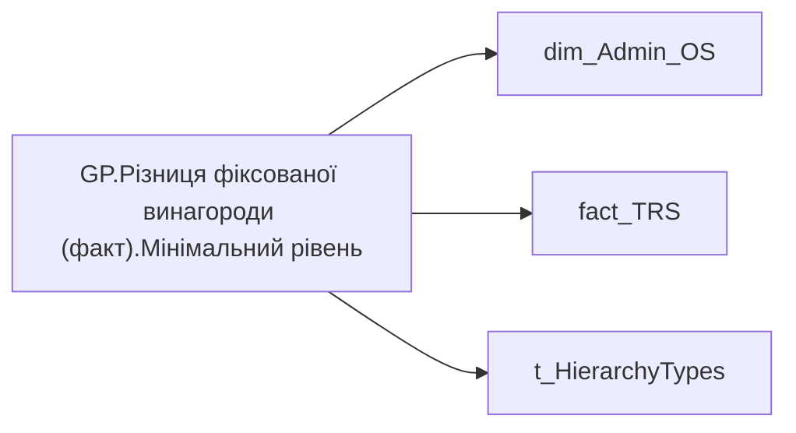

# GP.Різниця фіксованої винагороди (факт).Мінімальний рівень

*тека `Group_Profile\TRS` · формат `#,0`*

## Технічний опис

| Властивість | Значення |
|---|---|
| Тип | міра |
| Home table | _Measures |
| displayFolder | `Group_Profile\TRS` |
| formatString | `#,0` |
| dataType | — |
| Прихована | ні |

### DAX

```dax
//************* ROLE FILTERS **************
VAR _roleIndex = SELECTEDVALUE ( 't_HierarchyTypes'[Index], 1 )   -- 0 = LT, 1 = Admin
VAR _filter_lt = TREATAS ( VALUES ( 'dim_Admin_LT_OS'[USER_ACCESS_ID] ),dim_Admin_OS[USER_ACCESS_ID] )

/* *********** ADMIN *********** */
VAR _admin =
    VAR _Employees = VALUES('dim_Admin_OS'[USER_ACCESS_ID])
        VAR _table0 = 
            ADDCOLUMNS(
                _Employees,
                "@Indicator",
                CALCULATE(
                    SUM('fact_TRS'[PAYMENTS_FACT_UAH]),
                    'fact_TRS'[TRS_CATEGORY] = "Фіксована винагорода",
                    'fact_TRS'[is_payments_plan] = 1,
                    'fact_TRS'[PERIOD] = EOMONTH(TODAY(), -2) + 1,
                    'dim_Admin_OS'[IS_MANAGER] = FALSE())
            )
        VAR _ShareOfSomeIndicator = 
            MINX(
                FILTER(
                    _table0, 
                    NOT ISBLANK([@Indicator]) && [@Indicator] > 0
                ), [@Indicator]
            )

        RETURN _ShareOfSomeIndicator

/* *********** ADMIN LT *********** */
VAR _admin_lt =
    VAR _Employees =VALUES('dim_Admin_OS'[USER_ACCESS_ID])
        VAR _table0 = 
            CALCULATETABLE(
                ADDCOLUMNS(
                    _Employees,
                    "@Indicator",
                    CALCULATE(
                        SUM('fact_TRS'[PAYMENTS_FACT_UAH]),
                        'fact_TRS'[TRS_CATEGORY] = "Фіксована винагорода",
                        'fact_TRS'[is_payments_plan] = 1,
                        'fact_TRS'[PERIOD] = EOMONTH(TODAY(), -2) + 1,
                        'dim_Admin_OS'[IS_MANAGER] = FALSE())),
                _filter_lt
            )
        VAR _ShareOfSomeIndicator = 
            MINX(
                FILTER(
                    _table0, 
                    NOT ISBLANK([@Indicator]) && [@Indicator] > 0
                ), [@Indicator]
            )

        RETURN _ShareOfSomeIndicator
    
VAR _res = 
	SWITCH(
		_roleIndex,
		0, _admin_lt,
		1, _admin
	)
RETURN _res
```

### Джерела даних

Вихідні таблиці: `DM.vw_R27_dim_Employee_Access_List`, `DM.vw_R27_fact_TRS_PDP`

Колонки: `IS_MANAGER`, `Index`, `PAYMENTS_FACT_UAH`, `PERIOD`, `TRS_CATEGORY`, `USER_ACCESS_ID`, `is_payments_plan`

Power Query: `dim_Admin_OS`

### Залежності (таблиці й колонки)

Таблиці: `dim_Admin_OS`, `fact_TRS`, `t_HierarchyTypes`

Колонки: `dim_Admin_LT_OS[USER_ACCESS_ID]`, `dim_Admin_OS[IS_MANAGER]`, `dim_Admin_OS[USER_ACCESS_ID]`, `fact_TRS[PAYMENTS_FACT_UAH]`, `fact_TRS[PERIOD]`, `fact_TRS[TRS_CATEGORY]`, `fact_TRS[is_payments_plan]`, `t_HierarchyTypes[Index]`

### Схема



---

## Бізнес-суть

!!! note "Бізнес-визначення відсутнє"
    Поля міри не зіставлено з wiki «Таблицями джерел даних». Можна заповнити вручну в `manualNotes`.

## На сторінках звіту

[Group Profile](../report/group-profile.md) · [Підсказка "Мін винагорода (факт)"](../report/pidskazka-min-vynahoroda-fakt.md)

## Пов'язані міри

**Використовується в:** [GP.Різниця фіксованої винагороди (факт).Різниця](../measures/gp-riznytsia-fiksovanoi-vynahorody-fakt-riznytsia.md)

## Нотатки

_порожньо_
