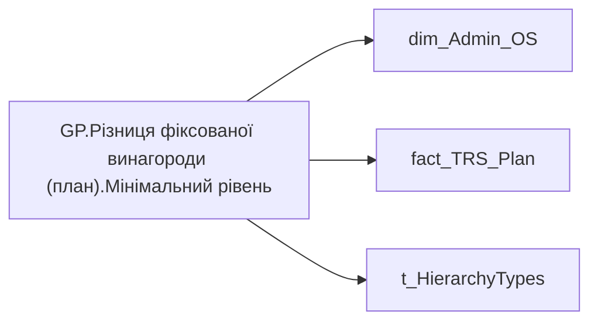

# GP.Різниця фіксованої винагороди (план).Мінімальний рівень

*тека `Group_Profile\TRS` · формат `#,0`*

## Технічний опис

| Властивість | Значення |
|---|---|
| Тип | міра |
| Home table | _Measures |
| displayFolder | `Group_Profile\TRS` |
| formatString | `#,0` |
| dataType | — |
| Прихована | ні |

### DAX

```dax
//************* ROLE FILTERS **************
VAR _roleIndex = SELECTEDVALUE ( 't_HierarchyTypes'[Index], 1 )   -- 0 = LT, 1 = Admin
VAR _filter_lt = TREATAS ( VALUES ( 'dim_Admin_LT_OS'[USER_ACCESS_ID] ),dim_Admin_OS[USER_ACCESS_ID] )

/* *********** ADMIN *********** */
VAR _admin =
    VAR _Employees =VALUES('dim_Admin_OS'[USER_ACCESS_ID])
        VAR _table0 = 
            ADDCOLUMNS(
                _Employees,
                "@Indicator",
                CALCULATE(
                    SUM('fact_TRS_Plan'[PAYMENT_PLAN_SUM]),
                    'fact_TRS_Plan'[CATEGORY_NAME] = "Фіксована винагорода",
                    'fact_TRS_Plan'[IS_ACTUAL] = TRUE(),
                    ('fact_TRS_Plan'[END_DATE] > TODAY() || 'fact_TRS_Plan'[END_DATE] = DATE(2001, 01, 01)),
                    'dim_Admin_OS'[IS_MANAGER] = FALSE())
            )
        VAR _ShareOfSomeIndicator = 
            MINX(
                FILTER(
                    _table0, 
                    NOT ISBLANK([@Indicator]) && [@Indicator] > 0
                ), [@Indicator]
            )

        RETURN _ShareOfSomeIndicator

/* *********** ADMIN LT *********** */
VAR _admin_lt =
    VAR _Employees =VALUES('dim_Admin_OS'[USER_ACCESS_ID])
        VAR _table0 = 
            CALCULATETABLE(
                ADDCOLUMNS(
                    _Employees,
                    "@Indicator",
                    CALCULATE(
                        SUM('fact_TRS_Plan'[PAYMENT_PLAN_SUM]),
                        'fact_TRS_Plan'[CATEGORY_NAME] = "Фіксована винагорода",
                        'fact_TRS_Plan'[IS_ACTUAL] = TRUE(),
                        ('fact_TRS_Plan'[END_DATE] > TODAY() || 'fact_TRS_Plan'[END_DATE] = DATE(2001, 01, 01)),
                        'dim_Admin_OS'[IS_MANAGER] = FALSE())),
                _filter_lt
            )
        VAR _ShareOfSomeIndicator = 
            MINX(
                FILTER(
                    _table0, 
                    NOT ISBLANK([@Indicator]) && [@Indicator] > 0
                ), [@Indicator]
            )

        RETURN _ShareOfSomeIndicator
    
VAR _res = 
	SWITCH(
		_roleIndex,
		0, _admin_lt,
		1, _admin
	)
RETURN 
COALESCE(_res, "-")
```

### Джерела даних

Вихідні таблиці: `DM.vw_R27_dim_Employee_Access_List`, `DM.vw_R27_fact_TRS_Plan_PDP`

Колонки: `CATEGORY_NAME`, `END_DATE`, `IS_ACTUAL`, `IS_MANAGER`, `Index`, `PAYMENT_PLAN_SUM`, `USER_ACCESS_ID`

Power Query: `dim_Admin_OS`

### Залежності (таблиці й колонки)

Таблиці: `dim_Admin_OS`, `fact_TRS_Plan`, `t_HierarchyTypes`

Колонки: `dim_Admin_LT_OS[USER_ACCESS_ID]`, `dim_Admin_OS[IS_MANAGER]`, `dim_Admin_OS[USER_ACCESS_ID]`, `fact_TRS_Plan[CATEGORY_NAME]`, `fact_TRS_Plan[END_DATE]`, `fact_TRS_Plan[IS_ACTUAL]`, `fact_TRS_Plan[PAYMENT_PLAN_SUM]`, `t_HierarchyTypes[Index]`

### Схема



---

## Бізнес-суть

IS_MANAGER → Кількість керівників; IS_MANAGER → Керівник; IS_MANAGER → Доля керівників серед всіх співробітників (%); IS_MANAGER → Керівник - ПІБ керівника команди; CATEGORY_NAME → Назва блоку; END_DATE → Термін без відпустки в днях по пріоритетному місцю роботи на поточну дату; PAYMENT_PLAN_SUM → Річний цільовий дохід; PAYMENT_PLAN_SUM → Розмір фіксованої винагороди плановий, за місяць ПОТОЧНИЙ; PAYMENT_PLAN_SUM → Сума (на поточний момент); PAYMENT_PLAN_SUM → Середній розмір премії за місяць; PAYMENT_PLAN_SUM → Доля учасників із зміною фіксованої винагороди; PAYMENT_PLAN_SUM → Діапазон фіксованої винагороди (план)

Відібрати із переліку усіх членів команди тих, у кого поле is_manager = 1 Якщо lead team - то ПІБ керівника цієї команди (поточного користувача).  <br>Якщо структурна одиниця- ПІБ керівника визначати по кадровому підрозділу цієї одиниці.  <br>Потрібно відібрати в кадровому підрозділі запис в якому is_manager =true та вивести ПІБ.  <br>Якщо для кадрового підрозділу відсутній такий запис, то вивести "Дані відсутні"  <br>Це поле має бути доступне у візуалізаціях, побудованих на основі фактової таблиці [dm.vw_R27_fact_Employee_List]. Керівником вважається той працівник, який має підлеглих. TODAY -

**Вимоги:** `Індивідуальний-профіль-працівника/Історія-по-посадам`, `Індивідуальний-профіль-працівника/Історія-по-посадам/Реліз-1.-Історія-по-посадам`, `Індивідуальний-профіль-працівника/Сторінка-Винагорода-працівника`, `Індивідуальний-профіль-працівника/Сторінка-Винагорода-працівника/Деталізація-на-сторінці-Винагорода`, `Індивідуальний-профіль-працівника/Сторінка-Винагорода-працівника/Доопрацювання-сторінки-ТРС`, `Індивідуальний-профіль-працівника/Сторінка-Результативність-та-оцінка/Блок-Оцінка-компетенцій`, `Допоміжні-вітрини-для-звіту/Таблиця-для-розрахунку-агрегованих-метрик-по-звіту`, `Командний-профіль/Паспортна-частина-групового-профілю/Редизайн-паспортної-частини-групового-профілю`, `Командний-профіль/Паспортна-частина-групового-профілю/Сторінка-Картка-команди`, `Командний-профіль/Сторінка-TRS-команди`, `Командний-профіль/Сторінка-TRS-команди/Доопрацювання-сторінки-TRS`, `Командний-профіль/Сторінка-TRS-команди/Сторінка-Винагорода-групового-профілю#вимоги-до-звіту`, `Командний-профіль/Сторінка-Ефективність`, `Командний-профіль/Сторінка-Загальна-інформація-про-команду`, `Командний-профіль/Сторінка-Результативність-та-оцінка-команди/Блок-Оцінка-компетенцій-(груповий-профіль)`

## На сторінках звіту

[Group Profile](../report/group-profile.md) · [Підсказка "Мін винагорода (план)"](../report/pidskazka-min-vynahoroda-plan.md)

## Пов'язані міри

**Використовується в:** [GP.Різниця фіксованої винагороди (план).Різниця](../measures/gp-riznytsia-fiksovanoi-vynahorody-plan-riznytsia.md)

## Нотатки

_порожньо_
