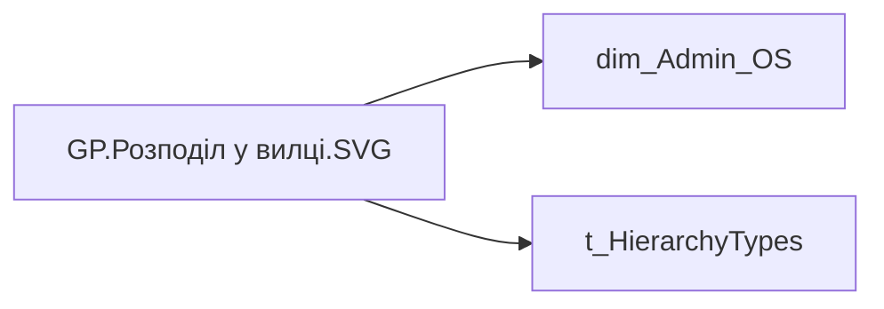

# GP.Розподіл у вилці.SVG

*тека `Group_Profile\TRS`*

## Технічний опис

| Властивість | Значення |
|---|---|
| Тип | міра |
| Home table | _Measures |
| displayFolder | `Group_Profile\TRS` |
| formatString | — |
| dataType | — |
| Прихована | ні |

### DAX

```dax
/* ═══════════ РОЗМІРИ ═══════════ */
VAR _W       = 300
VAR _H       = 135
VAR _LabelW  = 90
VAR _BarMaxW = 165
VAR _ValW    = 40
VAR _RowH    = 25
VAR _TopPad  = 6
VAR _LeftPad = 4

/* ═══════════ РОЛІ / ФІЛЬТР ═══════════ */
VAR _roleIndex  = SELECTEDVALUE ( 't_HierarchyTypes'[Index], 1 )
VAR _filter_lt  = TREATAS ( VALUES ( 'dim_Admin_LT_OS'[USER_ACCESS_ID] ), 'dim_Admin_OS'[USER_ACCESS_ID] )

/* ═══════════ ОБЧИСЛЕННЯ ADMIN ═══════════ */
VAR _UsersRaw_Admin =
    ADDCOLUMNS (
        VALUES ( 'dim_Admin_OS'[USER_ACCESS_ID] ),
        "@pos", CALCULATE ( SELECTEDVALUE ( 'Fact_Burnout_Indicators'[SALARY_RANGE] ) )
    )

VAR _Total_Admin    = COUNTROWS ( _UsersRaw_Admin )
VAR _BelowMin_Admin = COUNTROWS ( FILTER ( _UsersRaw_Admin, [@pos] = "Нижче мінімума" ) )
VAR _MinMid_Admin   = COUNTROWS ( FILTER ( _UsersRaw_Admin, [@pos] = "Мінімум-середина" ) )
VAR _Mid_Admin      = COUNTROWS ( FILTER ( _UsersRaw_Admin, [@pos] = "Середина" ) )
VAR _MidMax_Admin   = COUNTROWS ( FILTER ( _UsersRaw_Admin, [@pos] = "Середина-максимум" ) )

/* ═══════════ ОБЧИСЛЕННЯ LT ═══════════ */
VAR _UsersRaw_LT =
    CALCULATETABLE (
        ADDCOLUMNS (
            VALUES ( 'dim_Admin_OS'[USER_ACCESS_ID] ),
            "@pos", CALCULATE ( SELECTEDVALUE ( 'Fact_Burnout_Indicators'[SALARY_RANGE] ) )
        ),
        _filter_lt
    )

VAR _Total_LT    = COUNTROWS ( _UsersRaw_LT )
VAR _BelowMin_LT = COUNTROWS ( FILTER ( _UsersRaw_LT, [@pos] = "Нижче мінімума" ) )
VAR _MinMid_LT   = COUNTROWS ( FILTER ( _UsersRaw_LT, [@pos] = "Мінімум-середина" ) )
VAR _Mid_LT      = COUNTROWS ( FILTER ( _UsersRaw_LT, [@pos] = "Середина" ) )
VAR _MidMax_LT   = COUNTROWS ( FILTER ( _UsersRaw_LT, [@pos] = "Середина-максимум" ) )

/* ═══════════ ВИБІР РОЛІ ═══════════ */
VAR _Total    = SWITCH ( _roleIndex, 0, _Total_LT,    _Total_Admin )
VAR _BelowMin = SWITCH ( _roleIndex, 0, _BelowMin_LT, _BelowMin_Admin )
VAR _MinMid   = SWITCH ( _roleIndex, 0, _MinMid_LT,   _MinMid_Admin )
VAR _Mid      = SWITCH ( _roleIndex, 0, _Mid_LT,      _Mid_Admin )
VAR _MidMax   = SWITCH ( _roleIndex, 0, _MidMax_LT,   _MidMax_Admin )
VAR _NoData   = _Total - _BelowMin - _MinMid - _Mid - _MidMax

/* ═══════════ ЧАСТКИ ═══════════ */
VAR _P_NoData   = DIVIDE ( _NoData,   _Total, 0 )
VAR _P_BelowMin = DIVIDE ( _BelowMin, _Total, 0 )
VAR _P_MinMid   = DIVIDE ( _MinMid,   _Total, 0 )
VAR _P_Mid      = DIVIDE ( _Mid,      _Total, 0 )
VAR _P_MidMax   = DIVIDE ( _MidMax,   _Total, 0 )

/* ═══════════ ДИНАМІЧНИЙ МАСШТАБ ═══════════ */
// Знаходимо максимальну частку та встановлюємо вісь як 120% від цього максимуму
VAR _MaxPct  = MAX ( _P_NoData, MAX ( _P_BelowMin, MAX ( _P_MinMid, MAX ( _P_Mid, _P_MidMax ) ) ) )
VAR _AxisMax = IF ( _MaxPct = 0, 1, _MaxPct * 1.2 )

/* ═══════════ СТИЛІ ═══════════ */
VAR _ColText = "#1F4E79"
VAR _ColSub  = "#5A7FA8"
VAR _ColBg   = "#FFFFFF"
VAR _ColGrid = "#C8D8EC"
VAR _C0      = "#B0BEC5"
VAR _C1      = "#E53935"
VAR _C2      = "#FB8C00"
VAR _C3      = "#43A047"
VAR _C4      = "#1E88E5"
VAR _FmtPct  = "0%"

/* ═══════════ РЯДКИ БАРІВ ═══════════ */
VAR _Row0 =
    VAR _idx    = 0
    VAR _lbl    = "Дані відсутні"
    VAR _pct    = _P_NoData
    VAR _col    = _C0
    VAR _cnt    = _NoData
    VAR _y      = _TopPad + _idx * _RowH
    VAR _bw     = ROUND ( DIVIDE ( _pct, _AxisMax ) * _BarMaxW, 1 )
    VAR _pctTxt = SUBSTITUTE ( FORMAT ( _pct, _FmtPct ), ".", "," )
    RETURN
    "<g>" &
        "<text x='" & _LeftPad & "' y='" & (_y + 19) & "' font-family='Segoe UI' font-size='10' fill='" & _ColText & "' font-weight='600'>" & _lbl & "</text>" &
        "<rect x='" & _LabelW & "' y='" & (_y + 6) & "' width='" & _BarMaxW & "' height='14' rx='4' fill='" & _ColGrid & "' opacity='0.5'/>" &
        IF ( _bw > 0,
            "<rect x='" & _LabelW & "' y='" & (_y + 6) & "' width='" & _bw & "' height='14' rx='4' fill='" & _col & "'>" &
                "<title>" & _lbl & ": " & _pctTxt & " (" & _cnt & ")</title>" &
            "</rect>", "" ) &
        "<text x='" & (_LabelW + _BarMaxW + 8) & "' y='" & (_y + 19) & "' font-family='Segoe UI' font-size='11' fill='" & _ColSub & "'>" & _pctTxt & "</text>" &
    "</g>"

VAR _Row1 =
    VAR _idx    = 1
    VAR _lbl    = "Нижче мін"
    VAR _pct    = _P_BelowMin
    VAR _col    = _C1
    VAR _cnt    = _BelowMin
    VAR _y      = _TopPad + _idx * _RowH
    VAR _bw     = ROUND ( DIVIDE ( _pct, _AxisMax ) * _BarMaxW, 1 )
    VAR _pctTxt = SUBSTITUTE ( FORMAT ( _pct, _FmtPct ), ".", "," )
    RETURN
    "<g>" &
        "<text x='" & _LeftPad & "' y='" & (_y + 19) & "' font-family='Segoe UI' font-size='10' fill='" & _ColText & "' font-weight='600'>" & _lbl & "</text>" &
        "<rect x='" & _LabelW & "' y='" & (_y + 6) & "' width='" & _BarMaxW & "' height='14' rx='4' fill='" & _ColGrid & "' opacity='0.5'/>" &
        IF ( _bw > 0,
            "<rect x='" & _LabelW & "' y='" & (_y + 6) & "' width='" & _bw & "' height='14' rx='4' fill='" & _col & "'>" &
                "<title>" & _lbl & ": " & _pctTxt & " (" & _cnt & ")</title>" &
            "</rect>", "" ) &
        "<text x='" & (_LabelW + _BarMaxW + 8) & "' y='" & (_y + 19) & "' font-family='Segoe UI' font-size='11' fill='" & _ColSub & "'>" & _pctTxt & "</text>" &
    "</g>"

VAR _Row2 =
    VAR _idx    = 2
    VAR _lbl    = "Мін-середина"
    VAR _pct    = _P_MinMid
    VAR _col    = _C2
    VAR _cnt    = _MinMid
    VAR _y      = _TopPad + _idx * _RowH
    VAR _bw     = ROUND ( DIVIDE ( _pct, _AxisMax ) * _BarMaxW, 1 )
    VAR _pctTxt = SUBSTITUTE ( FORMAT ( _pct, _FmtPct ), ".", "," )
    RETURN
    "<g>" &
        "<text x='" & _LeftPad & "' y='" & (_y + 19) & "' font-family='Segoe UI' font-size='10' fill='" & _ColText & "' font-weight='600'>" & _lbl & "</text>" &
        "<rect x='" & _LabelW & "' y='" & (_y + 6) & "' width='" & _BarMaxW & "' height='14' rx='4' fill='" & _ColGrid & "' opacity='0.5'/>" &
        IF ( _bw > 0,
            "<rect x='" & _LabelW & "' y='" & (_y + 6) & "' width='" & _bw & "' height='14' rx='4' fill='" & _col & "'>" &
                "<title>" & _lbl & ": " & _pctTxt & " (" & _cnt & ")</title>" &
            "</rect>", "" ) &
        "<text x='" & (_LabelW + _BarMaxW + 8) & "' y='" & (_y + 19) & "' font-family='Segoe UI' font-size='11' fill='" & _ColSub & "'>" & _pctTxt & "</text>" &
    "</g>"

VAR _Row3 =
    VAR _idx    = 3
    VAR _lbl    = "Середина"
    VAR _pct    = _P_Mid
    VAR _col    = _C3
    VAR _cnt    = _Mid
    VAR _y      = _TopPad + _idx * _RowH
    VAR _bw     = ROUND ( DIVIDE ( _pct, _AxisMax ) * _BarMaxW, 1 )
    VAR _pctTxt = SUBSTITUTE ( FORMAT ( _pct, _FmtPct ), ".", "," )
    RETURN
    "<g>" &
        "<text x='" & _LeftPad & "' y='" & (_y + 19) & "' font-family='Segoe UI' font-size='10' fill='" & _ColText & "' font-weight='600'>" & _lbl & "</text>" &
        "<rect x='" & _LabelW & "' y='" & (_y + 6) & "' width='" & _BarMaxW & "' height='14' rx='4' fill='" & _ColGrid & "' opacity='0.5'/>" &
        IF ( _bw > 0,
            "<rect x='" & _LabelW & "' y='" & (_y + 6) & "' width='" & _bw & "' height='14' rx='4' fill='" & _col & "'>" &
                "<title>" & _lbl & ": " & _pctTxt & " (" & _cnt & ")</title>" &
            "</rect>", "" ) &
        "<text x='" & (_LabelW + _BarMaxW + 8) & "' y='" & (_y + 19) & "' font-family='Segoe UI' font-size='11' fill='" & _ColSub & "'>" & _pctTxt & "</text>" &
    "</g>"

VAR _Row4 =
    VAR _idx    = 4
    VAR _lbl    = "Сер-максимум"
    VAR _pct    = _P_MidMax
    VAR _col    = _C4
    VAR _cnt    = _MidMax
    VAR _y      = _TopPad + _idx * _RowH
    VAR _bw     = ROUND ( DIVIDE ( _pct, _AxisMax ) * _BarMaxW, 1 )
    VAR _pctTxt = SUBSTITUTE ( FORMAT ( _pct, _FmtPct ), ".", "," )
    RETURN
    "<g>" &
        "<text x='" & _LeftPad & "' y='" & (_y + 19) & "' font-family='Segoe UI' font-size='10' fill='" & _ColText & "' font-weight='600'>" & _lbl & "</text>" &
        "<rect x='" & _LabelW & "' y='" & (_y + 6) & "' width='" & _BarMaxW & "' height='14' rx='4' fill='" & _ColGrid & "' opacity='0.5'/>" &
        IF ( _bw > 0,
            "<rect x='" & _LabelW & "' y='" & (_y + 6) & "' width='" & _bw & "' height='14' rx='4' fill='" & _col & "'>" &
                "<title>" & _lbl & ": " & _pctTxt & " (" & _cnt & ")</title>" &
            "</rect>", "" ) &
        "<text x='" & (_LabelW + _BarMaxW + 8) & "' y='" & (_y + 19) & "' font-family='Segoe UI' font-size='11' fill='" & _ColSub & "'>" & _pctTxt & "</text>" &
    "</g>"

/* ═══════════ ЗБІРКА SVG ═══════════ */
RETURN
COALESCE (
    "<svg xmlns='http://www.w3.org/2000/svg' viewBox='0 0 " & _W & " " & _H & "' overflow='hidden'>" &
        "<rect width='" & _W & "' height='" & _H & "' fill='" & _ColBg & "' rx='6'/>" &
        _Row0 & _Row1 & _Row2 & _Row3 & _Row4 &
    "</svg>",
    "-"
)
```

### Джерела даних

Вихідні таблиці: `DM.vw_R27_dim_Employee_Access_List`

Колонки: `Index`, `SALARY_RANGE`, `USER_ACCESS_ID`

Power Query: `dim_Admin_OS`

### Залежності (таблиці й колонки)

Таблиці: `dim_Admin_OS`, `t_HierarchyTypes`

Колонки: `Fact_Burnout_Indicators[SALARY_RANGE]`, `dim_Admin_LT_OS[USER_ACCESS_ID]`, `dim_Admin_OS[USER_ACCESS_ID]`, `t_HierarchyTypes[Index]`

### Схема



---

## Бізнес-суть

!!! note "Бізнес-визначення відсутнє"
    Поля міри не зіставлено з wiki «Таблицями джерел даних». Можна заповнити вручну в `manualNotes`.

## На сторінках звіту

[Group Profile](../report/group-profile.md)

## Пов'язані міри

_Прямих зв'язків з іншими мірами немає._

## Нотатки

_порожньо_
