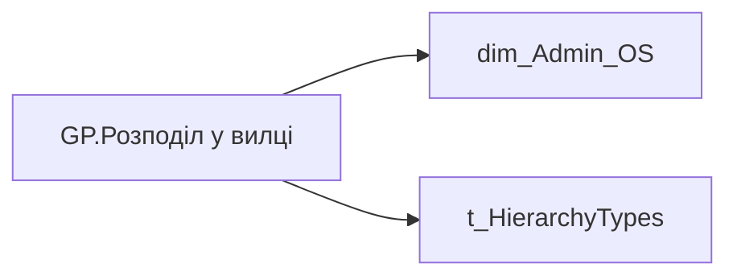

# GP.Розподіл у вилці

*тека `Group_Profile\TRS`*

## Бізнес-суть

SALARY_RANGE → Зарплата (вилки)

**Вимоги:** `Кейс-Утримання-працівників/Опис-джерел-для-сторінки-%22Кейс-звільнення-(вигорання)%22`

## На сторінках звіту

_Не використовується на основних сторінках звіту._

## Пов'язані міри

_Прямих зв'язків з іншими мірами немає._

---

## Технічний опис

| Властивість | Значення |
|---|---|
| Тип | міра |
| Home table | _Measures |
| displayFolder | `Group_Profile\TRS` |
| formatString | — |
| dataType | — |
| Прихована | ні |

### DAX

```dax
VAR _roleIndex = SELECTEDVALUE ( 't_HierarchyTypes'[Index], 1 )   -- 0 = LT, 1 = Admin
VAR _filter_lt = TREATAS ( VALUES ( 'dim_Admin_LT_OS'[USER_ACCESS_ID] ),'dim_Admin_OS'[USER_ACCESS_ID] )

/* *********** ADMIN *********** */
VAR _admin =
	VAR _eps = 1e-6
	VAR _UsersPosition =
		ADDCOLUMNS (
			VALUES('dim_Admin_OS'[USER_ACCESS_ID]),
			"@position",
			CALCULATE(SELECTEDVALUE('Fact_Burnout_Indicators'[SALARY_RANGE]))
		)
	VAR _TotalUsers = COUNTROWS(_UsersPosition)
	VAR C_BelowMin = COUNTROWS(FILTER(_UsersPosition, [@position] = "Нижче мінімума"))
	VAR C_MinMid = COUNTROWS(FILTER(_UsersPosition, [@position] = "Мінімум-середина"))
	VAR C_Mid = COUNTROWS(FILTER(_UsersPosition, [@position] = "Середина"))
	VAR C_MidMax = COUNTROWS(FILTER(_UsersPosition, [@position] = "Середина-максимум"))
	VAR _Format = "0.00%"
	RETURN 
		"Дані відсутні - " & SUBSTITUTE ( FORMAT (1 - DIVIDE(C_BelowMin+C_MinMid+C_Mid+C_MidMax, _TotalUsers), _Format ), ".", "," ) & UNICHAR ( 10 ) &
		"Нижче мінімума - " & SUBSTITUTE ( FORMAT ( DIVIDE(C_BelowMin, _TotalUsers), _Format ), ".", "," ) & UNICHAR ( 10 ) &
		"Мінімум-середина - " & SUBSTITUTE ( FORMAT ( DIVIDE(C_MinMid, _TotalUsers), _Format ), ".", "," ) & UNICHAR ( 10 ) &
		"Середина - " & SUBSTITUTE ( FORMAT ( DIVIDE(C_Mid, _TotalUsers), _Format ), ".", "," ) & UNICHAR ( 10 ) &
		"Середина-максимум - " & SUBSTITUTE ( FORMAT ( DIVIDE(C_MidMax, _TotalUsers), _Format ), ".", "," )

/* *********** LT *********** */
VAR _admin_lt =
	VAR _eps = 1e-6
	VAR _UsersPosition =
		CALCULATETABLE(
            ADDCOLUMNS (
                VALUES('dim_Admin_OS'[USER_ACCESS_ID]),
                "@position",
                CALCULATE(SELECTEDVALUE('Fact_Burnout_Indicators'[SALARY_RANGE]))
            ),
            _filter_lt
        )
	VAR _TotalUsers = COUNTROWS(_UsersPosition)
	VAR C_BelowMin = COUNTROWS(FILTER(_UsersPosition, [@position] = "Нижче мінімума"))
	VAR C_MinMid = COUNTROWS(FILTER(_UsersPosition, [@position] = "Мінімум-середина"))
	VAR C_Mid = COUNTROWS(FILTER(_UsersPosition, [@position] = "Середина"))
	VAR C_MidMax = COUNTROWS(FILTER(_UsersPosition, [@position] = "Середина-максимум"))
	VAR _Format = "0.00%"
	RETURN
		"Дані відсутні - " & SUBSTITUTE ( FORMAT (1 - DIVIDE(C_BelowMin+C_MinMid+C_Mid+C_MidMax, _TotalUsers), _Format ), ".", "," ) & UNICHAR ( 10 ) &
		"Нижче мінімума - " & SUBSTITUTE ( FORMAT ( DIVIDE(C_BelowMin, _TotalUsers), _Format ), ".", "," ) & UNICHAR ( 10 ) &
		"Мінімум-середина - " & SUBSTITUTE ( FORMAT ( DIVIDE(C_MinMid, _TotalUsers), _Format ), ".", "," ) & UNICHAR ( 10 ) &
		"Середина - " & SUBSTITUTE ( FORMAT ( DIVIDE(C_Mid, _TotalUsers), _Format ), ".", "," ) & UNICHAR ( 10 ) &
		"Середина-максимум - " & SUBSTITUTE ( FORMAT ( DIVIDE(C_MidMax, _TotalUsers), _Format ), ".", "," )

VAR _res =
	SWITCH (
		_roleIndex,
		0, _admin_lt,    -- LT
		1, _admin,       -- Admin
		_admin
	)
RETURN 
COALESCE(
	_res, "-")
```

### Джерела даних

Вихідні таблиці: `DM.vw_R27_dim_Employee_Access_List`

Колонки: `Index`, `SALARY_RANGE`, `USER_ACCESS_ID`

Power Query: `dim_Admin_OS`

### Залежності (таблиці й колонки)

Таблиці: `dim_Admin_OS`, `t_HierarchyTypes`

Колонки: `Fact_Burnout_Indicators[SALARY_RANGE]`, `dim_Admin_LT_OS[USER_ACCESS_ID]`, `dim_Admin_OS[USER_ACCESS_ID]`, `t_HierarchyTypes[Index]`

### Схема



## Нотатки

_порожньо_
