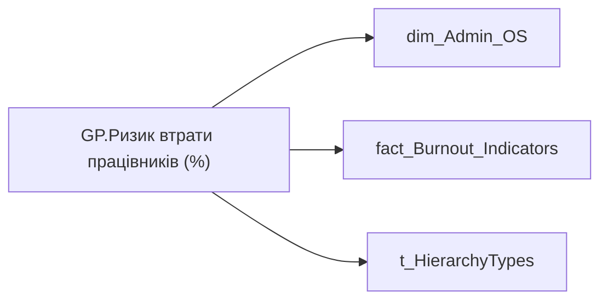

# GP.Ризик втрати працівників (%)

| Властивість | Значення |
|---|---|
| Тип | міра |
| Home table | _Measures |
| displayFolder | `Group_Profile\_Main\Ризики та фокуси уваги` |
| formatString | — |
| dataType | — |
| Прихована | ні |

## DAX

```dax
//************* ROLE FILTERS **************
VAR _filter_lt = TREATAS(VALUES(dim_Admin_LT_OS[USER_ACCESS_ID]), 'dim_Admin_OS'[USER_ACCESS_ID])

/* *********** ADMIN *********** */
VAR _count_risked_employee = 
CALCULATE(
	COUNTA('fact_Burnout_Indicators'[USER_ACCESS_ID]),
	'fact_Burnout_Indicators'[IS_FIRED] = FALSE(),
	'fact_Burnout_Indicators'[IS_TOTAL_RISK] = "Потребує уваги")

VAR _count_all_employee = 
CALCULATE(
	COUNTA('fact_Burnout_Indicators'[USER_ACCESS_ID]),
	FILTER(
		'fact_Burnout_Indicators',
		'fact_Burnout_Indicators'[IS_FIRED] = FALSE()))

VAR _admin =
CALCULATE(
	DIVIDE(
		_count_risked_employee,
		_count_all_employee, BLANK()))

/* *********** ADMIN LT *********** */
VAR _count_risked_employee_lt = 
CALCULATE(
	COUNTA('fact_Burnout_Indicators'[USER_ACCESS_ID]),
	'fact_Burnout_Indicators'[IS_FIRED] = FALSE(),
	'fact_Burnout_Indicators'[IS_TOTAL_RISK] = "Потребує уваги",
	_filter_lt)

VAR _count_all_employee_lt = 
CALCULATE(
	COUNTA('fact_Burnout_Indicators'[USER_ACCESS_ID]),
	'fact_Burnout_Indicators'[IS_FIRED] = FALSE(),
	_filter_lt)

VAR _admin_lt =
CALCULATE(
	DIVIDE(
		_count_risked_employee_lt,
		_count_all_employee_lt, BLANK()))

VAR _res = 
	SWITCH(
		SELECTEDVALUE( t_HierarchyTypes[Index] ),
		0, _admin_lt,
		1, _admin
	)

/* *********** RESULT *********** */
RETURN 
TRIM(
	FORMAT(
		COALESCE(_res, 0),
		"0.00%"
	) 
)
```

## Джерела

Вихідні таблиці: `DM.vw_R27_dim_Employee_Access_List`

Колонки: `IS_FIRED`, `IS_TOTAL_RISK`, `Index`, `USER_ACCESS_ID`

Power Query: `dim_Admin_OS`

## Бізнес-суть

IS_TOTAL_RISK → Ризик втрати працівника; IS_TOTAL_RISK → Ризик; IS_TOTAL_RISK → Ризик вигорання (%)

Це відсоток працівників, які знаходяться в статусі "Потребує уваги" = (кількість працівників в статусі "Потребує уваги"/загальну чисельність команди)*100%

**Вимоги:** `Індивідуальний-профіль-працівника/Паспортна-частина-індивідуального-профілю-співробітника`, `Індивідуальний-профіль-працівника/Паспортна-частина-індивідуального-профілю-співробітника/Сторінка-Картка-(паспорт)-працівника/Редизайн-паспортної-частини`, `Кейс-Утримання-працівників/Опис-джерел-для-сторінки-%22Кейс-звільнення-(вигорання)%22`, `Командний-профіль/Паспортна-частина-групового-профілю/Редизайн-паспортної-частини-групового-профілю`, `Командний-профіль/Сторінка-Моя-команда/ТЗ.-Деталізація-метрик-групового-профілю-звіту`

## Залежності

Таблиці: `dim_Admin_OS`, `fact_Burnout_Indicators`, `t_HierarchyTypes`

Колонки: `dim_Admin_OS[USER_ACCESS_ID]`, `fact_Burnout_Indicators[IS_FIRED]`, `fact_Burnout_Indicators[IS_TOTAL_RISK]`, `fact_Burnout_Indicators[USER_ACCESS_ID]`, `t_HierarchyTypes[Index]`

## Схема



## Нотатки

_порожньо_
