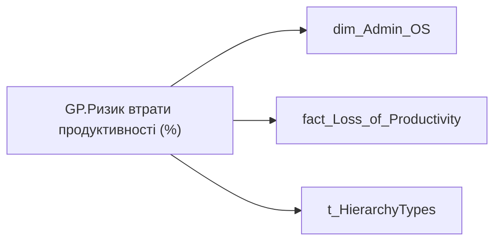

# GP.Ризик втрати продуктивності (%)

*тека `Group_Profile\_Main\Ризики та фокуси уваги`*

## Технічний опис

| Властивість | Значення |
|---|---|
| Тип | міра |
| Home table | _Measures |
| displayFolder | `Group_Profile\_Main\Ризики та фокуси уваги` |
| formatString | — |
| dataType | — |
| Прихована | ні |

### DAX

```dax
//************* ROLE FILTERS **************
VAR _filter_lt = TREATAS(VALUES(dim_Admin_LT_OS[USER_ACCESS_ID]), 'dim_Admin_OS'[USER_ACCESS_ID])

/* *********** ADMIN *********** */
VAR _count_risked_employee = 
CALCULATE(
	COUNTA('fact_Loss_of_Productivity'[USER_ACCESS_ID]),
	'fact_Loss_of_Productivity'[Total_Risk_Productive_Name] IN {"Ризик", "Помірний ризик"})

VAR _count_all_employee = 
CALCULATE(COUNTA('fact_Loss_of_Productivity'[USER_ACCESS_ID]))

VAR _admin =
CALCULATE(
	DIVIDE(
		_count_risked_employee,
		_count_all_employee, BLANK()))

/* *********** ADMIN LT *********** */
VAR _count_risked_employee_lt = 
CALCULATE(
	COUNTA('fact_Loss_of_Productivity'[USER_ACCESS_ID]),
	'fact_Loss_of_Productivity'[Total_Risk_Productive_Name] IN {"Ризик", "Помірний ризик"},
	_filter_lt)

VAR _count_all_employee_lt = 
CALCULATE(COUNTA('fact_Loss_of_Productivity'[USER_ACCESS_ID]), _filter_lt)

VAR _admin_lt =
CALCULATE(
	DIVIDE(
		_count_risked_employee_lt,
		_count_all_employee_lt, BLANK()),
	_filter_lt)

VAR _res = 
	SWITCH(
		SELECTEDVALUE( t_HierarchyTypes[Index] ),
		0, _admin_lt,
		1, _admin
	)

/* *********** RESULT *********** */
RETURN 
TRIM(
	FORMAT(
		COALESCE(_res, 0),
		"0.00%"
	) 
)
```

### Джерела даних

Вихідні таблиці: `DM.vw_R27_dim_Employee_Access_List`, `DM.vw_R27_fact_Loss_of_Productivity`

Колонки: `Index`, `Total_Risk_Productive_Name`, `USER_ACCESS_ID`

Power Query: `dim_Admin_OS`

### Залежності (таблиці й колонки)

Таблиці: `dim_Admin_OS`, `fact_Loss_of_Productivity`, `t_HierarchyTypes`

Колонки: `dim_Admin_OS[USER_ACCESS_ID]`, `fact_Loss_of_Productivity[Total_Risk_Productive_Name]`, `fact_Loss_of_Productivity[USER_ACCESS_ID]`, `t_HierarchyTypes[Index]`

### Схема



---

## Бізнес-суть

!!! note "Бізнес-визначення відсутнє"
    Поля міри не зіставлено з wiki «Таблицями джерел даних». Можна заповнити вручну в `manualNotes`.

## На сторінках звіту

[Group Profile](../report/group-profile.md)

## Пов'язані міри

_Прямих зв'язків з іншими мірами немає._

## Нотатки

_порожньо_
