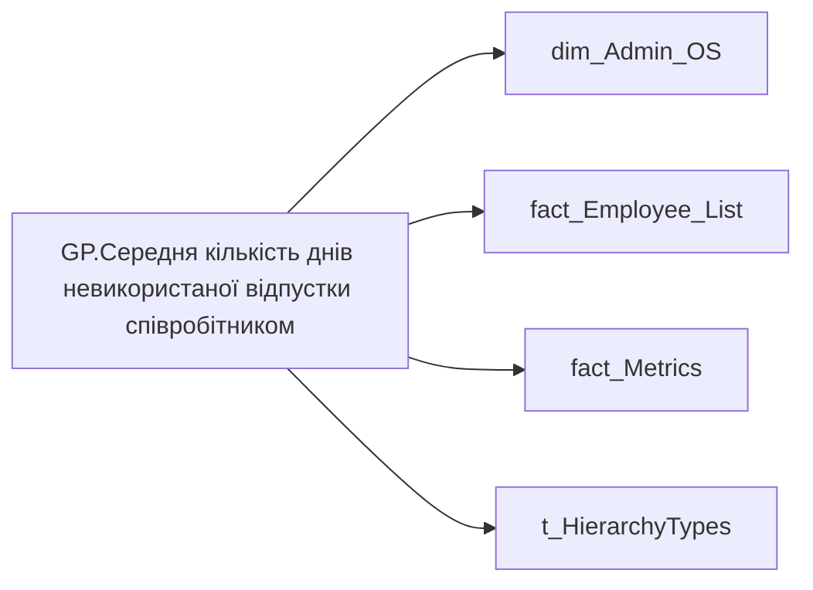

# GP.Середня кількість днів невикористаної відпустки співробітником

*тека `Group_Profile\_Main\Дані про команду`*

## Технічний опис

| Властивість | Значення |
|---|---|
| Тип | міра |
| Home table | _Measures |
| displayFolder | `Group_Profile\_Main\Дані про команду` |
| formatString | — |
| dataType | — |
| Прихована | ні |

### DAX

```dax
TRIM( 
		COALESCE( 
			FORMAT( [AC.Середня кількість днів невикористаної відпустки], "0.00" ), "-"
		)
	)

// VAR _admin =
//     AVERAGEX( 
//         VALUES( dim_Admin_OS[USER_ACCESS_ID] ), 
//         CALCULATE( 
//             SUM('fact_Metrics'[VACATION_RESERVE_BY_MAIN_POSITION])
//         )
//     )
// VAR _admin_lt =
//     CALCULATE(
//         AVERAGEX( 
//             VALUES( dim_Admin_OS[USER_ACCESS_ID] ), 
//             CALCULATE( 
//                 SUM('fact_Metrics'[VACATION_RESERVE_BY_MAIN_POSITION])
//             )
//         ),
//         TREATAS(VALUES( dim_Admin_LT_OS[USER_ACCESS_ID] ), fact_Employee_List[USER_ACCESS_ID])
//     )
// VAR _res = 
//     SWITCH(
//         SELECTEDVALUE( t_HierarchyTypes[Index] ),
//         0, _admin_lt,
//         1, _admin
//     )
// RETURN
//     TRIM( 
//         COALESCE( 
//             FORMAT( _res, "0.00" ), "-"
//         )
//     )
```

### Джерела даних

Вихідні таблиці: `DM.vw_R27_dim_Employee_Access_List`

Колонки: `Index`, `USER_ACCESS_ID`, `VACATION_RESERVE_BY_MAIN_POSITION`

Power Query: `dim_Admin_OS`

### Залежності (таблиці й колонки)

Таблиці: `dim_Admin_OS`, `fact_Employee_List`, `fact_Metrics`, `t_HierarchyTypes`

Колонки: `dim_Admin_OS[USER_ACCESS_ID]`, `fact_Employee_List[USER_ACCESS_ID]`, `fact_Metrics[VACATION_RESERVE_BY_MAIN_POSITION]`, `t_HierarchyTypes[Index]`

### Схема



---

## Бізнес-суть

### Опис із ТЗ

Це залишок днів відпусток, по яким формується резерв відпусток по підприємству /п)   Це поле має бути доступне у візуалізаціях, побудованих на основі фактової таблиці ` DM.vw_R27_fact_Vacation_Reserve`.   Цифру округлювати до цілих в більшу сторону, якщо цифра після коми 5-9, і в меншу сторону, якщо цифра після коми 0-4.   Не включати в MVP, але потрібно буде додати цей же показник, але в роках. Це відношення норми днів відпусток до залишку відпусток. Норма днів відпусток - відсутній в джерелах даних, потрібно досліджувати.

??? note "Поля-джерела та пов'язані бізнес-метрики (1)"
    | Поле | Бізнес-метрики |
    |---|---|
    | `VACATION_RESERVE_BY_MAIN_POSITION` | Залишок відпустки |

**Вимоги (ТЗ):**

- [Індивідуальний профіль працівника › Сторінка Здоров'я та благополуччя працівника](https://dev.azure.com/MHPITDepProjects/People%20Digital%20Profile%20%28PDP%29/_wiki/wikis/PDP.wiki?pagePath=/%D0%A4%D1%83%D0%BD%D0%BA%D1%86%D1%96%D0%BE%D0%BD%D0%B0%D0%BB%D1%8C%D0%BD%D1%96%20%D0%B2%D0%B8%D0%BC%D0%BE%D0%B3%D0%B8/%D0%92%D0%B8%D0%BC%D0%BE%D0%B3%D0%B8%20%D0%B4%D0%BE%20%D0%B7%D0%B2%D1%96%D1%82%D1%83%20People%20Digital%20Profile/%D0%86%D0%BD%D0%B4%D0%B8%D0%B2%D1%96%D0%B4%D1%83%D0%B0%D0%BB%D1%8C%D0%BD%D0%B8%D0%B9%20%D0%BF%D1%80%D0%BE%D1%84%D1%96%D0%BB%D1%8C%20%D0%BF%D1%80%D0%B0%D1%86%D1%96%D0%B2%D0%BD%D0%B8%D0%BA%D0%B0/%D0%A1%D1%82%D0%BE%D1%80%D1%96%D0%BD%D0%BA%D0%B0%20%D0%97%D0%B4%D0%BE%D1%80%D0%BE%D0%B2%27%D1%8F%20%D1%82%D0%B0%20%D0%B1%D0%BB%D0%B0%D0%B3%D0%BE%D0%BF%D0%BE%D0%BB%D1%83%D1%87%D1%87%D1%8F%20%D0%BF%D1%80%D0%B0%D1%86%D1%96%D0%B2%D0%BD%D0%B8%D0%BA%D0%B0)
- [Командний профіль › Сторінка Моя команда › ТЗ. Деталізація метрик групового профілю звіту](https://dev.azure.com/MHPITDepProjects/People%20Digital%20Profile%20%28PDP%29/_wiki/wikis/PDP.wiki?pagePath=/%D0%A4%D1%83%D0%BD%D0%BA%D1%86%D1%96%D0%BE%D0%BD%D0%B0%D0%BB%D1%8C%D0%BD%D1%96%20%D0%B2%D0%B8%D0%BC%D0%BE%D0%B3%D0%B8/%D0%92%D0%B8%D0%BC%D0%BE%D0%B3%D0%B8%20%D0%B4%D0%BE%20%D0%B7%D0%B2%D1%96%D1%82%D1%83%20People%20Digital%20Profile/%D0%9A%D0%BE%D0%BC%D0%B0%D0%BD%D0%B4%D0%BD%D0%B8%D0%B9%20%D0%BF%D1%80%D0%BE%D1%84%D1%96%D0%BB%D1%8C/%D0%A1%D1%82%D0%BE%D1%80%D1%96%D0%BD%D0%BA%D0%B0%20%D0%9C%D0%BE%D1%8F%20%D0%BA%D0%BE%D0%BC%D0%B0%D0%BD%D0%B4%D0%B0/%D0%A2%D0%97.%20%D0%94%D0%B5%D1%82%D0%B0%D0%BB%D1%96%D0%B7%D0%B0%D1%86%D1%96%D1%8F%20%D0%BC%D0%B5%D1%82%D1%80%D0%B8%D0%BA%20%D0%B3%D1%80%D1%83%D0%BF%D0%BE%D0%B2%D0%BE%D0%B3%D0%BE%20%D0%BF%D1%80%D0%BE%D1%84%D1%96%D0%BB%D1%8E%20%D0%B7%D0%B2%D1%96%D1%82%D1%83)

## На сторінках звіту

[Group Profile](../report/group-profile.md)

## Пов'язані міри

**Використовує:** [AC.Середня кількість днів невикористаної відпустки](../measures/ac-serednia-kilkist-dniv-nevykorystanoi-vidpustky.md)

## Нотатки

_порожньо_
