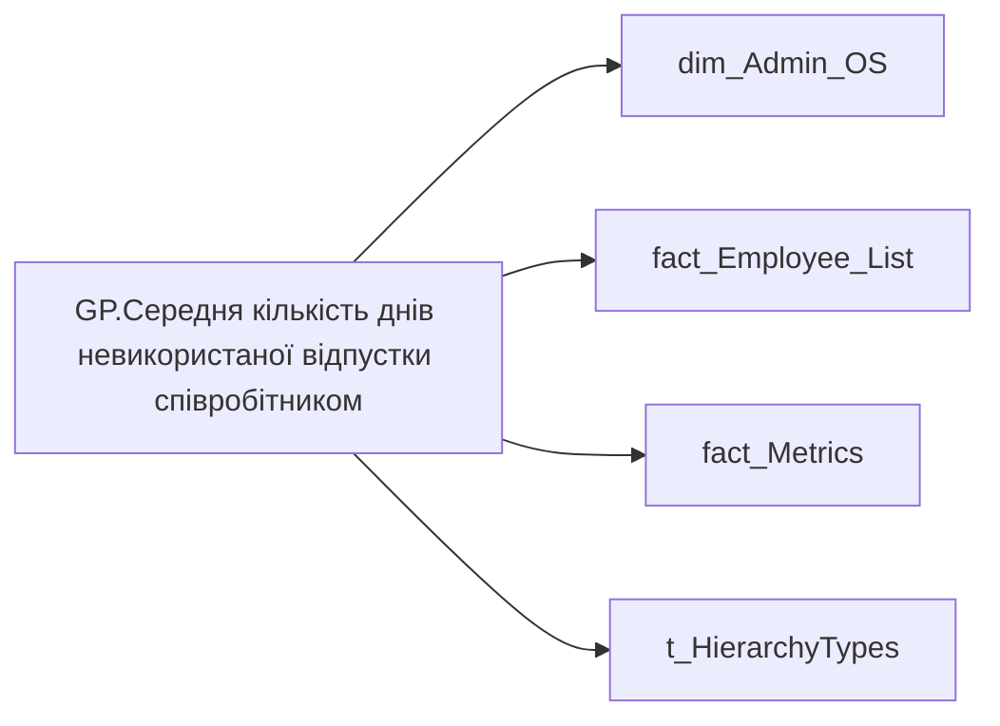

# GP.Середня кількість днів невикористаної відпустки співробітником

*тека `Group_Profile\_Main\Дані про команду`*

## Технічний опис

| Властивість | Значення |
|---|---|
| Тип | міра |
| Home table | _Measures |
| displayFolder | `Group_Profile\_Main\Дані про команду` |
| formatString | — |
| dataType | — |
| Прихована | ні |

### DAX

```dax
TRIM( 
		COALESCE( 
			FORMAT( [AC.Середня кількість днів невикористаної відпустки], "0.00" ), "-"
		)
	)

// VAR _admin =
//     AVERAGEX( 
//         VALUES( dim_Admin_OS[USER_ACCESS_ID] ), 
//         CALCULATE( 
//             SUM('fact_Metrics'[VACATION_RESERVE_BY_MAIN_POSITION])
//         )
//     )
// VAR _admin_lt =
//     CALCULATE(
//         AVERAGEX( 
//             VALUES( dim_Admin_OS[USER_ACCESS_ID] ), 
//             CALCULATE( 
//                 SUM('fact_Metrics'[VACATION_RESERVE_BY_MAIN_POSITION])
//             )
//         ),
//         TREATAS(VALUES( dim_Admin_LT_OS[USER_ACCESS_ID] ), fact_Employee_List[USER_ACCESS_ID])
//     )
// VAR _res = 
//     SWITCH(
//         SELECTEDVALUE( t_HierarchyTypes[Index] ),
//         0, _admin_lt,
//         1, _admin
//     )
// RETURN
//     TRIM( 
//         COALESCE( 
//             FORMAT( _res, "0.00" ), "-"
//         )
//     )
```

### Джерела даних

Вихідні таблиці: `DM.vw_R27_dim_Employee_Access_List`

Колонки: `Index`, `USER_ACCESS_ID`, `VACATION_RESERVE_BY_MAIN_POSITION`

Power Query: `dim_Admin_OS`

### Залежності (таблиці й колонки)

Таблиці: `dim_Admin_OS`, `fact_Employee_List`, `fact_Metrics`, `t_HierarchyTypes`

Колонки: `dim_Admin_OS[USER_ACCESS_ID]`, `fact_Employee_List[USER_ACCESS_ID]`, `fact_Metrics[VACATION_RESERVE_BY_MAIN_POSITION]`, `t_HierarchyTypes[Index]`

### Схема



---

## Бізнес-суть

!!! note "Бізнес-визначення відсутнє"
    Поля міри не зіставлено з wiki «Таблицями джерел даних». Можна заповнити вручну в `manualNotes`.

## На сторінках звіту

- [Group Profile](../report/group-profile.md) — Версія 1

## Пов'язані міри

**Використовує:** [AC.Середня кількість днів невикористаної відпустки](../measures/ac-serednia-kilkist-dniv-nevykorystanoi-vidpustky.md)

## Нотатки

_порожньо_
