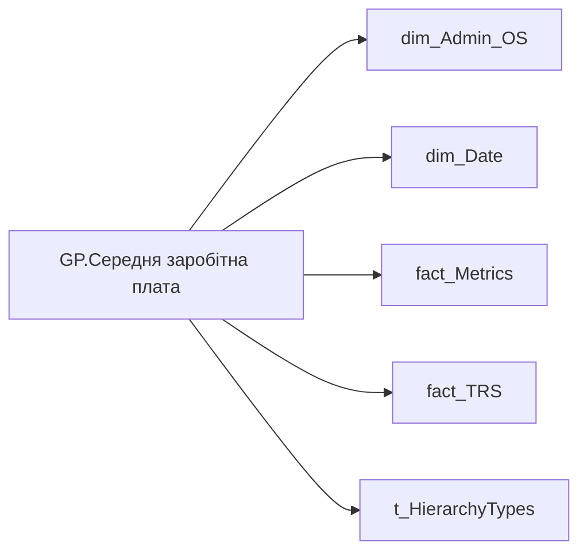

# GP.Середня заробітна плата

*тека `Group_Profile\_Main\Дані про команду`*

## Технічний опис

| Властивість | Значення |
|---|---|
| Тип | міра |
| Home table | _Measures |
| displayFolder | `Group_Profile\_Main\Дані про команду` |
| formatString | — |
| dataType | — |
| Прихована | ні |

### DAX

```dax
//************* ROLE FILTERS **************
VAR _filter_lt = TREATAS(VALUES(dim_Admin_LT_OS[USER_ACCESS_ID]), 'dim_Admin_OS'[USER_ACCESS_ID])

/* *********** ADMIN *********** */
VAR _admin =
	CALCULATE(
		AVERAGEX(
			VALUES('dim_Admin_OS'[USER_ACCESS_ID]),
			DIVIDE(
				CALCULATE(
					SUM('fact_TRS'[PAYMENTS_FACT_UAH])
				),
				CALCULATE(
					SUMX(
						'fact_Metrics',
						'fact_Metrics'[FTE_WEIGHTED_WORK_DAY_FOR_ABSENTEEISM] / 'fact_Metrics'[FTE_WEIGHTED_WORK_DAYS_PER_MONTH_YEAR_CNT]
					)
				)
			)
		),
		'fact_trs'[Tax_Pit_ID] <> "be804a94-651b-a8c1-c2aa-8a8740b17002",
		DATESINPERIOD('dim_Date'[Date],EOMONTH(TODAY(),-1),-12,MONTH)
	) / 12
VAR _admin_lt =
	CALCULATE(
		AVERAGEX(
			VALUES('dim_Admin_OS'[USER_ACCESS_ID]),
			DIVIDE(
				CALCULATE(
					SUM('fact_TRS'[PAYMENTS_FACT_UAH])
				),
				CALCULATE(
					SUMX(
						'fact_Metrics',
						'fact_Metrics'[FTE_WEIGHTED_WORK_DAY_FOR_ABSENTEEISM] / 'fact_Metrics'[FTE_WEIGHTED_WORK_DAYS_PER_MONTH_YEAR_CNT]
					)
				)
			)
		),
		'fact_trs'[Tax_Pit_ID] <> "be804a94-651b-a8c1-c2aa-8a8740b17002",
		DATESINPERIOD('dim_Date'[Date],EOMONTH(TODAY(),-1),-12,MONTH),
		_filter_lt
	) / 12
VAR _res = 
	SWITCH(
		SELECTEDVALUE( t_HierarchyTypes[Index] ),
		0, _admin_lt,
		1, _admin
	)
RETURN
	TRIM( 
		COALESCE( 
			SUBSTITUTE(FORMAT( _res, "#,0.00" ), ",", " "), "-"
		)
	)
```

### Джерела даних

Вихідні таблиці: `DM.vw_R27_dim_Employee_Access_List`, `DM.vw_R27_fact_TRS_PDP`

Колонки: `Date`, `FTE_WEIGHTED_WORK_DAYS_PER_MONTH_YEAR_CNT`, `FTE_WEIGHTED_WORK_DAY_FOR_ABSENTEEISM`, `Index`, `PAYMENTS_FACT_UAH`, `Tax_Pit_ID`, `USER_ACCESS_ID`

Power Query: `dim_Admin_OS`

### Залежності (таблиці й колонки)

Таблиці: `dim_Admin_OS`, `dim_Date`, `fact_Metrics`, `fact_TRS`, `t_HierarchyTypes`

Колонки: `dim_Admin_OS[USER_ACCESS_ID]`, `dim_Date[Date]`, `fact_Metrics[FTE_WEIGHTED_WORK_DAYS_PER_MONTH_YEAR_CNT]`, `fact_Metrics[FTE_WEIGHTED_WORK_DAY_FOR_ABSENTEEISM]`, `fact_TRS[PAYMENTS_FACT_UAH]`, `fact_trs[Tax_Pit_ID]`, `t_HierarchyTypes[Index]`

### Схема



---

## Бізнес-суть

**Бізнес-назва:** Середня заробітна плата

### Опис із ТЗ

Розрахункове поле:   Середня з/п = ((Х1 + Х2 + Х3.... + Xn )за 12 міс./С за 12 міс.,)/12 де: -  Х1, Х2,Х3... Xn - заробітна плата кожного працівника; - С - кількість FTE зважена на відпрацьований час.   До розрахунку брати всі складові з/п.Х = `payments_fact_UAH` сума за період по працівнику (крім `Tax_Pit_ID` = be804a94-651b-a8c1-c2aa-8a8740b17002)   С = ∑`FTE_weighted_work_day_for_absenteeism`/∑`FTE_weighted_work_days_per_month_year_cnt`  Ці поля брати із таблиці DM.`vw_R27_dim_Employee_Metric_Health_and_Wellbeing`

**Вимоги (ТЗ):**

- [Командний профіль › Паспортна частина групового профілю › Сторінка Картка команди](https://dev.azure.com/MHPITDepProjects/People%20Digital%20Profile%20%28PDP%29/_wiki/wikis/PDP.wiki?pagePath=/%D0%A4%D1%83%D0%BD%D0%BA%D1%86%D1%96%D0%BE%D0%BD%D0%B0%D0%BB%D1%8C%D0%BD%D1%96%20%D0%B2%D0%B8%D0%BC%D0%BE%D0%B3%D0%B8/%D0%92%D0%B8%D0%BC%D0%BE%D0%B3%D0%B8%20%D0%B4%D0%BE%20%D0%B7%D0%B2%D1%96%D1%82%D1%83%20People%20Digital%20Profile/%D0%9A%D0%BE%D0%BC%D0%B0%D0%BD%D0%B4%D0%BD%D0%B8%D0%B9%20%D0%BF%D1%80%D0%BE%D1%84%D1%96%D0%BB%D1%8C/%D0%9F%D0%B0%D1%81%D0%BF%D0%BE%D1%80%D1%82%D0%BD%D0%B0%20%D1%87%D0%B0%D1%81%D1%82%D0%B8%D0%BD%D0%B0%20%D0%B3%D1%80%D1%83%D0%BF%D0%BE%D0%B2%D0%BE%D0%B3%D0%BE%20%D0%BF%D1%80%D0%BE%D1%84%D1%96%D0%BB%D1%8E/%D0%A1%D1%82%D0%BE%D1%80%D1%96%D0%BD%D0%BA%D0%B0%20%D0%9A%D0%B0%D1%80%D1%82%D0%BA%D0%B0%20%D0%BA%D0%BE%D0%BC%D0%B0%D0%BD%D0%B4%D0%B8)

## На сторінках звіту

- [Group Profile](../report/group-profile.md) — Версія 1

## Пов'язані міри

_Прямих зв'язків з іншими мірами немає._

## Нотатки

_порожньо_
