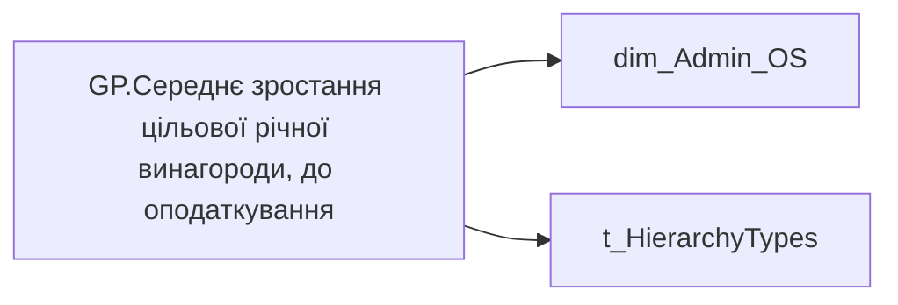

# GP.Середнє зростання цільової річної винагороди, до оподаткування

*тека `Group_Profile\TRS` · формат `0.00%;-0.00%;0.00%`*

## Бізнес-суть

!!! note "Бізнес-визначення відсутнє"
    Поля міри не зіставлено з wiki «Таблицями джерел даних». Можна заповнити вручну в `manualNotes`.

## На сторінках звіту

[Group Profile](../report/group-profile.md)

## Пов'язані міри

**Використовує:** [PP.Цільовий розмір річної винагороди, до оподаткування](../measures/pp-tsilovyi-rozmir-richnoi-vynahorody-do-opodatkuvannia.md), [PP.Цільовий розмір річної винагороди, до оподаткування (12 місяців назад)](../measures/pp-tsilovyi-rozmir-richnoi-vynahorody-do-opodatkuvannia-12-misiatsiv-nazad.md)

---

## Технічний опис

| Властивість | Значення |
|---|---|
| Тип | міра |
| Home table | _Measures |
| displayFolder | `Group_Profile\TRS` |
| formatString | `0.00%;-0.00%;0.00%` |
| dataType | — |
| Прихована | ні |

### DAX

```dax
//************* ROLE FILTERS **************
VAR _roleIndex = SELECTEDVALUE ( 't_HierarchyTypes'[Index], 1 )   -- 0 = LT, 1 = Admin
VAR _filter_lt = TREATAS ( VALUES ( 'dim_Admin_LT_OS'[USER_ACCESS_ID] ),dim_Admin_OS[USER_ACCESS_ID] )

/* *********** ADMIN *********** */
VAR _admin =
	VAR _Employees =VALUES('dim_Admin_OS'[USER_ACCESS_ID])
	VAR _EmployeeAnnualBonus = 
		ADDCOLUMNS(
			_Employees,
			"@Now", [PP.Цільовий розмір річної винагороди, до оподаткування],
			"@YearAgo", [PP.Цільовий розмір річної винагороди, до оподаткування (12 місяців назад)]
		)
	VAR _AverageAnnualBonusGrowth = 
		AVERAGEX(
			FILTER(
				_EmployeeAnnualBonus,
				NOT ISBLANK([@YearAgo])
			),
			DIVIDE([@Now] - [@YearAgo], [@YearAgo])
		)
	RETURN _AverageAnnualBonusGrowth

/* *********** LT *********** */
VAR _admin_lt =
	VAR _table0 = 
		CALCULATETABLE(
			ADDCOLUMNS(
				VALUES('dim_Admin_OS'[USER_ACCESS_ID]),
				"@Now", [PP.Цільовий розмір річної винагороди, до оподаткування],
				"@YearAgo", [PP.Цільовий розмір річної винагороди, до оподаткування (12 місяців назад)]
			),
			_filter_lt
		)
	VAR _AverageAnnualBonusGrowth = 
		AVERAGEX(
			FILTER(
				_table0,
				NOT ISBLANK([@YearAgo])
			),
			DIVIDE([@Now] - [@YearAgo], [@YearAgo])
		)
	RETURN _AverageAnnualBonusGrowth

VAR _res =
	SWITCH (
		_roleIndex,
		0, _admin_lt,    -- LT
		1, _admin,       -- Admin
		_admin
	)
RETURN 
COALESCE(
	_res, "-")
```

### Джерела даних

Вихідні таблиці: `DM.vw_R27_dim_Employee_Access_List`

Колонки: `Index`, `USER_ACCESS_ID`

Power Query: `dim_Admin_OS`

### Залежності (таблиці й колонки)

Таблиці: `dim_Admin_OS`, `t_HierarchyTypes`

Колонки: `dim_Admin_LT_OS[USER_ACCESS_ID]`, `dim_Admin_OS[USER_ACCESS_ID]`, `t_HierarchyTypes[Index]`

### Схема



## Нотатки

_порожньо_
