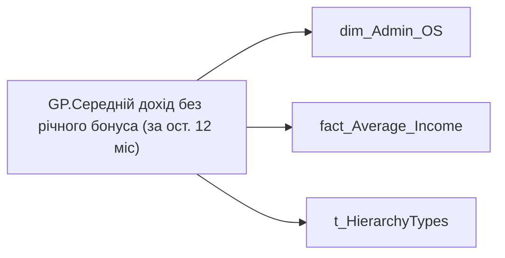

# GP.Середній дохід без річного бонуса (за ост. 12 міс)

*тека `Group_Profile\TRS` · формат `#,0`*

## Бізнес-суть

FTE_EMPLOYEE → Зайнятих ставок з відсутностями; FTE_EMPLOYEE → Зайняті ставки; FTE_EMPLOYEE → Кількість зайнятих FTE (факт); MONTLY_INCOME_WITHOUT_BONUS → Середній дохід без річного бонуса (за ост. 12 міс)

Поле завжди має значення, пусте поле не допускається Розрахункове поле.  <br>Потрібно підрахувати кількість фактично зайнятих ставок по штатним посадам по організації (organization_key) та підрозділу (division_key) по працівникам у статусах Активні та Інша відсутність (status_key = 1 або 4)  <br>(Аутсорс поки не входить в розрахунок) Середній дохід без річного бонуса (за ост. 12 міс) = ∑сума нарахувань по всім працівникам підрозділу/команди за попередні 12 міс./∑зайнятих ставок по всім працівника підрозділу/команди за попередні 12 міс.  <br>Потрібно зсумувати значення поля montly_income_withou

**Вимоги:** `Індивідуальний-профіль-працівника/Сторінка-Загальна-інформація-про-працівника`, `Допоміжні-вітрини-для-звіту/Таблиця-періодична-(попередні-12-міс)-для-розрахунку-метрики-Середній-дохід`, `Командний-профіль/Сторінка-TRS-команди/Доопрацювання-сторінки-TRS`, `Командний-профіль/Сторінка-Загальна-інформація-про-команду`

## На сторінках звіту

[Group Profile](../report/group-profile.md)

## Пов'язані міри

_Прямих зв'язків з іншими мірами немає._

---

## Технічний опис

| Властивість | Значення |
|---|---|
| Тип | міра |
| Home table | _Measures |
| displayFolder | `Group_Profile\TRS` |
| formatString | `#,0` |
| dataType | — |
| Прихована | ні |

### DAX

```dax
//************* ROLE FILTERS **************
VAR _roleIndex = SELECTEDVALUE ( 't_HierarchyTypes'[Index], 1 )   -- 0 = LT, 1 = Admin
VAR _filter_lt = TREATAS ( VALUES ( 'dim_Admin_LT_OS'[USER_ACCESS_ID] ),dim_Admin_OS[USER_ACCESS_ID] )

/* *********** ADMIN *********** */
VAR _admin =
CALCULATE(
    DIVIDE(
        SUM('fact_Average_Income'[MONTLY_INCOME_WITHOUT_BONUS]),
        SUM('fact_Average_Income'[FTE_EMPLOYEE]), BLANK()),
        'fact_Average_Income'[IS_INCLUDED_INTO_CALC] = 1)

/* *********** ADMIN LT *********** */
VAR _admin_lt =
CALCULATE(
    DIVIDE(
        SUM('fact_Average_Income'[MONTLY_INCOME_WITHOUT_BONUS]),
        SUM('fact_Average_Income'[FTE_EMPLOYEE]), BLANK()),
	_filter_lt,
    'fact_Average_Income'[IS_INCLUDED_INTO_CALC] = 1)
VAR _res = 
	SWITCH(
		_roleIndex,
		0, _admin_lt,
		1, _admin
	)
RETURN 
COALESCE(_res, "-")
```

### Джерела даних

Вихідні таблиці: `DM.vw_R27_dim_Employee_Access_List`, `DM.vw_R27_fact_Average_Income`

Колонки: `FTE_EMPLOYEE`, `IS_INCLUDED_INTO_CALC`, `Index`, `MONTLY_INCOME_WITHOUT_BONUS`, `USER_ACCESS_ID`

Power Query: `dim_Admin_OS`

### Залежності (таблиці й колонки)

Таблиці: `dim_Admin_OS`, `fact_Average_Income`, `t_HierarchyTypes`

Колонки: `dim_Admin_LT_OS[USER_ACCESS_ID]`, `dim_Admin_OS[USER_ACCESS_ID]`, `fact_Average_Income[FTE_EMPLOYEE]`, `fact_Average_Income[IS_INCLUDED_INTO_CALC]`, `fact_Average_Income[MONTLY_INCOME_WITHOUT_BONUS]`, `t_HierarchyTypes[Index]`

### Схема



## Нотатки

_порожньо_
