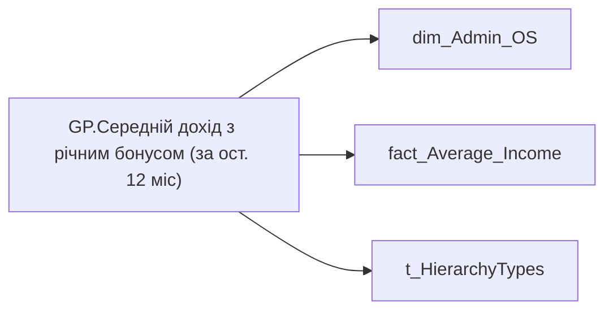

# GP.Середній дохід з річним бонусом (за ост. 12 міс)

*тека `Group_Profile\TRS` · формат `#,0`*

## Технічний опис

| Властивість | Значення |
|---|---|
| Тип | міра |
| Home table | _Measures |
| displayFolder | `Group_Profile\TRS` |
| formatString | `#,0` |
| dataType | — |
| Прихована | ні |

### DAX

```dax
//************* ROLE FILTERS **************
VAR _roleIndex = SELECTEDVALUE ( 't_HierarchyTypes'[Index], 1 )   -- 0 = LT, 1 = Admin
VAR _filter_lt = TREATAS ( VALUES ( 'dim_Admin_LT_OS'[USER_ACCESS_ID] ),dim_Admin_OS[USER_ACCESS_ID] )

/* *********** ADMIN *********** */
VAR _admin =
CALCULATE(
    DIVIDE(
        SUM('fact_Average_Income'[MONTLY_INCOME_WITH_BONUS]),
        SUM('fact_Average_Income'[FTE_EMPLOYEE]), BLANK()),
        'fact_Average_Income'[IS_INCLUDED_INTO_CALC] = 1)

/* *********** ADMIN LT *********** */
VAR _admin_lt =
CALCULATE(
    DIVIDE(
        SUM('fact_Average_Income'[MONTLY_INCOME_WITH_BONUS]),
        SUM('fact_Average_Income'[FTE_EMPLOYEE]), BLANK()),
	_filter_lt,
    'fact_Average_Income'[IS_INCLUDED_INTO_CALC] = 1)
VAR _res = 
	SWITCH(
		_roleIndex,
		0, _admin_lt,
		1, _admin
	)
RETURN 
COALESCE(_res, "-")
```

### Джерела даних

Вихідні таблиці: `DM.vw_R27_dim_Employee_Access_List`, `DM.vw_R27_fact_Average_Income`

Колонки: `FTE_EMPLOYEE`, `IS_INCLUDED_INTO_CALC`, `Index`, `MONTLY_INCOME_WITH_BONUS`, `USER_ACCESS_ID`

Power Query: `dim_Admin_OS`

### Залежності (таблиці й колонки)

Таблиці: `dim_Admin_OS`, `fact_Average_Income`, `t_HierarchyTypes`

Колонки: `dim_Admin_LT_OS[USER_ACCESS_ID]`, `dim_Admin_OS[USER_ACCESS_ID]`, `fact_Average_Income[FTE_EMPLOYEE]`, `fact_Average_Income[IS_INCLUDED_INTO_CALC]`, `fact_Average_Income[MONTLY_INCOME_WITH_BONUS]`, `t_HierarchyTypes[Index]`

### Схема



---

## Бізнес-суть

**Бізнес-назва:** Середній дохід з річним бонусом (за ост. 12 міс)

### Опис із ТЗ

Поле завжди має значення, пусте поле не допускається

Розрахункове поле.   Потрібно підрахувати кількість фактично зайнятих ставок по штатним посадам по організації (`organization_key`) та підрозділу (`division_key`) по працівникам у статусах Активні та Інша відсутність (`status_key` = 1 або 4)   (Аутсорс поки не входить в розрахунок)

Середній дохід з річним бонусом (за ост. 12 міс) = ∑сума нарахувань по всім працівникам підрозділу/команди за попередні 12 міс./∑зайнятих ставок по всім працівника підрозділу/команди за попередні 12 міс.   Потрібно зсумувати значення поля `montly_income_with_bonus` по підрозділу за попередні 12 міс та поділити на суму `FTE_employee` за попередні 12 міс по підрозділу, де `Is_included_into_calc` = 1

??? note "Поля-джерела та пов'язані бізнес-метрики (4)"
    | Поле | Бізнес-метрики |
    |---|---|
    | `FTE_EMPLOYEE` | Зайнятих ставок з відсутностями · Зайняті ставки · Кількість зайнятих FTE (факт) |
    | `MONTLY_INCOME_WITH_BONUS` | Середній дохід з річним бонусом (за ост. 12 міс) |

**Вимоги (ТЗ):**

- [Індивідуальний профіль працівника › Сторінка Загальна інформація про працівника](https://dev.azure.com/MHPITDepProjects/People%20Digital%20Profile%20%28PDP%29/_wiki/wikis/PDP.wiki?pagePath=/%D0%A4%D1%83%D0%BD%D0%BA%D1%86%D1%96%D0%BE%D0%BD%D0%B0%D0%BB%D1%8C%D0%BD%D1%96%20%D0%B2%D0%B8%D0%BC%D0%BE%D0%B3%D0%B8/%D0%92%D0%B8%D0%BC%D0%BE%D0%B3%D0%B8%20%D0%B4%D0%BE%20%D0%B7%D0%B2%D1%96%D1%82%D1%83%20People%20Digital%20Profile/%D0%86%D0%BD%D0%B4%D0%B8%D0%B2%D1%96%D0%B4%D1%83%D0%B0%D0%BB%D1%8C%D0%BD%D0%B8%D0%B9%20%D0%BF%D1%80%D0%BE%D1%84%D1%96%D0%BB%D1%8C%20%D0%BF%D1%80%D0%B0%D1%86%D1%96%D0%B2%D0%BD%D0%B8%D0%BA%D0%B0/%D0%A1%D1%82%D0%BE%D1%80%D1%96%D0%BD%D0%BA%D0%B0%20%D0%97%D0%B0%D0%B3%D0%B0%D0%BB%D1%8C%D0%BD%D0%B0%20%D1%96%D0%BD%D1%84%D0%BE%D1%80%D0%BC%D0%B0%D1%86%D1%96%D1%8F%20%D0%BF%D1%80%D0%BE%20%D0%BF%D1%80%D0%B0%D1%86%D1%96%D0%B2%D0%BD%D0%B8%D0%BA%D0%B0)
- [Допоміжні вітрини для звіту › Таблиця періодична (попередні 12 міс) для розрахунку метрики Середній дохід](https://dev.azure.com/MHPITDepProjects/People%20Digital%20Profile%20%28PDP%29/_wiki/wikis/PDP.wiki?pagePath=/%D0%A4%D1%83%D0%BD%D0%BA%D1%86%D1%96%D0%BE%D0%BD%D0%B0%D0%BB%D1%8C%D0%BD%D1%96%20%D0%B2%D0%B8%D0%BC%D0%BE%D0%B3%D0%B8/%D0%92%D0%B8%D0%BC%D0%BE%D0%B3%D0%B8%20%D0%B4%D0%BE%20%D0%B7%D0%B2%D1%96%D1%82%D1%83%20People%20Digital%20Profile/%D0%94%D0%BE%D0%BF%D0%BE%D0%BC%D1%96%D0%B6%D0%BD%D1%96%20%D0%B2%D1%96%D1%82%D1%80%D0%B8%D0%BD%D0%B8%20%D0%B4%D0%BB%D1%8F%20%D0%B7%D0%B2%D1%96%D1%82%D1%83/%D0%A2%D0%B0%D0%B1%D0%BB%D0%B8%D1%86%D1%8F%20%D0%BF%D0%B5%D1%80%D1%96%D0%BE%D0%B4%D0%B8%D1%87%D0%BD%D0%B0%20%28%D0%BF%D0%BE%D0%BF%D0%B5%D1%80%D0%B5%D0%B4%D0%BD%D1%96%2012%20%D0%BC%D1%96%D1%81%29%20%D0%B4%D0%BB%D1%8F%20%D1%80%D0%BE%D0%B7%D1%80%D0%B0%D1%85%D1%83%D0%BD%D0%BA%D1%83%20%D0%BC%D0%B5%D1%82%D1%80%D0%B8%D0%BA%D0%B8%20%D0%A1%D0%B5%D1%80%D0%B5%D0%B4%D0%BD%D1%96%D0%B9%20%D0%B4%D0%BE%D1%85%D1%96%D0%B4)
- [Командний профіль › Сторінка TRS команди › Доопрацювання сторінки TRS](https://dev.azure.com/MHPITDepProjects/People%20Digital%20Profile%20%28PDP%29/_wiki/wikis/PDP.wiki?pagePath=/%D0%A4%D1%83%D0%BD%D0%BA%D1%86%D1%96%D0%BE%D0%BD%D0%B0%D0%BB%D1%8C%D0%BD%D1%96%20%D0%B2%D0%B8%D0%BC%D0%BE%D0%B3%D0%B8/%D0%92%D0%B8%D0%BC%D0%BE%D0%B3%D0%B8%20%D0%B4%D0%BE%20%D0%B7%D0%B2%D1%96%D1%82%D1%83%20People%20Digital%20Profile/%D0%9A%D0%BE%D0%BC%D0%B0%D0%BD%D0%B4%D0%BD%D0%B8%D0%B9%20%D0%BF%D1%80%D0%BE%D1%84%D1%96%D0%BB%D1%8C/%D0%A1%D1%82%D0%BE%D1%80%D1%96%D0%BD%D0%BA%D0%B0%20TRS%20%D0%BA%D0%BE%D0%BC%D0%B0%D0%BD%D0%B4%D0%B8/%D0%94%D0%BE%D0%BE%D0%BF%D1%80%D0%B0%D1%86%D1%8E%D0%B2%D0%B0%D0%BD%D0%BD%D1%8F%20%D1%81%D1%82%D0%BE%D1%80%D1%96%D0%BD%D0%BA%D0%B8%20TRS)
- [Командний профіль › Сторінка Загальна інформація про команду](https://dev.azure.com/MHPITDepProjects/People%20Digital%20Profile%20%28PDP%29/_wiki/wikis/PDP.wiki?pagePath=/%D0%A4%D1%83%D0%BD%D0%BA%D1%86%D1%96%D0%BE%D0%BD%D0%B0%D0%BB%D1%8C%D0%BD%D1%96%20%D0%B2%D0%B8%D0%BC%D0%BE%D0%B3%D0%B8/%D0%92%D0%B8%D0%BC%D0%BE%D0%B3%D0%B8%20%D0%B4%D0%BE%20%D0%B7%D0%B2%D1%96%D1%82%D1%83%20People%20Digital%20Profile/%D0%9A%D0%BE%D0%BC%D0%B0%D0%BD%D0%B4%D0%BD%D0%B8%D0%B9%20%D0%BF%D1%80%D0%BE%D1%84%D1%96%D0%BB%D1%8C/%D0%A1%D1%82%D0%BE%D1%80%D1%96%D0%BD%D0%BA%D0%B0%20%D0%97%D0%B0%D0%B3%D0%B0%D0%BB%D1%8C%D0%BD%D0%B0%20%D1%96%D0%BD%D1%84%D0%BE%D1%80%D0%BC%D0%B0%D1%86%D1%96%D1%8F%20%D0%BF%D1%80%D0%BE%20%D0%BA%D0%BE%D0%BC%D0%B0%D0%BD%D0%B4%D1%83)

## На сторінках звіту

[Group Profile](../report/group-profile.md)

## Пов'язані міри

_Прямих зв'язків з іншими мірами немає._

## Нотатки

_порожньо_
