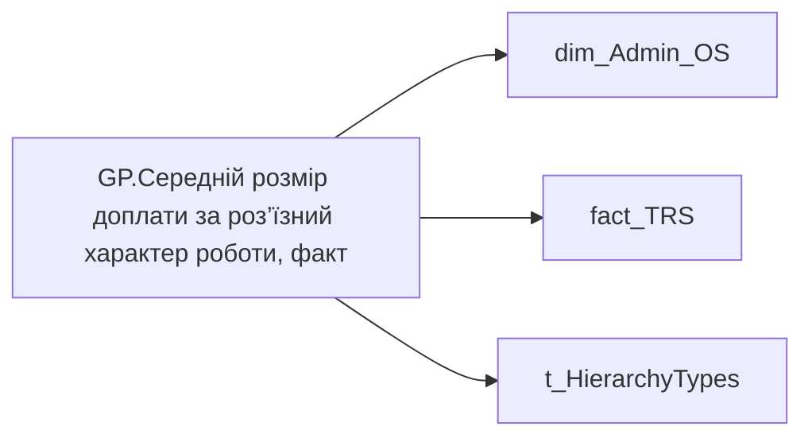

# GP.Середній розмір доплати за роз’їзний характер роботи, факт

*тека `Group_Profile\TRS` · формат `#,0`*

## Технічний опис

| Властивість | Значення |
|---|---|
| Тип | міра |
| Home table | _Measures |
| displayFolder | `Group_Profile\TRS` |
| formatString | `#,0` |
| dataType | — |
| Прихована | ні |

### DAX

```dax
//************* ROLE FILTERS **************
VAR _roleIndex = SELECTEDVALUE ( 't_HierarchyTypes'[Index], 1 )   -- 0 = LT, 1 = Admin
VAR _filter_lt = TREATAS ( VALUES ( 'dim_Admin_LT_OS'[USER_ACCESS_ID] ),dim_Admin_OS[USER_ACCESS_ID] )

/* *********** ADMIN *********** */
VAR _admin =
	VAR _Employees = VALUES('dim_Admin_OS'[USER_ACCESS_ID])
    VAR _Perionds = VALUES('fact_TRS'[PERIOD])
	VAR _table0 = 
		ADDCOLUMNS(
			CROSSJOIN(_Employees, _Perionds),
			"@Indicator",
			CALCULATE(
				SUM('fact_TRS'[PAYMENTS_FACT_UAH]),
				'fact_TRS'[ACCRUAL_TYPES_KEY] = "d8d58e4c-8800-ea51-9ff6-0bec21ff170f",
                'fact_TRS'[PAYMENTS_FACT_UAH] > 0,
                DATESINPERIOD( 'fact_TRS'[PERIOD], EOMONTH( TODAY(), - 1 ), - 12, MONTH )
			)
		)
	VAR _AverageOfSomeIndicator = 
		AVERAGEX(
			FILTER(
				_table0,
				NOT ISBLANK([@Indicator]) && [@Indicator] <> 0
			),
			[@Indicator]
		)
	RETURN _AverageOfSomeIndicator

/* *********** LT *********** */
VAR _admin_lt =
    VAR _Employees = VALUES('dim_Admin_OS'[USER_ACCESS_ID])
    VAR _Perionds = VALUES('fact_TRS'[PERIOD])
	VAR _table0 = 
		CALCULATETABLE(
			ADDCOLUMNS(
				CROSSJOIN(_Employees, _Perionds),
				"@Indicator",
				CALCULATE(
					MAX('fact_TRS'[PAYMENTS_FACT_UAH]),
					'fact_TRS'[ACCRUAL_TYPES_KEY] = "d8d58e4c-8800-ea51-9ff6-0bec21ff170f",
                    'fact_TRS'[PAYMENTS_FACT_UAH] > 0,
					DATESINPERIOD( 'fact_TRS'[PERIOD], EOMONTH( TODAY(), - 1 ), - 12, MONTH )
				)
			),
			_filter_lt
		)
	VAR _AverageOfSomeIndicator = 
		AVERAGEX(
			FILTER(
				_table0,
				NOT ISBLANK([@Indicator]) && [@Indicator] <> 0
			),
			[@Indicator]
		)
	RETURN _AverageOfSomeIndicator

VAR _res =
	SWITCH (
		_roleIndex,
		0, _admin_lt,    -- LT
		1, _admin,       -- Admin
		_admin
	)

RETURN
COALESCE(
	_res, "-")
```

### Джерела даних

Вихідні таблиці: `DM.vw_R27_dim_Employee_Access_List`, `DM.vw_R27_fact_TRS_PDP`

Колонки: `ACCRUAL_TYPES_KEY`, `Index`, `PAYMENTS_FACT_UAH`, `PERIOD`, `USER_ACCESS_ID`

Power Query: `dim_Admin_OS`

### Залежності (таблиці й колонки)

Таблиці: `dim_Admin_OS`, `fact_TRS`, `t_HierarchyTypes`

Колонки: `dim_Admin_LT_OS[USER_ACCESS_ID]`, `dim_Admin_OS[USER_ACCESS_ID]`, `fact_TRS[ACCRUAL_TYPES_KEY]`, `fact_TRS[PAYMENTS_FACT_UAH]`, `fact_TRS[PERIOD]`, `t_HierarchyTypes[Index]`

### Схема



---

## Бізнес-суть

!!! note "Бізнес-визначення відсутнє"
    Поля міри не зіставлено з wiki «Таблицями джерел даних». Можна заповнити вручну в `manualNotes`.

## На сторінках звіту

[Group Profile](../report/group-profile.md)

## Пов'язані міри

_Прямих зв'язків з іншими мірами немає._

## Нотатки

_порожньо_
