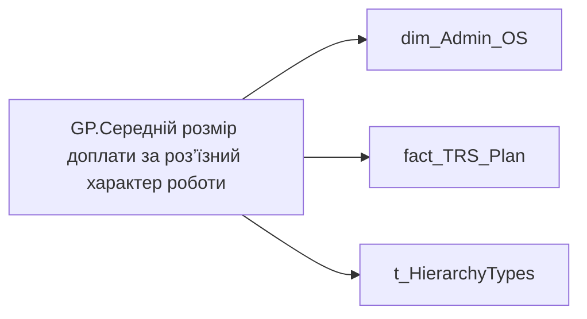

# GP.Середній розмір доплати за роз’їзний характер роботи

*тека `Group_Profile\TRS`*

!!! abstract "Джерела даних"
    `DM.vw_R27_dim_Employee_Access_List`, `DM.vw_R27_fact_TRS_Plan_PDP`

## Бізнес-суть

PAYMENT_PLAN_SUM → Річний цільовий дохід; PAYMENT_PLAN_SUM → Розмір фіксованої винагороди плановий, за місяць ПОТОЧНИЙ; PAYMENT_PLAN_SUM → Сума (на поточний момент); PAYMENT_PLAN_SUM → Середній розмір премії за місяць; PAYMENT_PLAN_SUM → Доля учасників із зміною фіксованої винагороди; PAYMENT_PLAN_SUM → Діапазон фіксованої винагороди (план)

PAYMENT_PLAN_SUMх(BONUS_MONTH_SALARY_CNTх12 +BONUS_QUARTER_SALARY_CNTх4+BONUS_YEAR_SALARY_CNT+12) Відібрати записи по працівнику [person_key], періоду [Period], організації [organization_key], підрозділу [division_key], де category_name = Фіксована винагорода, IS_ACTUAL  = "1", END_DATE > поточна дата, або END_DATE = "01.01.2001". (BONUS_MONTH_SALARY_CNT +BONUS_QUARTER_SALARY_CNT+  <br>BONUS_YEAR_SALARY_CNT)* PAYMENT_PLAN_SUM + (PAYMENT_PLAN_SUM*12) Розрахункове поле.  <br>Потрібно зсумувати значення поля [PAYMENT_PLAN_SUM] по тим членам команди, у яких воно > 0,00  по ACCRUAL_ORG_CODE = 00148

**Вимоги:** `Індивідуальний-профіль-працівника/Історія-по-посадам`, `Індивідуальний-профіль-працівника/Історія-по-посадам/Реліз-1.-Історія-по-посадам`, `Індивідуальний-профіль-працівника/Сторінка-Винагорода-працівника`, `Індивідуальний-профіль-працівника/Сторінка-Винагорода-працівника/Деталізація-на-сторінці-Винагорода`, `Індивідуальний-профіль-працівника/Сторінка-Винагорода-працівника/Доопрацювання-сторінки-ТРС`, `Командний-профіль/Сторінка-TRS-команди`, `Командний-профіль/Сторінка-TRS-команди/Доопрацювання-сторінки-TRS`, `Командний-профіль/Сторінка-TRS-команди/Сторінка-Винагорода-групового-профілю#вимоги-до-звіту`

## На сторінках звіту

[Group Profile](../report/group-profile.md)

## Пов'язані міри

_Прямих зв'язків з іншими мірами немає._

---

## Технічний опис

| Властивість | Значення |
|---|---|
| Тип | міра |
| Home table | _Measures |
| displayFolder | `Group_Profile\TRS` |
| formatString | — |
| dataType | — |
| Прихована | ні |

### DAX

```dax
//************* ROLE FILTERS **************
VAR _roleIndex = SELECTEDVALUE ( 't_HierarchyTypes'[Index], 1 )   -- 0 = LT, 1 = Admin
VAR _filter_lt = TREATAS ( VALUES ( 'dim_Admin_LT_OS'[USER_ACCESS_ID] ),dim_Admin_OS[USER_ACCESS_ID] )

/* *********** ADMIN *********** */
VAR _admin =
	VAR _Employees =VALUES('dim_Admin_OS'[USER_ACCESS_ID])
	VAR _table0 = 
		ADDCOLUMNS(
			_Employees,
			"@Indicator",
			CALCULATE(
				MAX(fact_TRS_Plan[PAYMENT_PLAN_SUM]),
				fact_TRS_Plan[IS_ACTUAL]=TRUE(),
				fact_TRS_Plan[ACCRUAL_ORG_CODE]="00193"
			)
		)
	VAR _AverageOfSomeIndicator = 
		AVERAGEX(
			FILTER(
				_table0,
				NOT ISBLANK([@Indicator]) && [@Indicator] <> 0
			),
			[@Indicator]
		)
	RETURN _AverageOfSomeIndicator

/* *********** LT *********** */
VAR _admin_lt =
	VAR _table0 = 
		CALCULATETABLE(
			ADDCOLUMNS(
				VALUES( 'dim_Admin_OS'[USER_ACCESS_ID] ),
				"@Indicator",
				CALCULATE(
					MAX(fact_TRS_Plan[PAYMENT_PLAN_SUM]),
					fact_TRS_Plan[IS_ACTUAL]=TRUE(),
					fact_TRS_Plan[ACCRUAL_ORG_CODE]="00193"
				)
			),
			_filter_lt
		)
	VAR _AverageOfSomeIndicator = 
		AVERAGEX(
			FILTER(
				_table0,
				NOT ISBLANK([@Indicator]) && [@Indicator] <> 0
			),
			[@Indicator]
		)
	RETURN _AverageOfSomeIndicator

VAR _res =
	SWITCH (
		_roleIndex,
		0, _admin_lt,    -- LT
		1, _admin,       -- Admin
		_admin
	)
RETURN 
COALESCE(
	_res, "-")
```

### Джерела даних

Вихідні таблиці: `DM.vw_R27_dim_Employee_Access_List`, `DM.vw_R27_fact_TRS_Plan_PDP`

Колонки: `ACCRUAL_ORG_CODE`, `IS_ACTUAL`, `Index`, `PAYMENT_PLAN_SUM`, `USER_ACCESS_ID`

Power Query: `dim_Admin_OS`

### Залежності (таблиці й колонки)

Таблиці: `dim_Admin_OS`, `fact_TRS_Plan`, `t_HierarchyTypes`

Колонки: `dim_Admin_LT_OS[USER_ACCESS_ID]`, `dim_Admin_OS[USER_ACCESS_ID]`, `fact_TRS_Plan[ACCRUAL_ORG_CODE]`, `fact_TRS_Plan[IS_ACTUAL]`, `fact_TRS_Plan[PAYMENT_PLAN_SUM]`, `t_HierarchyTypes[Index]`

### Схема



## Нотатки

_порожньо_
