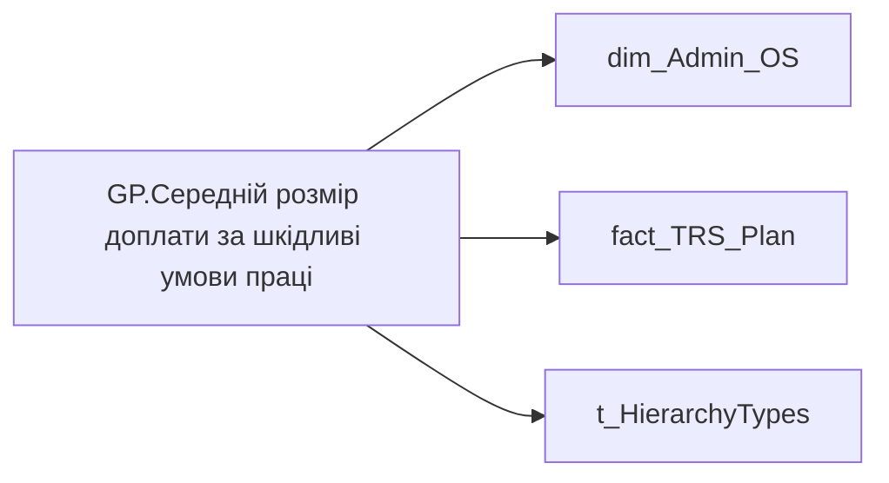

# GP.Середній розмір доплати за шкідливі умови праці

*тека `Group_Profile\TRS`*

## Технічний опис

| Властивість | Значення |
|---|---|
| Тип | міра |
| Home table | _Measures |
| displayFolder | `Group_Profile\TRS` |
| formatString | — |
| dataType | — |
| Прихована | ні |

### DAX

```dax
//************* ROLE FILTERS **************
VAR _roleIndex = SELECTEDVALUE ( 't_HierarchyTypes'[Index], 1 )   -- 0 = LT, 1 = Admin
VAR _filter_lt = TREATAS ( VALUES ( 'dim_Admin_LT_OS'[USER_ACCESS_ID] ),dim_Admin_OS[USER_ACCESS_ID] )

/* *********** ADMIN *********** */
VAR _admin =
	VAR _Employees =VALUES('dim_Admin_OS'[USER_ACCESS_ID])
	VAR _table0 = 
		ADDCOLUMNS(
			_Employees,
			"@Indicator",
			CALCULATE(
				MAX(fact_TRS_Plan[PAYMENT_PLAN_SUM]),
				fact_TRS_Plan[IS_ACTUAL]=TRUE(),
				fact_TRS_Plan[ACCRUAL_ORG_CODE]="00146"
			)
		)
	VAR _AverageOfSomeIndicator = 
		AVERAGEX(
			FILTER(
				_table0,
				NOT ISBLANK([@Indicator]) && [@Indicator] <> 0
			),
			[@Indicator]
		)
	RETURN _AverageOfSomeIndicator

/* *********** LT *********** */
VAR _admin_lt =
	VAR _table0 = 
		CALCULATETABLE(
			ADDCOLUMNS(
				VALUES( 'dim_Admin_OS'[USER_ACCESS_ID] ),
				"@Indicator",
				CALCULATE(
					MAX(fact_TRS_Plan[PAYMENT_PLAN_SUM]),
					fact_TRS_Plan[IS_ACTUAL]=TRUE(),
					fact_TRS_Plan[ACCRUAL_ORG_CODE]="00146"
				)
			),
			_filter_lt
		)
	VAR _AverageOfSomeIndicator = 
		AVERAGEX(
			FILTER(
				_table0,
				NOT ISBLANK([@Indicator]) && [@Indicator] <> 0
			),
			[@Indicator]
		)
	RETURN _AverageOfSomeIndicator

VAR _res =
	SWITCH (
		_roleIndex,
		0, _admin_lt,    -- LT
		1, _admin,       -- Admin
		_admin
	)
RETURN 
COALESCE(_res, "-")
```

### Джерела даних

Вихідні таблиці: `DM.vw_R27_dim_Employee_Access_List`, `DM.vw_R27_fact_TRS_Plan_PDP`

Колонки: `ACCRUAL_ORG_CODE`, `IS_ACTUAL`, `Index`, `PAYMENT_PLAN_SUM`, `USER_ACCESS_ID`

Power Query: `dim_Admin_OS`

### Залежності (таблиці й колонки)

Таблиці: `dim_Admin_OS`, `fact_TRS_Plan`, `t_HierarchyTypes`

Колонки: `dim_Admin_LT_OS[USER_ACCESS_ID]`, `dim_Admin_OS[USER_ACCESS_ID]`, `fact_TRS_Plan[ACCRUAL_ORG_CODE]`, `fact_TRS_Plan[IS_ACTUAL]`, `fact_TRS_Plan[PAYMENT_PLAN_SUM]`, `t_HierarchyTypes[Index]`

### Схема



---

## Бізнес-суть

**Бізнес-назва:** Середній розмір доплати за шкідливі умови праці

### Опис із ТЗ

Розрахункове поле. Значення рахуємо у двох вимірах, відстоках та гривнях   Для визначення відсотка потрібно зсумувати значення поля `INIT_PAYMENT_PLAN_SUM` по тим членам команди, у яких воно > 0,00  по `ACCRUAL_ORG_CODE` = 00146, `IS_ACTUAL`  = "1", `END_DATE` > поточна дата, або `END_DATE` = "01.01.2001 та поділити на кількість таких записів (членів команди, у яких є такий вид нарахування в планових виплатах).   Для визначення суми потрібно зсумувати значення поля `PAYMENT_PLAN_SUM` по тим членам команди, у яких воно > 0,00  по `ACCRUAL_ORG_CODE` = 00146, `IS_ACTUAL`  = "1", `END_DATE` > поточна дата, або `END_DATE` = "01.01.2001 та поділити на кількість таких записів (членів команди, у яких є такий вид нарахування в планових виплатах).

Розрахункове поле.   Потрібно зсумувати значення поля `PAYMENTS_FACT_UAH` по тим членам команди, у яких воно > 0,00  по по `accrual_types_key` = c31b06b3-0fac-2fb2-cb4b-f806abbbfb95 за останні 12 міс. та поділити на кількість таких записів (членів команди, у яких є такий вид нарахування в фактових виплатах) за ост.12 міс.

**Вимоги (ТЗ):**

- [Командний профіль › Сторінка TRS команди](https://dev.azure.com/MHPITDepProjects/People%20Digital%20Profile%20%28PDP%29/_wiki/wikis/PDP.wiki?pagePath=/%D0%A4%D1%83%D0%BD%D0%BA%D1%86%D1%96%D0%BE%D0%BD%D0%B0%D0%BB%D1%8C%D0%BD%D1%96%20%D0%B2%D0%B8%D0%BC%D0%BE%D0%B3%D0%B8/%D0%92%D0%B8%D0%BC%D0%BE%D0%B3%D0%B8%20%D0%B4%D0%BE%20%D0%B7%D0%B2%D1%96%D1%82%D1%83%20People%20Digital%20Profile/%D0%9A%D0%BE%D0%BC%D0%B0%D0%BD%D0%B4%D0%BD%D0%B8%D0%B9%20%D0%BF%D1%80%D0%BE%D1%84%D1%96%D0%BB%D1%8C/%D0%A1%D1%82%D0%BE%D1%80%D1%96%D0%BD%D0%BA%D0%B0%20TRS%20%D0%BA%D0%BE%D0%BC%D0%B0%D0%BD%D0%B4%D0%B8)
- [Командний профіль › Сторінка TRS команди › Доопрацювання сторінки TRS](https://dev.azure.com/MHPITDepProjects/People%20Digital%20Profile%20%28PDP%29/_wiki/wikis/PDP.wiki?pagePath=/%D0%A4%D1%83%D0%BD%D0%BA%D1%86%D1%96%D0%BE%D0%BD%D0%B0%D0%BB%D1%8C%D0%BD%D1%96%20%D0%B2%D0%B8%D0%BC%D0%BE%D0%B3%D0%B8/%D0%92%D0%B8%D0%BC%D0%BE%D0%B3%D0%B8%20%D0%B4%D0%BE%20%D0%B7%D0%B2%D1%96%D1%82%D1%83%20People%20Digital%20Profile/%D0%9A%D0%BE%D0%BC%D0%B0%D0%BD%D0%B4%D0%BD%D0%B8%D0%B9%20%D0%BF%D1%80%D0%BE%D1%84%D1%96%D0%BB%D1%8C/%D0%A1%D1%82%D0%BE%D1%80%D1%96%D0%BD%D0%BA%D0%B0%20TRS%20%D0%BA%D0%BE%D0%BC%D0%B0%D0%BD%D0%B4%D0%B8/%D0%94%D0%BE%D0%BE%D0%BF%D1%80%D0%B0%D1%86%D1%8E%D0%B2%D0%B0%D0%BD%D0%BD%D1%8F%20%D1%81%D1%82%D0%BE%D1%80%D1%96%D0%BD%D0%BA%D0%B8%20TRS)
- [Командний профіль › Сторінка TRS команди › Сторінка Винагорода групового профілю › вимоги до звіту](https://dev.azure.com/MHPITDepProjects/People%20Digital%20Profile%20%28PDP%29/_wiki/wikis/PDP.wiki?pagePath=/%D0%A4%D1%83%D0%BD%D0%BA%D1%86%D1%96%D0%BE%D0%BD%D0%B0%D0%BB%D1%8C%D0%BD%D1%96%20%D0%B2%D0%B8%D0%BC%D0%BE%D0%B3%D0%B8/%D0%92%D0%B8%D0%BC%D0%BE%D0%B3%D0%B8%20%D0%B4%D0%BE%20%D0%B7%D0%B2%D1%96%D1%82%D1%83%20People%20Digital%20Profile/%D0%9A%D0%BE%D0%BC%D0%B0%D0%BD%D0%B4%D0%BD%D0%B8%D0%B9%20%D0%BF%D1%80%D0%BE%D1%84%D1%96%D0%BB%D1%8C/%D0%A1%D1%82%D0%BE%D1%80%D1%96%D0%BD%D0%BA%D0%B0%20TRS%20%D0%BA%D0%BE%D0%BC%D0%B0%D0%BD%D0%B4%D0%B8/%D0%A1%D1%82%D0%BE%D1%80%D1%96%D0%BD%D0%BA%D0%B0%20%D0%92%D0%B8%D0%BD%D0%B0%D0%B3%D0%BE%D1%80%D0%BE%D0%B4%D0%B0%20%D0%B3%D1%80%D1%83%D0%BF%D0%BE%D0%B2%D0%BE%D0%B3%D0%BE%20%D0%BF%D1%80%D0%BE%D1%84%D1%96%D0%BB%D1%8E)

## На сторінках звіту

- [Group Profile](../report/group-profile.md) — TRS

## Пов'язані міри

_Прямих зв'язків з іншими мірами немає._

## Нотатки

_порожньо_
