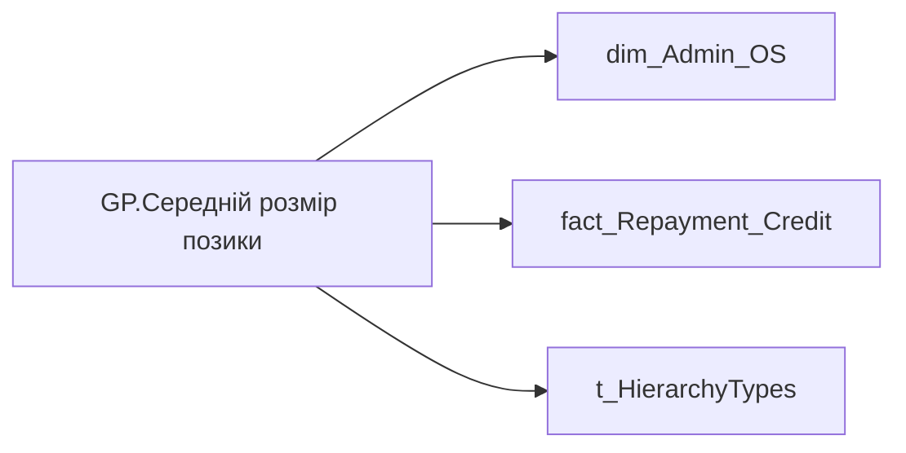

# GP.Середній розмір позики

*тека `Group_Profile\TRS`*

## Бізнес-суть

ACTION_END_DATE → Доля команди із позиками; land_share_contract_sum → Сума позики; land_share_contract_sum → Позика на ноутбук (остання); land_share_contract_sum → Доля команди з позикою на ноутбук (%) (діюча); land_share_contract_sum → Середній розмір позики; land_share_contract_sum → Позики

Потрібно підрахувати кількість працівників у команді, по яким є записи в таблиці DM.vw_R27_fact_Repayment_Credit_PDP та поле action_end_date>поточна дата (діюча позика) та поділити на поточну кількість членів команди. В деталізацію вивести ПІБ таких працівників, вид і розмір позики, дати видачі та погашення. Потрібно відібрати всі записи по працівнику [person_key], періоду [Period], організації [organization_key] ,  договору [CONTRACT_KEY], де [BUDGET_ITEM_CODE] = '0000008240'  <br>Якщо по працівнику не знайшлося запису, то вивести прочерк "-" Розрахункове поле: відношення кількості працівникі

**Вимоги:** `Індивідуальний-профіль-працівника/Сторінка-Винагорода-працівника`, `Індивідуальний-профіль-працівника/Сторінка-Винагорода-працівника/Доопрацювання-сторінки-ТРС`, `Командний-профіль/Сторінка-TRS-команди`, `Командний-профіль/Сторінка-TRS-команди/Доопрацювання-сторінки-TRS`, `Командний-профіль/Сторінка-TRS-команди/Сторінка-Винагорода-групового-профілю#вимоги-до-звіту`, `Командний-профіль/Сторінка-Моя-команда/ТЗ.-Деталізація-метрик-групового-профілю-звіту`

## На сторінках звіту

[Group Profile](../report/group-profile.md)

## Пов'язані міри

_Прямих зв'язків з іншими мірами немає._

---

## Технічний опис

| Властивість | Значення |
|---|---|
| Тип | міра |
| Home table | _Measures |
| displayFolder | `Group_Profile\TRS` |
| formatString | — |
| dataType | — |
| Прихована | ні |

### DAX

```dax
//************* ROLE FILTERS **************
VAR _roleIndex = SELECTEDVALUE ( 't_HierarchyTypes'[Index], 1 )   -- 0 = LT, 1 = Admin
VAR _filter_lt = TREATAS ( VALUES ( 'dim_Admin_LT_OS'[USER_ACCESS_ID] ),dim_Admin_OS[USER_ACCESS_ID] )

/* *********** ADMIN *********** */
VAR _admin = 
CALCULATE(
    AVERAGE('fact_Repayment_Credit'[land_share_contract_sum]),
    'fact_Repayment_Credit'[ACTION_END_DATE] > TODAY())

/* *********** LT *********** */
VAR _admin_lt =
CALCULATE(
    AVERAGE('fact_Repayment_Credit'[land_share_contract_sum]),
    'fact_Repayment_Credit'[ACTION_END_DATE] > TODAY(),
    _filter_lt)

VAR _res =
	SWITCH (
		_roleIndex,
		0, _admin_lt,    -- LT
		1, _admin,       -- Admin
		_admin
	)
RETURN 
COALESCE(_res, "-")
```

### Джерела даних

Вихідні таблиці: `DM.vw_R27_dim_Employee_Access_List`, `DM.vw_R27_fact_Repayment_Credit_PDP`

Колонки: `ACTION_END_DATE`, `Index`, `USER_ACCESS_ID`, `land_share_contract_sum`

Power Query: `dim_Admin_OS`

### Залежності (таблиці й колонки)

Таблиці: `dim_Admin_OS`, `fact_Repayment_Credit`, `t_HierarchyTypes`

Колонки: `dim_Admin_LT_OS[USER_ACCESS_ID]`, `dim_Admin_OS[USER_ACCESS_ID]`, `fact_Repayment_Credit[ACTION_END_DATE]`, `fact_Repayment_Credit[land_share_contract_sum]`, `t_HierarchyTypes[Index]`

### Схема



## Нотатки

_порожньо_
