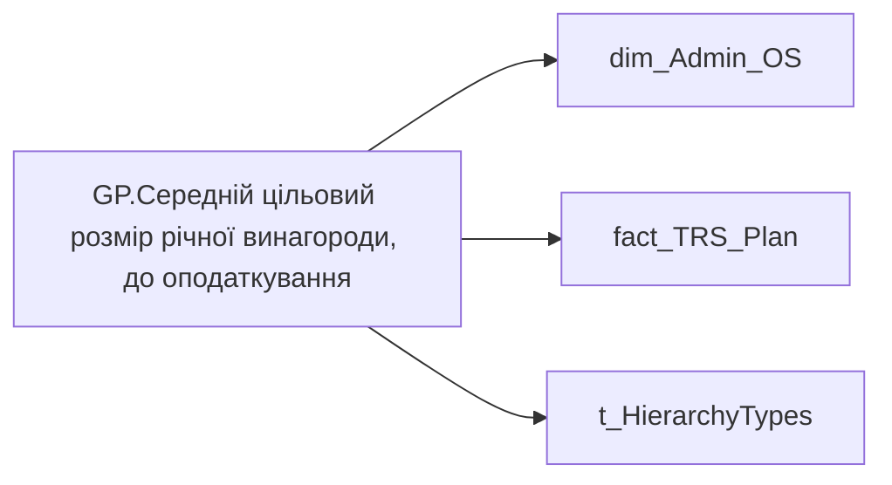

# GP.Середній цільовий розмір річної винагороди, до оподаткування

| Властивість | Значення |
|---|---|
| Тип | міра |
| Home table | _Measures |
| displayFolder | `Group_Profile\TRS` |
| formatString | `#,0` |
| dataType | — |
| Прихована | ні |

## DAX

```dax
//************* ROLE FILTERS **************
VAR _roleIndex = SELECTEDVALUE ( 't_HierarchyTypes'[Index], 1 )   -- 0 = LT, 1 = Admin
VAR _filter_lt = TREATAS ( VALUES ( 'dim_Admin_LT_OS'[USER_ACCESS_ID] ),dim_Admin_OS[USER_ACCESS_ID] )

/* *********** ADMIN *********** */
VAR _admin =      //Fixed * 12 + Variable
AVERAGEX(
	VALUES('dim_Admin_OS'[USER_ACCESS_ID]),
	CALCULATE (
		SUMX (
			fact_TRS_Plan,
			IF (
				fact_TRS_Plan[CALC_TYPE_CODE] = "UAH",
				fact_TRS_Plan[INIT_PAYMENT_PLAN_SUM],
				fact_TRS_Plan[PAYMENT_PLAN_SUM]
			)
		),
		fact_TRS_Plan[IS_ACTUAL] = TRUE (),
		fact_TRS_Plan[category_name] = "Фіксована винагорода",
		fact_TRS_Plan[TARIFF_RATE_TYPE_CODE] <> "СДЕЛЬНАЯ",
		fact_TRS_Plan[END_DATE] > TODAY () 
			|| fact_TRS_Plan[END_DATE] = DATE (2001, 1, 1)
	) * 12 +
	CALCULATE (
		SUM ( fact_TRS_Plan[BONES_SIZE] ),
		fact_TRS_Plan[IS_ACTUAL] = TRUE (),
		fact_TRS_Plan[CALC_TYPE_CODE] = "UAH",
		fact_TRS_Plan[category_name] = "Фіксована винагорода"
	)
)

/* *********** ADMIN LT *********** */
VAR _admin_lt = //Fixed * 12 + Variable
CALCULATE(
	AVERAGEX(
		VALUES('dim_Admin_OS'[USER_ACCESS_ID]),
		CALCULATE (
			SUMX (
				fact_TRS_Plan,
				IF (
					fact_TRS_Plan[CALC_TYPE_CODE] = "UAH",
					fact_TRS_Plan[INIT_PAYMENT_PLAN_SUM],
					fact_TRS_Plan[PAYMENT_PLAN_SUM]
				)
			),
			fact_TRS_Plan[IS_ACTUAL] = TRUE (),
			fact_TRS_Plan[category_name] = "Фіксована винагорода",
			fact_TRS_Plan[TARIFF_RATE_TYPE_CODE] <> "СДЕЛЬНАЯ",
			fact_TRS_Plan[END_DATE] > TODAY () 
				|| fact_TRS_Plan[END_DATE] = DATE (2001, 1, 1)
		) * 12 +
		CALCULATE (
			SUM ( fact_TRS_Plan[BONES_SIZE] ),
			fact_TRS_Plan[IS_ACTUAL] = TRUE (),
			fact_TRS_Plan[CALC_TYPE_CODE] = "UAH",
			fact_TRS_Plan[category_name] = "Фіксована винагорода"
		)
	),
	_filter_lt
)
VAR _res = 
	SWITCH(
		_roleIndex,
		0, _admin_lt,
		1, _admin
	)
RETURN 
COALESCE(_res, "-")
```

## Джерела

Вихідні таблиці: `DM.vw_R27_dim_Employee_Access_List`, `DM.vw_R27_fact_TRS_Plan_PDP`

Колонки: `BONES_SIZE`, `CALC_TYPE_CODE`, `END_DATE`, `INIT_PAYMENT_PLAN_SUM`, `IS_ACTUAL`, `Index`, `PAYMENT_PLAN_SUM`, `TARIFF_RATE_TYPE_CODE`, `USER_ACCESS_ID`, `category_name`

Power Query: `dim_Admin_OS`

## Бізнес-суть

BONES_SIZE → Середній розмір щомісячної премії; BONES_SIZE → Середній розмір квартальної премії; BONES_SIZE → Середній розмір річного бонусу; END_DATE → Термін без відпустки в днях по пріоритетному місцю роботи на поточну дату; INIT_PAYMENT_PLAN_SUM → Цільовий розмір річної винагороди, до оподаткування; INIT_PAYMENT_PLAN_SUM → Оклад по годинах; INIT_PAYMENT_PLAN_SUM → Оклад по днях; INIT_PAYMENT_PLAN_SUM → Премія за місяць, %; INIT_PAYMENT_PLAN_SUM → Доплата за шкідливі умови праці, %; INIT_PAYMENT_PLAN_SUM → Роз'їзний характер роботи, %; INIT_PAYMENT_PLAN_SUM → Оренда житла; INIT_PAYMENT_PLAN_SUM → Середній цільовий розмір річної винагороди, до оподаткування; INIT_PAYMENT_PLAN_SUM → Середня зарплата (оклад); INIT_PAYMENT_PLAN_SUM → Доля команди з премією за місяць, %; INIT_PAYMENT_PLAN_SUM → Доля команди з доплатою за шкідливі умови праці, %; INIT_PAYMENT_PLAN_SUM → Доля команди з доплатою за роз’їзний характер роботи, %; INIT_PAYMENT_PLAN_SUM → Середній розмір доплати за шкідливі умови праці; INIT_PAYMENT_PLAN_SUM → Середній розмір доплати за роз’їзний характер роботи; INIT_PAYMENT_PLAN_SUM → Середні витрати на оренду житла; INIT_PAYMENT_PLAN_SUM → Річний цільовий дохід (РЦД); INIT_PAYMENT_PLAN_SUM → Оклад; PAYMENT_PLAN_SUM → Річний цільовий дохід; PAYMENT_PLAN_SUM → Розмір фіксованої винагороди плановий, за місяць ПОТОЧНИЙ; PAYMENT_PLAN_SUM → Сума (на поточний момент); PAYMENT_PLAN_SUM → Середній розмір премії за місяць; PAYMENT_PLAN_SUM → Доля учасників із зміною фіксованої винагороди; PAYMENT_PLAN_SUM → Діапазон фіксованої винагороди (план); TARIFF_RATE_TYPE_CODE → Вид оплати праці (тарифної ставки); TARIFF_RATE_TYPE_CODE → Вид Тарифної Ставки; category_name → Назва блоку

Розрахункове.  <br>Потрібно зсумувати значення поля BONES_SIZE по тим працівникам, для яких BONUS_MONTH_SALARY_CNT>0, IS_ACTUAL  = "1", CALC_TYPE_CODE = "UAH", category_name = Фіксована винагорода та поділити на кількість членів команди, у яких є такий вид нарахування в планових виплатах.  <br>В деталізацію вивести перелік таких працівників та суму по кожному із них Розрахункове.  <br>Потрібно зсумувати значення поля BONES_SIZE по тим працівникам, для яких BONUS_QUARTER_SALARY_CNT>0, IS_ACTUAL  = "1", CALC_TYPE_CODE = "UAH", category_name = Фіксована винагорода та поділити на кількість членів 

**Вимоги:** `Індивідуальний-профіль-працівника/Історія-по-посадам`, `Індивідуальний-профіль-працівника/Історія-по-посадам/Реліз-1.-Історія-по-посадам`, `Індивідуальний-профіль-працівника/Сторінка-Винагорода-працівника`, `Індивідуальний-профіль-працівника/Сторінка-Винагорода-працівника/Деталізація-на-сторінці-Винагорода`, `Індивідуальний-профіль-працівника/Сторінка-Винагорода-працівника/Доопрацювання-сторінки-ТРС`, `Індивідуальний-профіль-працівника/Сторінка-Винагорода-працівника/РВІ.-Зміна-алгоритму-розрахунку-Річного-цільового-доходу`, `Індивідуальний-профіль-працівника/Сторінка-Результативність-та-оцінка/Блок-Оцінка-компетенцій`, `Допоміжні-вітрини-для-звіту/Таблиця-для-розрахунку-агрегованих-метрик-по-звіту`, `Командний-профіль/Сторінка-TRS-команди`, `Командний-профіль/Сторінка-TRS-команди/Доопрацювання-сторінки-TRS`, `Командний-профіль/Сторінка-TRS-команди/Сторінка-Винагорода-групового-профілю#вимоги-до-звіту`, `Командний-профіль/Сторінка-Моя-команда/ТЗ.-Деталізація-метрик-групового-профілю-звіту`, `Командний-профіль/Сторінка-Результативність-та-оцінка-команди/Блок-Оцінка-компетенцій-(груповий-профіль)`

## Залежності

Таблиці: `dim_Admin_OS`, `fact_TRS_Plan`, `t_HierarchyTypes`

Колонки: `dim_Admin_LT_OS[USER_ACCESS_ID]`, `dim_Admin_OS[USER_ACCESS_ID]`, `fact_TRS_Plan[BONES_SIZE]`, `fact_TRS_Plan[CALC_TYPE_CODE]`, `fact_TRS_Plan[END_DATE]`, `fact_TRS_Plan[INIT_PAYMENT_PLAN_SUM]`, `fact_TRS_Plan[IS_ACTUAL]`, `fact_TRS_Plan[PAYMENT_PLAN_SUM]`, `fact_TRS_Plan[TARIFF_RATE_TYPE_CODE]`, `fact_TRS_Plan[category_name]`, `t_HierarchyTypes[Index]`

## Схема



## Нотатки

_порожньо_
