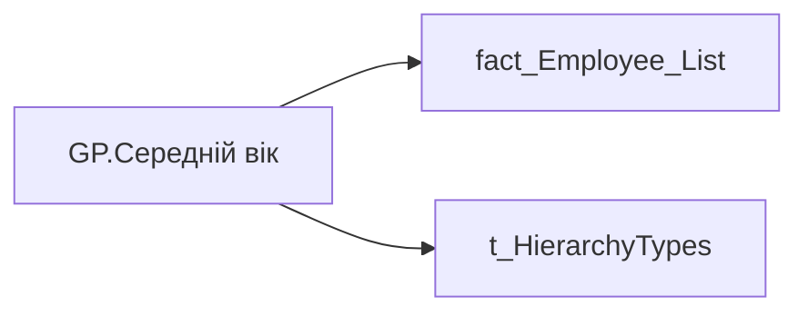

# GP.Середній вік

| Властивість | Значення |
|---|---|
| Тип | міра |
| Home table | _Measures |
| displayFolder | `Group_Profile\Загальна інформація` |
| formatString | `#,0.00;-#,0.00;0.00` |
| dataType | — |
| Прихована | ні |

## DAX

```dax
//************* ROLE FILTERS **************
VAR _roleIndex = SELECTEDVALUE ( 't_HierarchyTypes'[Index], 1 )   -- 0 = LT, 1 = Admin
VAR _filter_lt = TREATAS ( VALUES ( 'dim_Admin_LT_OS'[USER_ACCESS_ID] ),'fact_Employee_List'[USER_ACCESS_ID] )

/* *********** ADMIN *********** */
VAR _admin =
	AVERAGEX(
		VALUES('fact_Employee_List'[PERSON_KEY]),
		CALCULATE(AVERAGE('fact_Employee_List'[age]))
	)

/* *********** LT *********** */
VAR _admin_lt =
CALCULATE(
	AVERAGEX(
		VALUES('fact_Employee_List'[PERSON_KEY]),
		CALCULATE(AVERAGE('fact_Employee_List'[age]))
	),
	_filter_lt
)
VAR _res =
	SWITCH (
		_roleIndex,
		0, _admin_lt,    -- LT
		1, _admin,       -- Admin
		_admin
	)
RETURN COALESCE(_res, "-")
```

## Джерела


Колонки: `Index`, `PERSON_KEY`, `USER_ACCESS_ID`, `age`

Power Query: `fact_Employee_List`

## Бізнес-суть

age → Середній вік

Розрахункове поле: Середній вік = (age1 +age2 + age3.... + agen )/С, де: - age1, age2,age3... agen - вік кожного працівника; - С - кількість працівників в команді

**Вимоги:** `Командний-профіль/Сторінка-Загальна-інформація-про-команду`

## Залежності

Таблиці: `fact_Employee_List`, `t_HierarchyTypes`

Колонки: `dim_Admin_LT_OS[USER_ACCESS_ID]`, `fact_Employee_List[PERSON_KEY]`, `fact_Employee_List[USER_ACCESS_ID]`, `fact_Employee_List[age]`, `t_HierarchyTypes[Index]`

## Схема



## Нотатки

_порожньо_
