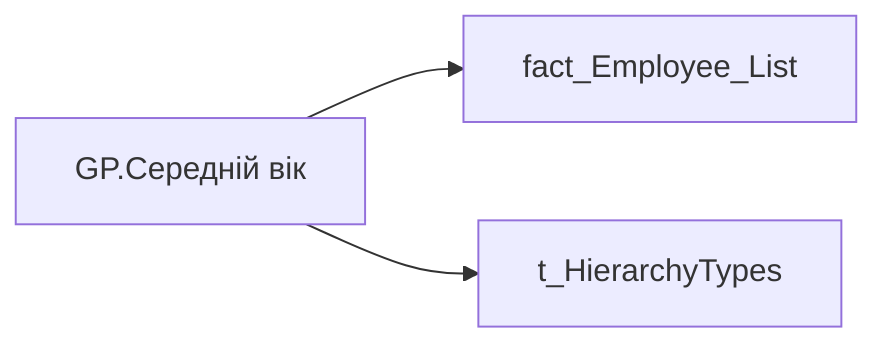

# GP.Середній вік

*тека `Group_Profile\Загальна інформація` · формат `#,0.00;-#,0.00;0.00`*

## Технічний опис

| Властивість | Значення |
|---|---|
| Тип | міра |
| Home table | _Measures |
| displayFolder | `Group_Profile\Загальна інформація` |
| formatString | `#,0.00;-#,0.00;0.00` |
| dataType | — |
| Прихована | ні |

### DAX

```dax
//************* ROLE FILTERS **************
VAR _roleIndex = SELECTEDVALUE ( 't_HierarchyTypes'[Index], 1 )   -- 0 = LT, 1 = Admin
VAR _filter_lt = TREATAS ( VALUES ( 'dim_Admin_LT_OS'[USER_ACCESS_ID] ),'fact_Employee_List'[USER_ACCESS_ID] )

/* *********** ADMIN *********** */
VAR _admin =
	AVERAGEX(
		VALUES('fact_Employee_List'[PERSON_KEY]),
		CALCULATE(AVERAGE('fact_Employee_List'[age]))
	)

/* *********** LT *********** */
VAR _admin_lt =
CALCULATE(
	AVERAGEX(
		VALUES('fact_Employee_List'[PERSON_KEY]),
		CALCULATE(AVERAGE('fact_Employee_List'[age]))
	),
	_filter_lt
)
VAR _res =
	SWITCH (
		_roleIndex,
		0, _admin_lt,    -- LT
		1, _admin,       -- Admin
		_admin
	)
RETURN COALESCE(_res, "-")
```

### Джерела даних


Колонки: `Index`, `PERSON_KEY`, `USER_ACCESS_ID`, `age`

Power Query: `fact_Employee_List`

### Залежності (таблиці й колонки)

Таблиці: `fact_Employee_List`, `t_HierarchyTypes`

Колонки: `dim_Admin_LT_OS[USER_ACCESS_ID]`, `fact_Employee_List[PERSON_KEY]`, `fact_Employee_List[USER_ACCESS_ID]`, `fact_Employee_List[age]`, `t_HierarchyTypes[Index]`

### Схема



---

## Бізнес-суть

**Бізнес-назва:** Середній вік

### Опис із ТЗ

Розрахункове поле: Середній вік = (age1 +age2 + age3.... + agen )/С, де: - age1, age2,age3... agen - вік кожного працівника; - С - кількість працівників в команді

??? note "Поля-джерела та пов'язані бізнес-метрики (1)"
    | Поле | Бізнес-метрики |
    |---|---|
    | `age` | Середній вік |

**Вимоги (ТЗ):**

- [Командний профіль › Сторінка Загальна інформація про команду](https://dev.azure.com/MHPITDepProjects/People%20Digital%20Profile%20%28PDP%29/_wiki/wikis/PDP.wiki?pagePath=/%D0%A4%D1%83%D0%BD%D0%BA%D1%86%D1%96%D0%BE%D0%BD%D0%B0%D0%BB%D1%8C%D0%BD%D1%96%20%D0%B2%D0%B8%D0%BC%D0%BE%D0%B3%D0%B8/%D0%92%D0%B8%D0%BC%D0%BE%D0%B3%D0%B8%20%D0%B4%D0%BE%20%D0%B7%D0%B2%D1%96%D1%82%D1%83%20People%20Digital%20Profile/%D0%9A%D0%BE%D0%BC%D0%B0%D0%BD%D0%B4%D0%BD%D0%B8%D0%B9%20%D0%BF%D1%80%D0%BE%D1%84%D1%96%D0%BB%D1%8C/%D0%A1%D1%82%D0%BE%D1%80%D1%96%D0%BD%D0%BA%D0%B0%20%D0%97%D0%B0%D0%B3%D0%B0%D0%BB%D1%8C%D0%BD%D0%B0%20%D1%96%D0%BD%D1%84%D0%BE%D1%80%D0%BC%D0%B0%D1%86%D1%96%D1%8F%20%D0%BF%D1%80%D0%BE%20%D0%BA%D0%BE%D0%BC%D0%B0%D0%BD%D0%B4%D1%83)

## На сторінках звіту

[Group Profile](../report/group-profile.md)

## Пов'язані міри

_Прямих зв'язків з іншими мірами немає._

## Нотатки

_порожньо_
