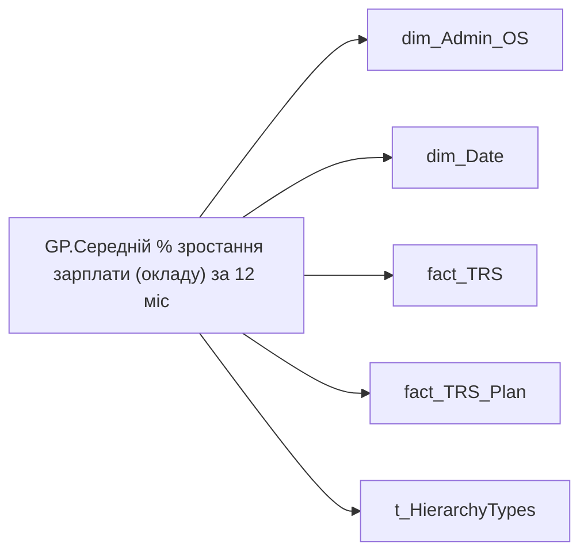

# GP.Середній % зростання зарплати (окладу) за 12 міс

*тека `Group_Profile\TRS` · формат `0.00%;-0.00%;0.00%`*

## Технічний опис

| Властивість | Значення |
|---|---|
| Тип | міра |
| Home table | _Measures |
| displayFolder | `Group_Profile\TRS` |
| formatString | `0.00%;-0.00%;0.00%` |
| dataType | — |
| Прихована | ні |

### DAX

```dax
//************* ROLE FILTERS **************
VAR _roleIndex = SELECTEDVALUE ( 't_HierarchyTypes'[Index], 1 )   -- 0 = LT, 1 = Admin
VAR _filter_lt = TREATAS ( VALUES ( 'dim_Admin_LT_OS'[USER_ACCESS_ID] ),dim_Admin_OS[USER_ACCESS_ID] )

/* *********** ADMIN *********** */
VAR _admin =
	VAR _Employees =VALUES('dim_Admin_OS'[USER_ACCESS_ID])
	VAR _table0 = 
		ADDCOLUMNS(
			_Employees,
			"@Now",
			CALCULATE(
				MAX(fact_TRS_Plan[INIT_PAYMENT_PLAN_SUM]),
				fact_TRS_Plan[IS_ACTUAL]=TRUE(),
				fact_TRS_Plan[ACCRUAL_ORG_BASE_CODE] IN { "00002","00001" }
			),
			"@YearAgo",
				VAR _CurrMonthStart = DATE ( YEAR ( TODAY() ), MONTH ( TODAY() ), 1 )
				VAR _PrevYearSameMonthStart = EDATE ( _CurrMonthStart, -12 )
				VAR _prev_year = 
					CALCULATE(
						AVERAGE(fact_TRS[PAYMENTS_PLAN_UAH]),
						fact_TRS[ACCRUAL_TYPES_KEY] IN { "5e416521-f6d6-80e3-bcde-48aec8a474fe", "5b975c51-df44-fbad-4b67-73abd98b7e0e" },
						TREATAS({_PrevYearSameMonthStart}, 'dim_Date'[Date])
					)
				RETURN _prev_year
		)
	VAR _AverageSalaryGrowth = 
		DIVIDE(
			SUMX(
				FILTER(
					_table0, 
					NOT ISBLANK([@YearAgo]) && [@Now] - [@YearAgo] > 0
				),
				[@Now] - [@YearAgo]
			),
			SUMX(
				FILTER(
					_table0, 
					NOT ISBLANK([@YearAgo]) && [@Now] - [@YearAgo] > 0
				),
				[@YearAgo]
			)
		)
	RETURN _AverageSalaryGrowth


/* *********** LT *********** */
VAR _admin_lt =
	VAR _table0 = 
		CALCULATETABLE(
			ADDCOLUMNS(
				VALUES( 'dim_Admin_OS'[USER_ACCESS_ID] ),
				"@Now",
				CALCULATE(
					MAX( fact_TRS_Plan[INIT_PAYMENT_PLAN_SUM] ),
					fact_TRS_Plan[IS_ACTUAL] = TRUE(),
					fact_TRS_Plan[ACCRUAL_ORG_BASE_CODE] IN { "00002", "00001" }
				),
				"@YearAgo",
				VAR _CurrMonthStart = DATE( YEAR( TODAY() ), MONTH( TODAY() ), 1 )
				VAR _PrevYearSameMonthStart = EDATE( _CurrMonthStart, - 12 )
				VAR _prev_year =
				CALCULATE(
					AVERAGE( fact_TRS[PAYMENTS_PLAN_UAH] ),
					fact_TRS[ACCRUAL_TYPES_KEY] IN { "5e416521-f6d6-80e3-bcde-48aec8a474fe", "5b975c51-df44-fbad-4b67-73abd98b7e0e" },
					TREATAS( { _PrevYearSameMonthStart }, 'dim_Date'[Date] )
				)
				RETURN _prev_year
			),
			_filter_lt
		)
	VAR _AverageSalaryGrowth = 
		DIVIDE(
			SUMX(
				FILTER(
					_table0, 
					NOT ISBLANK([@YearAgo]) && [@Now] - [@YearAgo] > 0
				),
				[@Now] - [@YearAgo]
			),
			SUMX(
				FILTER(
					_table0, 
					NOT ISBLANK([@YearAgo]) && [@Now] - [@YearAgo] > 0
				),
				[@YearAgo]
			)
		)
	RETURN _AverageSalaryGrowth

VAR _res =
	SWITCH (
		_roleIndex,
		0, _admin_lt,    -- LT
		1, _admin,       -- Admin
		_admin
	)
RETURN 
COALESCE(
	_res, "-")
```

### Джерела даних

Вихідні таблиці: `DM.vw_R27_dim_Employee_Access_List`, `DM.vw_R27_fact_TRS_PDP`, `DM.vw_R27_fact_TRS_Plan_PDP`

Колонки: `ACCRUAL_ORG_BASE_CODE`, `ACCRUAL_TYPES_KEY`, `Date`, `INIT_PAYMENT_PLAN_SUM`, `IS_ACTUAL`, `Index`, `PAYMENTS_PLAN_UAH`, `USER_ACCESS_ID`

Power Query: `dim_Admin_OS`

### Залежності (таблиці й колонки)

Таблиці: `dim_Admin_OS`, `dim_Date`, `fact_TRS`, `fact_TRS_Plan`, `t_HierarchyTypes`

Колонки: `dim_Admin_LT_OS[USER_ACCESS_ID]`, `dim_Admin_OS[USER_ACCESS_ID]`, `dim_Date[Date]`, `fact_TRS[ACCRUAL_TYPES_KEY]`, `fact_TRS[PAYMENTS_PLAN_UAH]`, `fact_TRS_Plan[ACCRUAL_ORG_BASE_CODE]`, `fact_TRS_Plan[INIT_PAYMENT_PLAN_SUM]`, `fact_TRS_Plan[IS_ACTUAL]`, `t_HierarchyTypes[Index]`

### Схема



---

## Бізнес-суть

!!! note "Бізнес-визначення відсутнє"
    Поля міри не зіставлено з wiki «Таблицями джерел даних». Можна заповнити вручну в `manualNotes`.

## На сторінках звіту

- [Group Profile](../report/group-profile.md) — TRS

## Пов'язані міри

_Прямих зв'язків з іншими мірами немає._

## Нотатки

_порожньо_
