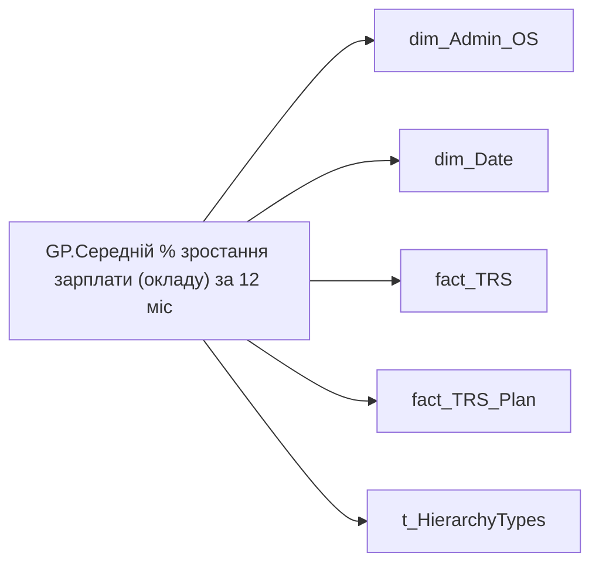

# GP.Середній % зростання зарплати (окладу) за 12 міс

*тека `Group_Profile\TRS` · формат `0.00%;-0.00%;0.00%`*

## Технічний опис

| Властивість | Значення |
|---|---|
| Тип | міра |
| Home table | _Measures |
| displayFolder | `Group_Profile\TRS` |
| formatString | `0.00%;-0.00%;0.00%` |
| dataType | — |
| Прихована | ні |

### DAX

```dax
//************* ROLE FILTERS **************
VAR _roleIndex = SELECTEDVALUE ( 't_HierarchyTypes'[Index], 1 )   -- 0 = LT, 1 = Admin
VAR _filter_lt = TREATAS ( VALUES ( 'dim_Admin_LT_OS'[USER_ACCESS_ID] ),dim_Admin_OS[USER_ACCESS_ID] )

/* *********** ADMIN *********** */
VAR _admin =
	VAR _Employees =VALUES('dim_Admin_OS'[USER_ACCESS_ID])
	VAR _table0 = 
		ADDCOLUMNS(
			_Employees,
			"@Now",
			CALCULATE(
				MAX(fact_TRS_Plan[INIT_PAYMENT_PLAN_SUM]),
				fact_TRS_Plan[IS_ACTUAL]=TRUE(),
				fact_TRS_Plan[ACCRUAL_ORG_BASE_CODE] IN { "00002","00001" }
			),
			"@YearAgo",
				VAR _CurrMonthStart = DATE ( YEAR ( TODAY() ), MONTH ( TODAY() ), 1 )
				VAR _PrevYearSameMonthStart = EDATE ( _CurrMonthStart, -12 )
				VAR _prev_year = 
					CALCULATE(
						AVERAGE(fact_TRS[PAYMENTS_PLAN_UAH]),
						fact_TRS[ACCRUAL_TYPES_KEY] IN { "5e416521-f6d6-80e3-bcde-48aec8a474fe", "5b975c51-df44-fbad-4b67-73abd98b7e0e" },
						TREATAS({_PrevYearSameMonthStart}, 'dim_Date'[Date])
					)
				RETURN _prev_year
		)
	VAR _AverageSalaryGrowth = 
		DIVIDE(
			SUMX(
				FILTER(
					_table0, 
					NOT ISBLANK([@YearAgo]) && [@Now] - [@YearAgo] > 0
				),
				[@Now] - [@YearAgo]
			),
			SUMX(
				FILTER(
					_table0, 
					NOT ISBLANK([@YearAgo]) && [@Now] - [@YearAgo] > 0
				),
				[@YearAgo]
			)
		)
	RETURN _AverageSalaryGrowth


/* *********** LT *********** */
VAR _admin_lt =
	VAR _table0 = 
		CALCULATETABLE(
			ADDCOLUMNS(
				VALUES( 'dim_Admin_OS'[USER_ACCESS_ID] ),
				"@Now",
				CALCULATE(
					MAX( fact_TRS_Plan[INIT_PAYMENT_PLAN_SUM] ),
					fact_TRS_Plan[IS_ACTUAL] = TRUE(),
					fact_TRS_Plan[ACCRUAL_ORG_BASE_CODE] IN { "00002", "00001" }
				),
				"@YearAgo",
				VAR _CurrMonthStart = DATE( YEAR( TODAY() ), MONTH( TODAY() ), 1 )
				VAR _PrevYearSameMonthStart = EDATE( _CurrMonthStart, - 12 )
				VAR _prev_year =
				CALCULATE(
					AVERAGE( fact_TRS[PAYMENTS_PLAN_UAH] ),
					fact_TRS[ACCRUAL_TYPES_KEY] IN { "5e416521-f6d6-80e3-bcde-48aec8a474fe", "5b975c51-df44-fbad-4b67-73abd98b7e0e" },
					TREATAS( { _PrevYearSameMonthStart }, 'dim_Date'[Date] )
				)
				RETURN _prev_year
			),
			_filter_lt
		)
	VAR _AverageSalaryGrowth = 
		DIVIDE(
			SUMX(
				FILTER(
					_table0, 
					NOT ISBLANK([@YearAgo]) && [@Now] - [@YearAgo] > 0
				),
				[@Now] - [@YearAgo]
			),
			SUMX(
				FILTER(
					_table0, 
					NOT ISBLANK([@YearAgo]) && [@Now] - [@YearAgo] > 0
				),
				[@YearAgo]
			)
		)
	RETURN _AverageSalaryGrowth

VAR _res =
	SWITCH (
		_roleIndex,
		0, _admin_lt,    -- LT
		1, _admin,       -- Admin
		_admin
	)
RETURN 
COALESCE(
	_res, "-")
```

### Джерела даних

Вихідні таблиці: `DM.vw_R27_dim_Employee_Access_List`, `DM.vw_R27_fact_TRS_PDP`, `DM.vw_R27_fact_TRS_Plan_PDP`

Колонки: `ACCRUAL_ORG_BASE_CODE`, `ACCRUAL_TYPES_KEY`, `Date`, `INIT_PAYMENT_PLAN_SUM`, `IS_ACTUAL`, `Index`, `PAYMENTS_PLAN_UAH`, `USER_ACCESS_ID`

Power Query: `dim_Admin_OS`

### Залежності (таблиці й колонки)

Таблиці: `dim_Admin_OS`, `dim_Date`, `fact_TRS`, `fact_TRS_Plan`, `t_HierarchyTypes`

Колонки: `dim_Admin_LT_OS[USER_ACCESS_ID]`, `dim_Admin_OS[USER_ACCESS_ID]`, `dim_Date[Date]`, `fact_TRS[ACCRUAL_TYPES_KEY]`, `fact_TRS[PAYMENTS_PLAN_UAH]`, `fact_TRS_Plan[ACCRUAL_ORG_BASE_CODE]`, `fact_TRS_Plan[INIT_PAYMENT_PLAN_SUM]`, `fact_TRS_Plan[IS_ACTUAL]`, `t_HierarchyTypes[Index]`

### Схема



---

## Бізнес-суть

### Опис із ТЗ

Відібрати записи по працівнику `person_key`, періоду `Period`, організації `organization_key`, підрозділу `division_key`, де `trs_category` = Фіксована винагорода, `is_payments_plan`  = "1"

Потрібно відібрати записи станом на 12 міс. тому, де `ACCRUAL_TYPES_KEY` = 5e416521-f6d6-80e3-bcde-48aec8a474fe та `IS_PAYMENTS_PLAN` =1

Сума за поточний місяць (план) - Відібрати записи по працівнику `person_key`, періоду `Period`, організації `organization_key`, підрозділу `division_key`, де `category_name` = Фіксована винагорода, `IS_ACTUAL`  = "1", `END_DATE` > поточна дата, або `END_DATE` = "01.01.2001".   Сума станом рік назад (план) - Відібрати записи по працівнику `person_key`, періоду `Period`, організації `organization_key`, підрозділу `division_key`, де `trs_category` = Фіксована винагорода, `is_payments_plan`  = "1"

Це сума по блокам Фіксована винагорода, всього х 12, Змінна винагорода (Щомісячна премія+ Квартальна премія+ Річний бонус) приведена до річної суми.   - **Фіксована винагорода** = Відібрати записи по працівнику `person_key`, періоду `Period`, організації `organization_key`, підрозділу `division_key`, де `category_name` = Фіксована винагорода, `IS_ACTUAL`  = "1",  `TARIFF_RATE_TYPE_CODE` <> "СДЕЛЬНАЯ", `END_DATE` > поточна дата, або `END_DATE` = "01.01.2001".   Значення брати з `INIT_PAYMENT_PLAN_SUM`, якщо `CALC_TYPE_CODE` = "UAH", інакше - `PAYMENT_PLAN_SUM`.    - **Змінна винагорода**(визначається по атрибутах із таблиці DM.`vw_R27_fact_Employee_List_PDP`) = Сума Розмірів премій місячних, квартальних і річних **Розмір місячної премії** = `Min_Tariff_Rate` х `BONUS_MONTH_SALARY_CNT` х 12 - сума (к-сть окладівхОкладх12)   Якщо по працівнику записи відсутні, то показати 0,00 грн.  **Розмір квартальної премії** = `Min_Tariff_Rate` х `BONUS_QUARTER_SALARY_CNT` х 4 - сума (к-сть окладівхОкладх4)   Якщо по працівнику записи відсутні, то показати 0,00 грн.  **Розмір річної премії** = `Min_Tariff_Rate` х `BONUS_YEAR_SALARY_CNT` - сума (к-сть окладівхОклад)   Якщо по працівнику записи відсутні, то показати 0,00 грн.

Це поле має бути доступне у візуалізаціях, побудованих на основі фактової таблиці `DM.vw_R29_fact_TRS_Plan`   Відібрати записи по працівнику по працівнику `person_key`, періоду `Period`, організації `organization_key` ,  підрозділу `division_key` де `ACCRUAL_ORG_CODE` = 00002, `IS_ACTUAL`  = "1", `END_DATE` > поточна дата, або `END_DATE` = "01.01.2001   Якщо для працівника застосовується інший вид оплати праці, то вивести "Дані відсутні"

??? note "Поля-джерела та пов'язані бізнес-метрики (21)"
    | Поле | Бізнес-метрики |
    |---|---|
    | `INIT_PAYMENT_PLAN_SUM` | Цільовий розмір річної винагороди, до оподаткування · Оклад по годинах · Оклад по днях · Премія за місяць, % · Доплата за шкідливі умови праці, % · Роз'їзний характер роботи, % · Оренда житла · Середній цільовий розмір річної винагороди, до оподаткування · Середня зарплата (оклад) · Доля команди з премією за місяць, % · Доля команди з доплатою за шкідливі умови праці, % · Доля команди з доплатою за роз’їзний характер роботи, % · Середній розмір доплати за шкідливі умови праці · Середній розмір доплати за роз’їзний характер роботи · Середні витрати на оренду житла · Річний цільовий дохід (РЦД) · Оклад |
    | `PAYMENTS_PLAN_UAH` | Розмір фіксованої винагороди плановий, за місяць СТАНОМ НА РІК НАЗАД · Сума (рік тому) · Оклад по годинам (рік тому) · % зміни фіксованої винагороди |

**Вимоги (ТЗ):**

- [Індивідуальний профіль працівника › Сторінка Винагорода працівника](https://dev.azure.com/MHPITDepProjects/People%20Digital%20Profile%20%28PDP%29/_wiki/wikis/PDP.wiki?pagePath=/%D0%A4%D1%83%D0%BD%D0%BA%D1%86%D1%96%D0%BE%D0%BD%D0%B0%D0%BB%D1%8C%D0%BD%D1%96%20%D0%B2%D0%B8%D0%BC%D0%BE%D0%B3%D0%B8/%D0%92%D0%B8%D0%BC%D0%BE%D0%B3%D0%B8%20%D0%B4%D0%BE%20%D0%B7%D0%B2%D1%96%D1%82%D1%83%20People%20Digital%20Profile/%D0%86%D0%BD%D0%B4%D0%B8%D0%B2%D1%96%D0%B4%D1%83%D0%B0%D0%BB%D1%8C%D0%BD%D0%B8%D0%B9%20%D0%BF%D1%80%D0%BE%D1%84%D1%96%D0%BB%D1%8C%20%D0%BF%D1%80%D0%B0%D1%86%D1%96%D0%B2%D0%BD%D0%B8%D0%BA%D0%B0/%D0%A1%D1%82%D0%BE%D1%80%D1%96%D0%BD%D0%BA%D0%B0%20%D0%92%D0%B8%D0%BD%D0%B0%D0%B3%D0%BE%D1%80%D0%BE%D0%B4%D0%B0%20%D0%BF%D1%80%D0%B0%D1%86%D1%96%D0%B2%D0%BD%D0%B8%D0%BA%D0%B0)
- [Індивідуальний профіль працівника › Сторінка Винагорода працівника › Деталізація на сторінці Винагорода](https://dev.azure.com/MHPITDepProjects/People%20Digital%20Profile%20%28PDP%29/_wiki/wikis/PDP.wiki?pagePath=/%D0%A4%D1%83%D0%BD%D0%BA%D1%86%D1%96%D0%BE%D0%BD%D0%B0%D0%BB%D1%8C%D0%BD%D1%96%20%D0%B2%D0%B8%D0%BC%D0%BE%D0%B3%D0%B8/%D0%92%D0%B8%D0%BC%D0%BE%D0%B3%D0%B8%20%D0%B4%D0%BE%20%D0%B7%D0%B2%D1%96%D1%82%D1%83%20People%20Digital%20Profile/%D0%86%D0%BD%D0%B4%D0%B8%D0%B2%D1%96%D0%B4%D1%83%D0%B0%D0%BB%D1%8C%D0%BD%D0%B8%D0%B9%20%D0%BF%D1%80%D0%BE%D1%84%D1%96%D0%BB%D1%8C%20%D0%BF%D1%80%D0%B0%D1%86%D1%96%D0%B2%D0%BD%D0%B8%D0%BA%D0%B0/%D0%A1%D1%82%D0%BE%D1%80%D1%96%D0%BD%D0%BA%D0%B0%20%D0%92%D0%B8%D0%BD%D0%B0%D0%B3%D0%BE%D1%80%D0%BE%D0%B4%D0%B0%20%D0%BF%D1%80%D0%B0%D1%86%D1%96%D0%B2%D0%BD%D0%B8%D0%BA%D0%B0/%D0%94%D0%B5%D1%82%D0%B0%D0%BB%D1%96%D0%B7%D0%B0%D1%86%D1%96%D1%8F%20%D0%BD%D0%B0%20%D1%81%D1%82%D0%BE%D1%80%D1%96%D0%BD%D1%86%D1%96%20%D0%92%D0%B8%D0%BD%D0%B0%D0%B3%D0%BE%D1%80%D0%BE%D0%B4%D0%B0)
- [Індивідуальний профіль працівника › Сторінка Винагорода працівника › Доопрацювання сторінки ТРС](https://dev.azure.com/MHPITDepProjects/People%20Digital%20Profile%20%28PDP%29/_wiki/wikis/PDP.wiki?pagePath=/%D0%A4%D1%83%D0%BD%D0%BA%D1%86%D1%96%D0%BE%D0%BD%D0%B0%D0%BB%D1%8C%D0%BD%D1%96%20%D0%B2%D0%B8%D0%BC%D0%BE%D0%B3%D0%B8/%D0%92%D0%B8%D0%BC%D0%BE%D0%B3%D0%B8%20%D0%B4%D0%BE%20%D0%B7%D0%B2%D1%96%D1%82%D1%83%20People%20Digital%20Profile/%D0%86%D0%BD%D0%B4%D0%B8%D0%B2%D1%96%D0%B4%D1%83%D0%B0%D0%BB%D1%8C%D0%BD%D0%B8%D0%B9%20%D0%BF%D1%80%D0%BE%D1%84%D1%96%D0%BB%D1%8C%20%D0%BF%D1%80%D0%B0%D1%86%D1%96%D0%B2%D0%BD%D0%B8%D0%BA%D0%B0/%D0%A1%D1%82%D0%BE%D1%80%D1%96%D0%BD%D0%BA%D0%B0%20%D0%92%D0%B8%D0%BD%D0%B0%D0%B3%D0%BE%D1%80%D0%BE%D0%B4%D0%B0%20%D0%BF%D1%80%D0%B0%D1%86%D1%96%D0%B2%D0%BD%D0%B8%D0%BA%D0%B0/%D0%94%D0%BE%D0%BE%D0%BF%D1%80%D0%B0%D1%86%D1%8E%D0%B2%D0%B0%D0%BD%D0%BD%D1%8F%20%D1%81%D1%82%D0%BE%D1%80%D1%96%D0%BD%D0%BA%D0%B8%20%D0%A2%D0%A0%D0%A1)
- [Індивідуальний профіль працівника › Сторінка Винагорода працівника › РВІ. Зміна алгоритму розрахунку Річного цільового доходу](https://dev.azure.com/MHPITDepProjects/People%20Digital%20Profile%20%28PDP%29/_wiki/wikis/PDP.wiki?pagePath=/%D0%A4%D1%83%D0%BD%D0%BA%D1%86%D1%96%D0%BE%D0%BD%D0%B0%D0%BB%D1%8C%D0%BD%D1%96%20%D0%B2%D0%B8%D0%BC%D0%BE%D0%B3%D0%B8/%D0%92%D0%B8%D0%BC%D0%BE%D0%B3%D0%B8%20%D0%B4%D0%BE%20%D0%B7%D0%B2%D1%96%D1%82%D1%83%20People%20Digital%20Profile/%D0%86%D0%BD%D0%B4%D0%B8%D0%B2%D1%96%D0%B4%D1%83%D0%B0%D0%BB%D1%8C%D0%BD%D0%B8%D0%B9%20%D0%BF%D1%80%D0%BE%D1%84%D1%96%D0%BB%D1%8C%20%D0%BF%D1%80%D0%B0%D1%86%D1%96%D0%B2%D0%BD%D0%B8%D0%BA%D0%B0/%D0%A1%D1%82%D0%BE%D1%80%D1%96%D0%BD%D0%BA%D0%B0%20%D0%92%D0%B8%D0%BD%D0%B0%D0%B3%D0%BE%D1%80%D0%BE%D0%B4%D0%B0%20%D0%BF%D1%80%D0%B0%D1%86%D1%96%D0%B2%D0%BD%D0%B8%D0%BA%D0%B0/%D0%A0%D0%92%D0%86.%20%D0%97%D0%BC%D1%96%D0%BD%D0%B0%20%D0%B0%D0%BB%D0%B3%D0%BE%D1%80%D0%B8%D1%82%D0%BC%D1%83%20%D1%80%D0%BE%D0%B7%D1%80%D0%B0%D1%85%D1%83%D0%BD%D0%BA%D1%83%20%D0%A0%D1%96%D1%87%D0%BD%D0%BE%D0%B3%D0%BE%20%D1%86%D1%96%D0%BB%D1%8C%D0%BE%D0%B2%D0%BE%D0%B3%D0%BE%20%D0%B4%D0%BE%D1%85%D0%BE%D0%B4%D1%83)
- [Командний профіль › Сторінка TRS команди](https://dev.azure.com/MHPITDepProjects/People%20Digital%20Profile%20%28PDP%29/_wiki/wikis/PDP.wiki?pagePath=/%D0%A4%D1%83%D0%BD%D0%BA%D1%86%D1%96%D0%BE%D0%BD%D0%B0%D0%BB%D1%8C%D0%BD%D1%96%20%D0%B2%D0%B8%D0%BC%D0%BE%D0%B3%D0%B8/%D0%92%D0%B8%D0%BC%D0%BE%D0%B3%D0%B8%20%D0%B4%D0%BE%20%D0%B7%D0%B2%D1%96%D1%82%D1%83%20People%20Digital%20Profile/%D0%9A%D0%BE%D0%BC%D0%B0%D0%BD%D0%B4%D0%BD%D0%B8%D0%B9%20%D0%BF%D1%80%D0%BE%D1%84%D1%96%D0%BB%D1%8C/%D0%A1%D1%82%D0%BE%D1%80%D1%96%D0%BD%D0%BA%D0%B0%20TRS%20%D0%BA%D0%BE%D0%BC%D0%B0%D0%BD%D0%B4%D0%B8)
- [Командний профіль › Сторінка TRS команди › Сторінка Винагорода групового профілю › вимоги до звіту](https://dev.azure.com/MHPITDepProjects/People%20Digital%20Profile%20%28PDP%29/_wiki/wikis/PDP.wiki?pagePath=/%D0%A4%D1%83%D0%BD%D0%BA%D1%86%D1%96%D0%BE%D0%BD%D0%B0%D0%BB%D1%8C%D0%BD%D1%96%20%D0%B2%D0%B8%D0%BC%D0%BE%D0%B3%D0%B8/%D0%92%D0%B8%D0%BC%D0%BE%D0%B3%D0%B8%20%D0%B4%D0%BE%20%D0%B7%D0%B2%D1%96%D1%82%D1%83%20People%20Digital%20Profile/%D0%9A%D0%BE%D0%BC%D0%B0%D0%BD%D0%B4%D0%BD%D0%B8%D0%B9%20%D0%BF%D1%80%D0%BE%D1%84%D1%96%D0%BB%D1%8C/%D0%A1%D1%82%D0%BE%D1%80%D1%96%D0%BD%D0%BA%D0%B0%20TRS%20%D0%BA%D0%BE%D0%BC%D0%B0%D0%BD%D0%B4%D0%B8/%D0%A1%D1%82%D0%BE%D1%80%D1%96%D0%BD%D0%BA%D0%B0%20%D0%92%D0%B8%D0%BD%D0%B0%D0%B3%D0%BE%D1%80%D0%BE%D0%B4%D0%B0%20%D0%B3%D1%80%D1%83%D0%BF%D0%BE%D0%B2%D0%BE%D0%B3%D0%BE%20%D0%BF%D1%80%D0%BE%D1%84%D1%96%D0%BB%D1%8E)
- [Командний профіль › Сторінка Моя команда › ТЗ. Деталізація метрик групового профілю звіту](https://dev.azure.com/MHPITDepProjects/People%20Digital%20Profile%20%28PDP%29/_wiki/wikis/PDP.wiki?pagePath=/%D0%A4%D1%83%D0%BD%D0%BA%D1%86%D1%96%D0%BE%D0%BD%D0%B0%D0%BB%D1%8C%D0%BD%D1%96%20%D0%B2%D0%B8%D0%BC%D0%BE%D0%B3%D0%B8/%D0%92%D0%B8%D0%BC%D0%BE%D0%B3%D0%B8%20%D0%B4%D0%BE%20%D0%B7%D0%B2%D1%96%D1%82%D1%83%20People%20Digital%20Profile/%D0%9A%D0%BE%D0%BC%D0%B0%D0%BD%D0%B4%D0%BD%D0%B8%D0%B9%20%D0%BF%D1%80%D0%BE%D1%84%D1%96%D0%BB%D1%8C/%D0%A1%D1%82%D0%BE%D1%80%D1%96%D0%BD%D0%BA%D0%B0%20%D0%9C%D0%BE%D1%8F%20%D0%BA%D0%BE%D0%BC%D0%B0%D0%BD%D0%B4%D0%B0/%D0%A2%D0%97.%20%D0%94%D0%B5%D1%82%D0%B0%D0%BB%D1%96%D0%B7%D0%B0%D1%86%D1%96%D1%8F%20%D0%BC%D0%B5%D1%82%D1%80%D0%B8%D0%BA%20%D0%B3%D1%80%D1%83%D0%BF%D0%BE%D0%B2%D0%BE%D0%B3%D0%BE%20%D0%BF%D1%80%D0%BE%D1%84%D1%96%D0%BB%D1%8E%20%D0%B7%D0%B2%D1%96%D1%82%D1%83)

## На сторінках звіту

[Group Profile](../report/group-profile.md)

## Пов'язані міри

_Прямих зв'язків з іншими мірами немає._

## Нотатки

_порожньо_
