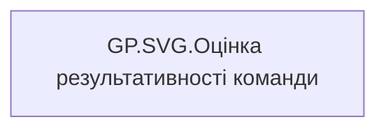

# GP.SVG.Оцінка результативності команди

*тека `Group_Profile\_Main\SVG`*

## Бізнес-суть

!!! note "Бізнес-визначення відсутнє"
    Поля міри не зіставлено з wiki «Таблицями джерел даних». Можна заповнити вручну в `manualNotes`.

## На сторінках звіту

_Не використовується на основних сторінках звіту._

## Пов'язані міри

**Використовує:** [GP.Оцінка результативності попередній рік](../measures/gp-otsinka-rezultatyvnosti-poperednii-rik.md), [GP.Оцінка результативності поточний рік](../measures/gp-otsinka-rezultatyvnosti-potochnyi-rik.md)

---

## Технічний опис

| Властивість | Значення |
|---|---|
| Тип | міра |
| Home table | _Measures |
| displayFolder | `Group_Profile\_Main\SVG` |
| formatString | — |
| dataType | — |
| Прихована | ні |

### DAX

```dax
VAR _fontFamily      = "Segoe UI"
VAR _labelColor      = "#222222"
VAR _MaxValue        = 5

// --- параметри підпису над баром ---
VAR _ValueFontSize = 11
VAR _LineH         = 11            // компактніше міжряддя
VAR _TopTextH      = 2 * _LineH    // висота для двох рядків

// --- дані ---
VAR _data =
	UNION(
		ROW("@Year", INT(YEAR(TODAY())-2), "Value", [GP.Оцінка результативності попередній рік]),
		ROW("@Year", INT(YEAR(TODAY())-1),    "Value", [GP.Оцінка результативності поточний рік])
	)

// --- геометрія полотна ---
VAR _W          = 250
VAR _H          = 150
VAR _MarginTop  = 8                 // менший відступ зверху
VAR _MarginBot  = 22
VAR _ChartTop   = _MarginTop + _TopTextH + 2    // ближче до підпису
VAR _ChartBot   = _H - _MarginBot
VAR _ChartH     = _ChartBot - _ChartTop

VAR _BarCount   = MAX(1, COUNTROWS(_data))
VAR _BarWidth   = 20
VAR _Gap        = 30
VAR _TotalBarsW = _BarCount * _BarWidth + (_BarCount - 1) * _Gap
VAR _StartX     = (_W - _TotalBarsW) / 2
VAR _RX         = _BarWidth / 2

// --- побудова ---
VAR _BarsSVG =
	CONCATENATEX(
		ADDCOLUMNS(
			ADDCOLUMNS(_data, "@i", RANKX(_data, [@Year], , ASC, Dense) - 1),
			"@x",  _StartX + [@i] * (_BarWidth + _Gap),
			"@cx", _StartX + [@i] * (_BarWidth + _Gap) + _BarWidth / 2
		),
		VAR _x    = [@x]
		VAR _cx   = [@cx]
		VAR _v    = [Value]
		VAR _vmax = _MaxValue

		// класифікація і колір
		VAR _ClassLetter =
			SWITCH(
				TRUE(),
				ISBLANK(_v), "",
				_v < 3, "D",
				_v <= 3.39, "C",
				_v <= 3.89, "B",
				_v <= 4.29, "A",
				_v <= 5.00, "A+"
			)
		VAR _FillColor =
			SWITCH(
				_ClassLetter,
				"", "#222222",
				"D", "#FF7777",
				"C", "#FFA64D",
				"B", "#FFE066",
				"A", "#A0E695",
				"A+", "#2E8B57"
			)

		// заповнення
		VAR _ratio = MIN(DIVIDE(_v, _vmax, 0), 1)
		VAR _fillH = _ratio * _ChartH
		VAR _yFill = _ChartBot - _fillH

		// фон бару
		VAR _bgRect =
			"<rect x='" & _x & "' y='" & _ChartTop &
			"' width='" & _BarWidth & "' height='" & _ChartH &
			"' rx='" & _RX & "' ry='" & _RX &
			"' fill='" & _FillColor & "' fill-opacity='0.15' />"

		// заповнений бар
		VAR _fillRect =
			"<rect x='" & _x & "' y='" & FORMAT(_yFill, "0.0") &
			"' width='" & _BarWidth & "' height='" & FORMAT(_fillH, "0.0") &
			"' rx='" & _RX & "' ry='" & _RX &
			"' fill='" & _FillColor & "' />"

		// дворядковий підпис над баром
		VAR _valueText =
			"<text x='" & FORMAT(_cx,"0.0") & "' y='" & (_MarginTop + _ValueFontSize) &
			"' text-anchor='middle' style=""font-family:" & _fontFamily &
			"; font-size:" & _ValueFontSize & "px; fill:" & _labelColor &
			"; font-weight:400;"">" &
				COALESCE(FORMAT(_v, "#,##0.00"),"") & IF(_ClassLetter = "", "-", " (" & _ClassLetter & ")") &
			"</text>"

		// підпис року під баром
		VAR _labelText =
			"<text x='" & FORMAT(_cx,"0.0") & "' y='" & (_H - 4) &
			"' text-anchor='middle' style=""font-family:" & _fontFamily &
			"; font-size:11px; fill:" & _labelColor & ";"">" &
			SUBSTITUTE([@Year], "&", "&amp;") & "</text>"

		RETURN _bgRect & _fillRect & _valueText & _labelText,
		""
	)

RETURN
"<svg xmlns='http://www.w3.org/2000/svg' width='" & _W & "' height='" & _H &
"' viewBox='0 0 " & _W & " " & _H & "'>
<rect x='0' y='0' width='" & _W & "' height='" & _H & "' fill='white'/>
" & _BarsSVG & "
</svg>"
```

### Джерела даних

—

### Залежності (таблиці й колонки)

—

### Схема



## Нотатки

_порожньо_
