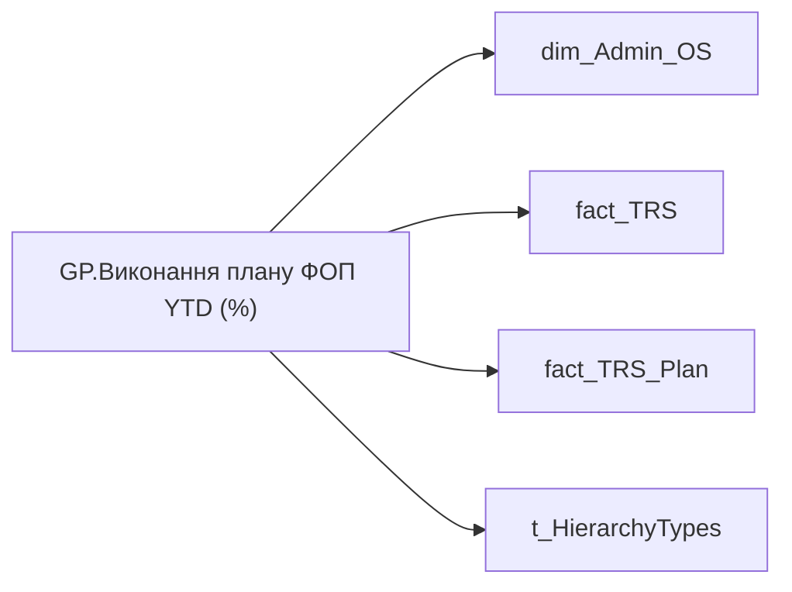

# GP.Виконання плану ФОП YTD (%)

*тека `Group_Profile\TRS`*

## Технічний опис

| Властивість | Значення |
|---|---|
| Тип | міра |
| Home table | _Measures |
| displayFolder | `Group_Profile\TRS` |
| formatString | — |
| dataType | — |
| Прихована | ні |

### DAX

```dax
"В розробці"
// //************* ROLE FILTERS **************
// VAR _roleIndex = SELECTEDVALUE ( 't_HierarchyTypes'[Index], 1 )   -- 0 = LT, 1 = Admin
// VAR _filter_lt_plan_trs = TREATAS ( VALUES ( 'dim_Admin_LT_OS'[USER_ACCESS_ID] ),'fact_TRS_Plan'[USER_ACCESS_ID] )
// VAR _filter_lt_fact_trs = TREATAS ( VALUES ( 'dim_Admin_LT_OS'[USER_ACCESS_ID] ),'fact_TRS'[USER_ACCESS_ID] )

// /* *********** ADMIN *********** */
// VAR _admin =
//     VAR _Employees =
//         SUMMARIZE ( ALLSELECTED ( 'dim_Admin_OS'[USER_ACCESS_ID] ),
//                     'dim_Admin_OS'[USER_ACCESS_ID] )
//     VAR _EmployeeAnnualBonus = 
//         ADDCOLUMNS(
//             _Employees,
//             "@Now", [PP.Цільовий розмір річної винагороди, до оподаткування],
//             "@YearAgo", [PP.Цільовий розмір річної винагороди, до оподаткування (12 місяців назад)]
//         )
//     VAR _AverageAnnualBonusGrowth = 
//         AVERAGEX(
//             FILTER(
//                 _EmployeeAnnualBonus,
//                 NOT ISBLANK([@YearAgo])
//             ),
//             [@Now] - [@YearAgo]
//         )
//     RETURN _AverageAnnualBonusGrowth

// /* *********** LT *********** */
// VAR _admin_lt =
//     VAR _Employees =
//         SUMMARIZE ( ALLSELECTED ( 'dim_Admin_OS'[USER_ACCESS_ID] ),
//                     'dim_Admin_OS'[USER_ACCESS_ID] )
//     VAR _EmployeeAnnualBonus = 
//         ADDCOLUMNS(
//             _Employees,
//             "@Now",  CALCULATE([PP.Цільовий розмір річної винагороди, до оподаткування], _filter_lt_plan_trs),
//             "@YearAgo", CALCULATE([PP.Цільовий розмір річної винагороди, до оподаткування (12 місяців назад)], _filter_lt_fact_trs)
//         )
//     VAR _AverageAnnualBonusGrowth = 
//         AVERAGEX(
//             FILTER(
//                 _EmployeeAnnualBonus,
//                 NOT ISBLANK([@YearAgo])
//             ),
//             [@Now] - [@YearAgo]
//         )
//     RETURN _AverageAnnualBonusGrowth

// VAR _res =
//     SWITCH (
//         _roleIndex,
//         0, _admin_lt,    -- LT
//         1, _admin,       -- Admin
//         _admin
//     )
// RETURN _res
```

### Джерела даних

Вихідні таблиці: `DM.vw_R27_dim_Employee_Access_List`, `DM.vw_R27_fact_TRS_PDP`, `DM.vw_R27_fact_TRS_Plan_PDP`

Колонки: `Index`, `USER_ACCESS_ID`

Power Query: `dim_Admin_OS`

### Залежності (таблиці й колонки)

Таблиці: `dim_Admin_OS`, `fact_TRS`, `fact_TRS_Plan`, `t_HierarchyTypes`

Колонки: `dim_Admin_LT_OS[USER_ACCESS_ID]`, `dim_Admin_OS[USER_ACCESS_ID]`, `fact_TRS[USER_ACCESS_ID]`, `fact_TRS_Plan[USER_ACCESS_ID]`, `t_HierarchyTypes[Index]`

### Схема



---

## Бізнес-суть

**Бізнес-назва:** Виконання плану ФОП YTD (%)

### Опис із ТЗ

Розрахункове поле: відношення плану ФОП по кадровому підрозділу до факту ФОП по кадровому підрозділу за період з початку року до поточної дати.   ПО lead team таку метрику рахувати поки не будемо.   Відібрати записи по періоду `Period`, організації `organization_key` , підрозділу `unit_key`   `total_sum` - планові виплати    `payment_fact` - фактичні виплати   Виконання плану ФОП YTD (%) = (Факт ФОП YTD / План ФОП YTD) × 100   До ФОП входять тільки ті види нарахувань, по яким поле `is_include_in_FOP_analytics` = '1'

Розрахункове поле: відношення плану ФОП по кадровому підрозділу до факту ФОП по кадровому підрозділу за період з початку року до поточної дати.   ПО lead team таку метрику рахувати поки не будемо.   Відібрати записи по періоду `Period`, організації `organization_key` , підрозділу `unit_key`   `total_sum` - планові виплати    `payment_fact` - фактичні виплати   Виконання плану ФОП YTD (%) = (Факт ФОП YTD / План ФОП YTD) × 100   До ФОП входять тільки ті види нарахувань, по яким поле `is_include_in_FOP_analytics` = '1'

**Вимоги (ТЗ):**

- [Командний профіль › Сторінка TRS команди](https://dev.azure.com/MHPITDepProjects/People%20Digital%20Profile%20%28PDP%29/_wiki/wikis/PDP.wiki?pagePath=/%D0%A4%D1%83%D0%BD%D0%BA%D1%86%D1%96%D0%BE%D0%BD%D0%B0%D0%BB%D1%8C%D0%BD%D1%96%20%D0%B2%D0%B8%D0%BC%D0%BE%D0%B3%D0%B8/%D0%92%D0%B8%D0%BC%D0%BE%D0%B3%D0%B8%20%D0%B4%D0%BE%20%D0%B7%D0%B2%D1%96%D1%82%D1%83%20People%20Digital%20Profile/%D0%9A%D0%BE%D0%BC%D0%B0%D0%BD%D0%B4%D0%BD%D0%B8%D0%B9%20%D0%BF%D1%80%D0%BE%D1%84%D1%96%D0%BB%D1%8C/%D0%A1%D1%82%D0%BE%D1%80%D1%96%D0%BD%D0%BA%D0%B0%20TRS%20%D0%BA%D0%BE%D0%BC%D0%B0%D0%BD%D0%B4%D0%B8)
- [Командний профіль › Сторінка TRS команди › Сторінка Винагорода групового профілю › вимоги до звіту](https://dev.azure.com/MHPITDepProjects/People%20Digital%20Profile%20%28PDP%29/_wiki/wikis/PDP.wiki?pagePath=/%D0%A4%D1%83%D0%BD%D0%BA%D1%86%D1%96%D0%BE%D0%BD%D0%B0%D0%BB%D1%8C%D0%BD%D1%96%20%D0%B2%D0%B8%D0%BC%D0%BE%D0%B3%D0%B8/%D0%92%D0%B8%D0%BC%D0%BE%D0%B3%D0%B8%20%D0%B4%D0%BE%20%D0%B7%D0%B2%D1%96%D1%82%D1%83%20People%20Digital%20Profile/%D0%9A%D0%BE%D0%BC%D0%B0%D0%BD%D0%B4%D0%BD%D0%B8%D0%B9%20%D0%BF%D1%80%D0%BE%D1%84%D1%96%D0%BB%D1%8C/%D0%A1%D1%82%D0%BE%D1%80%D1%96%D0%BD%D0%BA%D0%B0%20TRS%20%D0%BA%D0%BE%D0%BC%D0%B0%D0%BD%D0%B4%D0%B8/%D0%A1%D1%82%D0%BE%D1%80%D1%96%D0%BD%D0%BA%D0%B0%20%D0%92%D0%B8%D0%BD%D0%B0%D0%B3%D0%BE%D1%80%D0%BE%D0%B4%D0%B0%20%D0%B3%D1%80%D1%83%D0%BF%D0%BE%D0%B2%D0%BE%D0%B3%D0%BE%20%D0%BF%D1%80%D0%BE%D1%84%D1%96%D0%BB%D1%8E)

## На сторінках звіту

_Не використовується на основних сторінках звіту._

## Пов'язані міри

**Використовує:** [PP.Цільовий розмір річної винагороди, до оподаткування](../measures/pp-tsilovyi-rozmir-richnoi-vynahorody-do-opodatkuvannia.md), [PP.Цільовий розмір річної винагороди, до оподаткування (12 місяців назад)](../measures/pp-tsilovyi-rozmir-richnoi-vynahorody-do-opodatkuvannia-12-misiatsiv-nazad.md)

## Нотатки

_порожньо_
