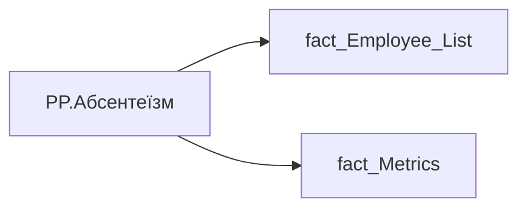

# PP.Абсентеїзм

*тека `Personal_Profile\Здоров'я та благополуччя`*

## Технічний опис

| Властивість | Значення |
|---|---|
| Тип | міра |
| Home table | _Measures |
| displayFolder | `Personal_Profile\Здоров'я та благополуччя` |
| formatString | — |
| dataType | — |
| Прихована | ні |

### DAX

```dax
VAR _employee_id = SELECTEDVALUE('fact_Employee_List'[EMPLOYEE_ID])
VAR _ratio = 
CALCULATE(
	DIVIDE(
		SUM('fact_Metrics'[Sick_Leave_Day_Without_Pregnancy]),
		SUMX(
			'fact_Metrics',
			'fact_Metrics'[FTE_WEIGHTED_WORK_DAY_FOR_ABSENTEEISM] + 'fact_Metrics'[Sick_Leave_Day_Without_Pregnancy]
		)
	)
)
RETURN 
	SWITCH(
		TRUE(),
		ISBLANK(_ratio), "0.00%",
		_ratio = 0, "0.00%",
		FORMAT(_ratio, "0.00%")
	)
```

### Джерела даних


Колонки: `EMPLOYEE_ID`, `FTE_WEIGHTED_WORK_DAY_FOR_ABSENTEEISM`, `Sick_Leave_Day_Without_Pregnancy`

Power Query: `fact_Employee_List`

### Залежності (таблиці й колонки)

Таблиці: `fact_Employee_List`, `fact_Metrics`

Колонки: `fact_Employee_List[EMPLOYEE_ID]`, `fact_Metrics[FTE_WEIGHTED_WORK_DAY_FOR_ABSENTEEISM]`, `fact_Metrics[Sick_Leave_Day_Without_Pregnancy]`

### Схема



---

## Бізнес-суть

FTE_WEIGHTED_WORK_DAY_FOR_ABSENTEEISM → Відпрацьовані робочі дні у місяці зважені на FTE_employee; Sick_Leave_Day_Without_Pregnancy → <br>Абсентеїзм; Sick_Leave_Day_Without_Pregnancy → Кількість робочих днів на лікарняному зважена на FTE; Sick_Leave_Day_Without_Pregnancy → Коеф. Абсентеїзму, %; Sick_Leave_Day_Without_Pregnancy → Рівень абсентеїзму (%); Sick_Leave_Day_Without_Pregnancy → Коеф. Абсентизму, %; Sick_Leave_Day_Without_Pregnancy → Абсентеїзм

Коефіцієнт абсентизму розраховується по працівнику за попередні 12 місяців, НЕ включаючи поточний місяць.АБСЕНТИЗМ= (Кількість днів на лікарняному без днів на лікарняному по вагітності та пологам)/(відпрацьовані робочі дні у місяці*FTE_employee + дні на лік-му (без днів на лікарняному по вагітності та пологам)  <br>= Sick_Leave_Day_Without_Pregnancy/(FTE_weighted_work_day_for_absenteeism+Sick_Leave_Day_Without_Pregnancy) За виключенням лікарняних, де is_pregnancy=0 за останні 12 міс, не включаючи поточний Розрахункове поле.  <br>Коефіцієнт абсентизму розраховується по команді за попередні 12 м

**Вимоги:** `Індивідуальний-профіль-працівника/Паспортна-частина-індивідуального-профілю-співробітника/Деталізація-в-паспортній-частині`, `Індивідуальний-профіль-працівника/Сторінка-Здоров'я-та-благополуччя-працівника`, `Командний-профіль/Паспортна-частина-групового-профілю/Редизайн-паспортної-частини-групового-профілю`, `Командний-профіль/Паспортна-частина-групового-профілю/Сторінка-Картка-команди`, `Командний-профіль/Сторінка-Здоров'я-та-благополуччя-команди`, `Командний-профіль/Сторінка-Моя-команда/ТЗ.-Деталізація-метрик-групового-профілю-звіту`

## На сторінках звіту

[Personal Profile](../report/personal-profile.md)

## Пов'язані міри

**Використовується в:** [PP.Ризик.Абсентеїзм](../measures/pp-ryzyk-absenteizm.md)

## Нотатки

_порожньо_
