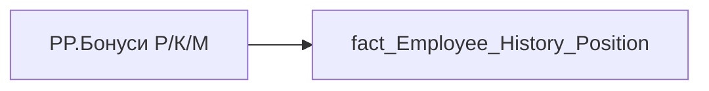

# PP.Бонуси Р/К/М

*тека `Personal_Profile\Життєвий цикл`*

## Технічний опис

| Властивість | Значення |
|---|---|
| Тип | міра |
| Home table | _Measures |
| displayFolder | `Personal_Profile\Життєвий цикл` |
| formatString | — |
| dataType | — |
| Прихована | ні |

### DAX

```dax
VAR _maxd = [PP.history_position_maxd]
VAR _res = 
    CALCULATE(
        SELECTEDVALUE(fact_Employee_History_Position[BONUS_YEAR_SALARY_CNT]),
        'fact_Employee_History_Position'[PERIOD] = _maxd
    )
RETURN COALESCE(_res & "Р" & ", 0K" & ", 0M", "—")
```

### Джерела даних

Вихідні таблиці: `DM.vw_R27_fact_Employee_History_Position`

Колонки: `BONUS_YEAR_SALARY_CNT`, `PERIOD`

Power Query: `fact_Employee_History_Position`

### Залежності (таблиці й колонки)

Таблиці: `fact_Employee_History_Position`

Колонки: `fact_Employee_History_Position[BONUS_YEAR_SALARY_CNT]`, `fact_Employee_History_Position[PERIOD]`

### Схема



---

## Бізнес-суть

!!! note "Бізнес-визначення відсутнє"
    Поля міри не зіставлено з wiki «Таблицями джерел даних». Можна заповнити вручну в `manualNotes`.

## На сторінках звіту

- [Personal Profile](../report/personal-profile.md) — Життєвий цикл

## Пов'язані міри

**Використовує:** [PP.history_position_maxd](../measures/pp-history-position-maxd.md)

## Нотатки

_порожньо_
