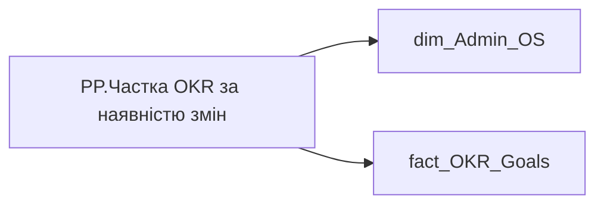

# PP.Частка OKR за наявністю змін

*тека `Personal_Profile\Результативність та оцінка\OKR` · формат `0`*

## Технічний опис

| Властивість | Значення |
|---|---|
| Тип | міра |
| Home table | _Measures |
| displayFolder | `Personal_Profile\Результативність та оцінка\OKR` |
| formatString | `0` |
| dataType | — |
| Прихована | ні |

### DAX

```dax
VAR _employee_id = CALCULATETABLE(VALUES('dim_Admin_OS'[EMPLOYEE_ID]))
VAR _res = 
CALCULATE(
        COUNTROWS(VALUES('fact_OKR_Goals'[OKR_OBJECTIVE_ID])),
    TREATAS(_employee_id,'fact_OKR_Goals'[EMPLOYEE_ID])
)
RETURN _res
```

### Джерела даних

Вихідні таблиці: `DM.R27_fact_OKR_Goals`, `DM.vw_R27_dim_Employee_Access_List`

Колонки: `EMPLOYEE_ID`, `OKR_OBJECTIVE_ID`

Power Query: `dim_Admin_OS`

### Залежності (таблиці й колонки)

Таблиці: `dim_Admin_OS`, `fact_OKR_Goals`

Колонки: `dim_Admin_OS[EMPLOYEE_ID]`, `fact_OKR_Goals[EMPLOYEE_ID]`, `fact_OKR_Goals[OKR_OBJECTIVE_ID]`

### Схема



---

## Бізнес-суть

!!! note "Бізнес-визначення відсутнє"
    Поля міри не зіставлено з wiki «Таблицями джерел даних». Можна заповнити вручну в `manualNotes`.

## На сторінках звіту

[Personal Profile](../report/personal-profile.md)

## Пов'язані міри

_Прямих зв'язків з іншими мірами немає._

## Нотатки

_порожньо_
