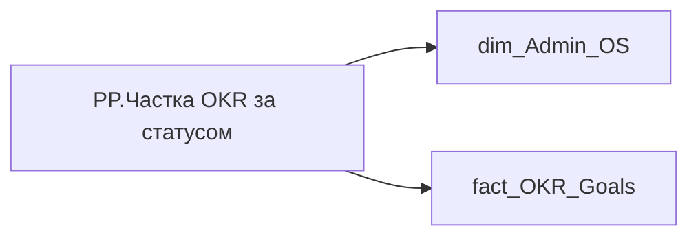

# PP.Частка OKR за статусом

*тека `Personal_Profile\Результативність та оцінка\OKR`*

!!! abstract "Джерела даних"
    `DM.R27_fact_OKR_Goals`, `DM.vw_R27_dim_Employee_Access_List`

## Бізнес-суть

FILLING_STATUS → Каскадований ОКР; FILLING_STATUS → Лінкований ОКР; FILLING_STATUS → Статус цілі

Якщо поле filling_status= Каскадовано Якщо поле filling_status= З’єднано

**Вимоги:** `Індивідуальний-профіль-працівника/Сторінка-Результативність-та-оцінка`, `Командний-профіль/Сторінка-Результативність-та-оцінка-команди/Створити-блок-Виконання-OKR`

## На сторінках звіту

_Не використовується на основних сторінках звіту._

## Пов'язані міри

_Прямих зв'язків з іншими мірами немає._

---

## Технічний опис

| Властивість | Значення |
|---|---|
| Тип | міра |
| Home table | _Measures |
| displayFolder | `Personal_Profile\Результативність та оцінка\OKR` |
| formatString | — |
| dataType | — |
| Прихована | ні |

### DAX

```dax
VAR _employee_id = CALCULATETABLE(VALUES('dim_Admin_OS'[EMPLOYEE_ID]))
VAR _res = 
CALCULATE(
    DIVIDE(
        COUNTROWS(VALUES('fact_OKR_Goals'[OKR_OBJECTIVE_ID])),
        CALCULATE(
            COUNTROWS(VALUES('fact_OKR_Goals'[OKR_OBJECTIVE_ID])),
            ALL(fact_OKR_Goals[FILLING_STATUS])
        )
    ),
    TREATAS(_employee_id,'fact_OKR_Goals'[EMPLOYEE_ID])
)
RETURN _res
```

### Джерела даних

Вихідні таблиці: `DM.R27_fact_OKR_Goals`, `DM.vw_R27_dim_Employee_Access_List`

Колонки: `EMPLOYEE_ID`, `FILLING_STATUS`, `OKR_OBJECTIVE_ID`

Power Query: `dim_Admin_OS`

### Залежності (таблиці й колонки)

Таблиці: `dim_Admin_OS`, `fact_OKR_Goals`

Колонки: `dim_Admin_OS[EMPLOYEE_ID]`, `fact_OKR_Goals[EMPLOYEE_ID]`, `fact_OKR_Goals[FILLING_STATUS]`, `fact_OKR_Goals[OKR_OBJECTIVE_ID]`

### Схема



## Нотатки

_порожньо_
