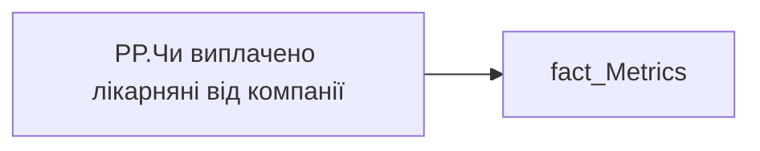

# PP.Чи виплачено лікарняні від компанії

*тека `Personal_Profile\Здоров'я та благополуччя`*

## Технічний опис

| Властивість | Значення |
|---|---|
| Тип | міра |
| Home table | _Measures |
| displayFolder | `Personal_Profile\Здоров'я та благополуччя` |
| formatString | — |
| dataType | — |
| Прихована | ні |

### DAX

```dax
VAR _HasData =
	COALESCE([PP.Лікарняні], 0) > 0        -- числова версія, BLANK коли даних нема
VAR _Paid =
	CALCULATE(
		COUNTROWS(
			FILTER('fact_Metrics', 'fact_Metrics'[IS_SICK_LEAVE_PAID] = TRUE())
		)
	) 
RETURN
SWITCH(
	TRUE(),
	_Paid = 0, "-",
	_Paid >0 , "Так",
	"Ні"
)
```

### Джерела даних


Колонки: `IS_SICK_LEAVE_PAID`

Power Query: `fact_Metrics`

### Залежності (таблиці й колонки)

Таблиці: `fact_Metrics`

Колонки: `fact_Metrics[IS_SICK_LEAVE_PAID]`

### Схема



---

## Бізнес-суть

**Бізнес-назва:** Чи виплачено лікарняні від компанії

### Опис із ТЗ

Якщо `is_sl_paid` = 1 за останні 12 міс, то Так, `is_sl_paid` = 0, то Ні   НЕ включаючи поточний місяць.

**Вимоги (ТЗ):**

- [Допоміжні вітрини для звіту › Таблиця для розрахунку агрегованих метрик по звіту](https://dev.azure.com/MHPITDepProjects/People%20Digital%20Profile%20%28PDP%29/_wiki/wikis/PDP.wiki?pagePath=/%D0%A4%D1%83%D0%BD%D0%BA%D1%86%D1%96%D0%BE%D0%BD%D0%B0%D0%BB%D1%8C%D0%BD%D1%96%20%D0%B2%D0%B8%D0%BC%D0%BE%D0%B3%D0%B8/%D0%92%D0%B8%D0%BC%D0%BE%D0%B3%D0%B8%20%D0%B4%D0%BE%20%D0%B7%D0%B2%D1%96%D1%82%D1%83%20People%20Digital%20Profile/%D0%94%D0%BE%D0%BF%D0%BE%D0%BC%D1%96%D0%B6%D0%BD%D1%96%20%D0%B2%D1%96%D1%82%D1%80%D0%B8%D0%BD%D0%B8%20%D0%B4%D0%BB%D1%8F%20%D0%B7%D0%B2%D1%96%D1%82%D1%83/%D0%A2%D0%B0%D0%B1%D0%BB%D0%B8%D1%86%D1%8F%20%D0%B4%D0%BB%D1%8F%20%D1%80%D0%BE%D0%B7%D1%80%D0%B0%D1%85%D1%83%D0%BD%D0%BA%D1%83%20%D0%B0%D0%B3%D1%80%D0%B5%D0%B3%D0%BE%D0%B2%D0%B0%D0%BD%D0%B8%D1%85%20%D0%BC%D0%B5%D1%82%D1%80%D0%B8%D0%BA%20%D0%BF%D0%BE%20%D0%B7%D0%B2%D1%96%D1%82%D1%83)

## На сторінках звіту

_Не використовується на основних сторінках звіту._

## Пов'язані міри

**Використовує:** [PP.Лікарняні](../measures/pp-likarniani.md)

## Нотатки

_порожньо_
