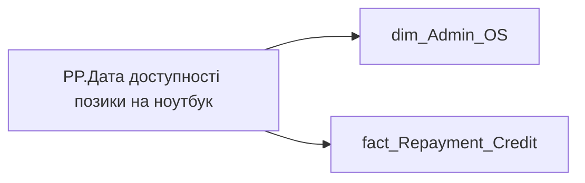

# PP.Дата доступності позики на ноутбук

*тека `Personal_Profile\TRS`*

## Технічний опис

| Властивість | Значення |
|---|---|
| Тип | міра |
| Home table | _Measures |
| displayFolder | `Personal_Profile\TRS` |
| formatString | — |
| dataType | — |
| Прихована | ні |

### DAX

```dax
VAR _last_date = 
	LASTNONBLANKVALUE(
		VALUES('dim_Admin_OS'[USER_ACCESS_ID]),
		CALCULATE(
			MAX('fact_Repayment_Credit'[ACTION_START_DATE]),
			'fact_Repayment_Credit'[BUDGET_ITEM_CODE] = "0000008240"
		)
	)
VAR _result = 
MAX(
	TODAY(),
	DATE(YEAR(_last_date)+3, MONTH(_last_date), DAY(_last_date) + 1)
)
RETURN FORMAT(_result, "dd.mm.yyyy")
	
```

### Джерела даних

Вихідні таблиці: `DM.vw_R27_dim_Employee_Access_List`, `DM.vw_R27_fact_Repayment_Credit_PDP`

Колонки: `ACTION_START_DATE`, `BUDGET_ITEM_CODE`, `USER_ACCESS_ID`

Power Query: `dim_Admin_OS`

### Залежності (таблиці й колонки)

Таблиці: `dim_Admin_OS`, `fact_Repayment_Credit`

Колонки: `dim_Admin_OS[USER_ACCESS_ID]`, `fact_Repayment_Credit[ACTION_START_DATE]`, `fact_Repayment_Credit[BUDGET_ITEM_CODE]`

### Схема



---

## Бізнес-суть

**Бізнес-назва:** Дата доступності позики на ноутбук

### Опис із ТЗ

Якщо працівник отримав таку позику, (тобто є запис в таблиці DM.`vw_R29_fact_Repayment_Credit` де `BUDGET_ITEM_CODE` = '0000008240') то це `ACTION_START_DATE` + 3 роки    Якщо працівник не отримував таку позику, то виводити дату кінця адаптаційного періоду   `adaptation_end_date` із dm.`vw_R27_fact_Employee_List`   По пріоритетному місцю роботи в організації (якщо кілька працевлаштувань)

**Вимоги (ТЗ):**

- [Індивідуальний профіль працівника › Сторінка Винагорода працівника](https://dev.azure.com/MHPITDepProjects/People%20Digital%20Profile%20%28PDP%29/_wiki/wikis/PDP.wiki?pagePath=/%D0%A4%D1%83%D0%BD%D0%BA%D1%86%D1%96%D0%BE%D0%BD%D0%B0%D0%BB%D1%8C%D0%BD%D1%96%20%D0%B2%D0%B8%D0%BC%D0%BE%D0%B3%D0%B8/%D0%92%D0%B8%D0%BC%D0%BE%D0%B3%D0%B8%20%D0%B4%D0%BE%20%D0%B7%D0%B2%D1%96%D1%82%D1%83%20People%20Digital%20Profile/%D0%86%D0%BD%D0%B4%D0%B8%D0%B2%D1%96%D0%B4%D1%83%D0%B0%D0%BB%D1%8C%D0%BD%D0%B8%D0%B9%20%D0%BF%D1%80%D0%BE%D1%84%D1%96%D0%BB%D1%8C%20%D0%BF%D1%80%D0%B0%D1%86%D1%96%D0%B2%D0%BD%D0%B8%D0%BA%D0%B0/%D0%A1%D1%82%D0%BE%D1%80%D1%96%D0%BD%D0%BA%D0%B0%20%D0%92%D0%B8%D0%BD%D0%B0%D0%B3%D0%BE%D1%80%D0%BE%D0%B4%D0%B0%20%D0%BF%D1%80%D0%B0%D1%86%D1%96%D0%B2%D0%BD%D0%B8%D0%BA%D0%B0)

## На сторінках звіту

- [Personal Profile](../report/personal-profile.md) — Винагорода

## Пов'язані міри

_Прямих зв'язків з іншими мірами немає._

## Нотатки

_порожньо_
