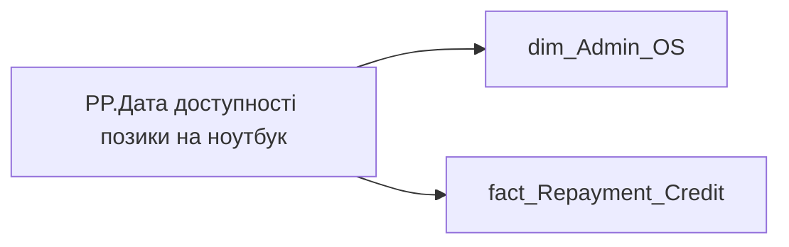

# PP.Дата доступності позики на ноутбук

*тека `Personal_Profile\TRS`*

## Технічний опис

| Властивість | Значення |
|---|---|
| Тип | міра |
| Home table | _Measures |
| displayFolder | `Personal_Profile\TRS` |
| formatString | — |
| dataType | — |
| Прихована | ні |

### DAX

```dax
VAR _last_date = 
	LASTNONBLANKVALUE(
		VALUES('dim_Admin_OS'[USER_ACCESS_ID]),
		CALCULATE(
			MAX('fact_Repayment_Credit'[ACTION_START_DATE]),
			'fact_Repayment_Credit'[BUDGET_ITEM_CODE] = "0000008240"
		)
	)
VAR _result = 
MAX(
	TODAY(),
	DATE(YEAR(_last_date)+3, MONTH(_last_date), DAY(_last_date) + 1)
)
RETURN FORMAT(_result, "dd.mm.yyyy")
	
```

### Джерела даних

Вихідні таблиці: `DM.vw_R27_dim_Employee_Access_List`, `DM.vw_R27_fact_Repayment_Credit_PDP`

Колонки: `ACTION_START_DATE`, `BUDGET_ITEM_CODE`, `USER_ACCESS_ID`

Power Query: `dim_Admin_OS`

### Залежності (таблиці й колонки)

Таблиці: `dim_Admin_OS`, `fact_Repayment_Credit`

Колонки: `dim_Admin_OS[USER_ACCESS_ID]`, `fact_Repayment_Credit[ACTION_START_DATE]`, `fact_Repayment_Credit[BUDGET_ITEM_CODE]`

### Схема



---

## Бізнес-суть

ACTION_START_DATE → Період позики; ACTION_START_DATE → Дата доступності позики на ноутбук; ACTION_START_DATE → Позика на ноутбук (дата доступності)

Якщо працівник отримав таку позику, (тобто є запис в таблиці DM.vw_R29_fact_Repayment_Credit де [BUDGET_ITEM_CODE] = '0000008240') то це [ACTION_START_DATE] + 3 роки  <br> Якщо працівник не отримував таку позику, то виводити дату кінця адаптаційного періоду  <br>adaptation_end_date із dm.vw_R27_fact_Employee_List  <br>По пріоритетному місцю роботи в організації (якщо кілька працевлаштувань) Якщо працівник отримав таку позику, (тобто є запис в таблиці DM.vw_R27_fact_Repayment_Credit де [BUDGET_ITEM_CODE] = '0000008240') то це [ACTION_START_DATE] + 3 роки  <br> Якщо працівник не отримував таку п

**Вимоги:** `Індивідуальний-профіль-працівника/Сторінка-Винагорода-працівника`, `Індивідуальний-профіль-працівника/Сторінка-Винагорода-працівника/Доопрацювання-сторінки-ТРС`, `Командний-профіль/Сторінка-Моя-команда/ТЗ.-Деталізація-метрик-групового-профілю-звіту`

## На сторінках звіту

[Personal Profile](../report/personal-profile.md)

## Пов'язані міри

_Прямих зв'язків з іншими мірами немає._

## Нотатки

_порожньо_
